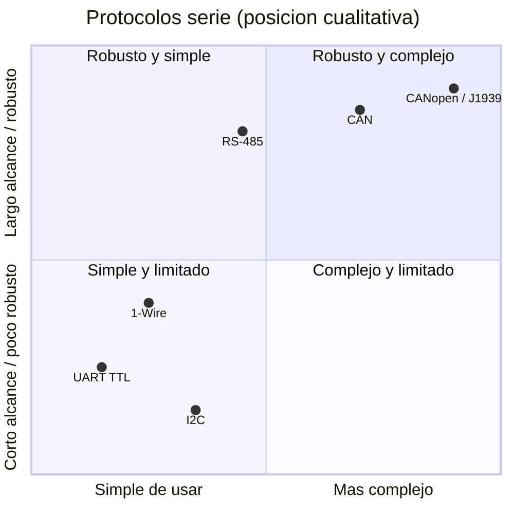
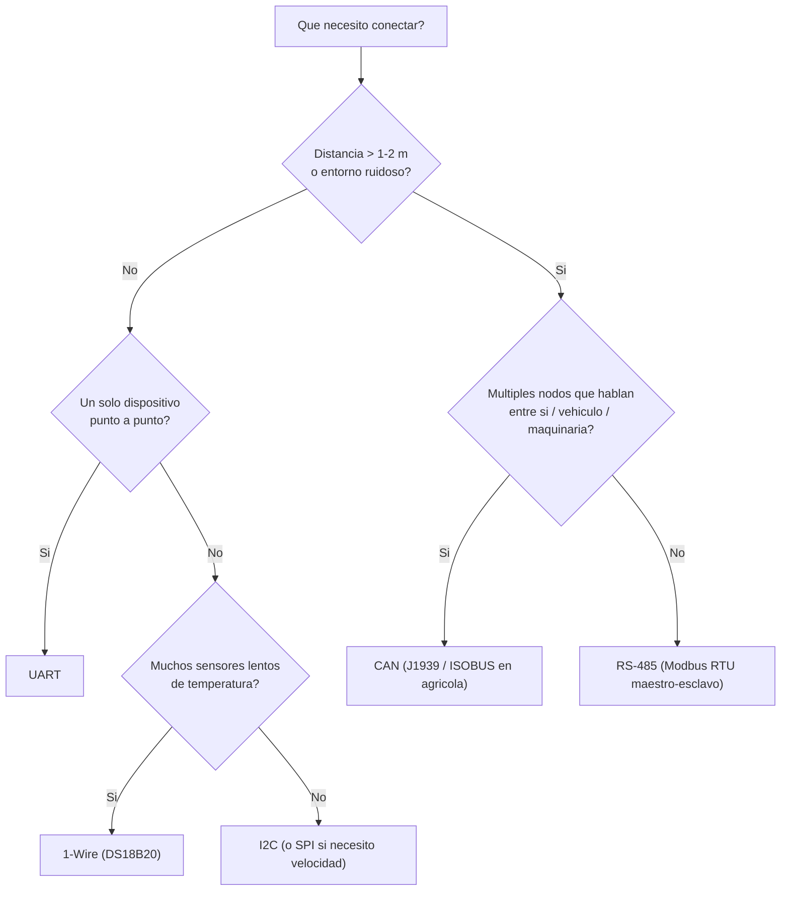
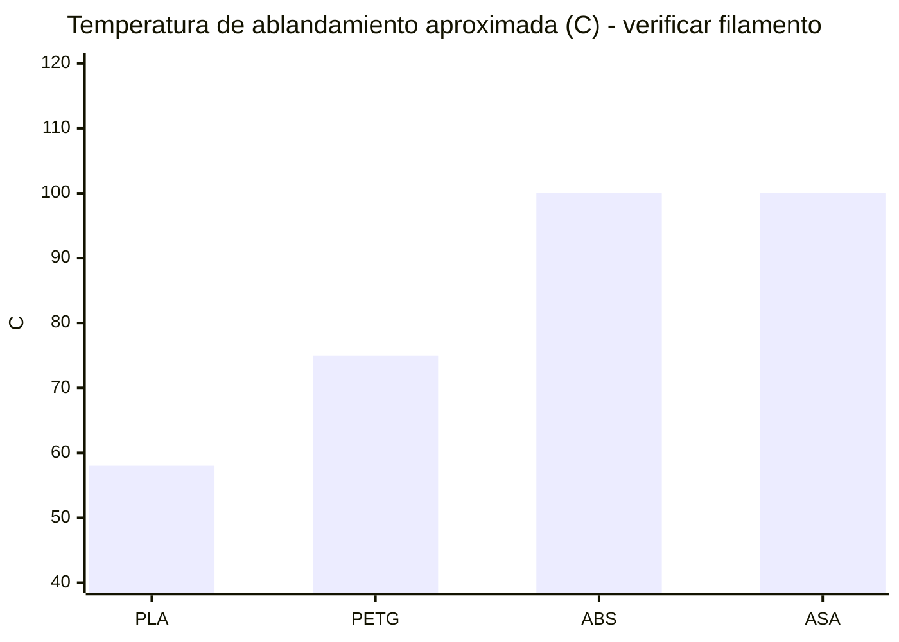
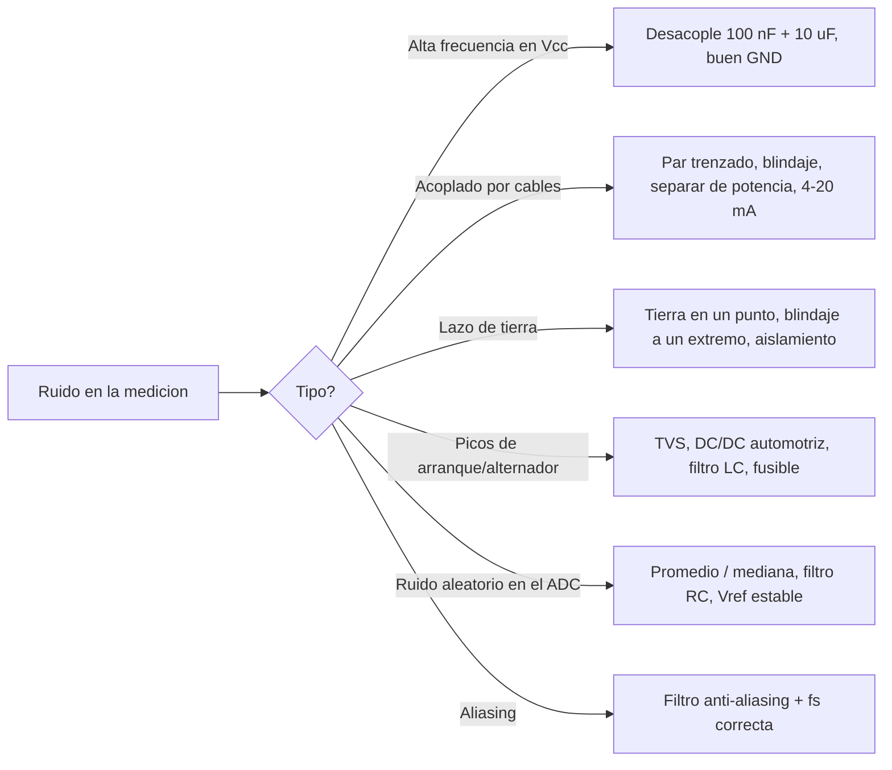

# Comparativas visuales

> Hojas de comparación para **decidir y recordar**. Las posiciones en los gráficos son **cualitativas y didácticas** (no medidas): dependen de transceptor, cable, configuración y software. Verifica cifras en datasheets/estándares.

## 1. Protocolos: complejidad vs robustez/alcance (cualitativo)

## 2. Elegir un bus en 5 preguntas

## 3. MCU vs SBC: qué usar para cada rol

| Rol | Arduino/AVR | ESP32 | STM32 | RP2040 (Pico) | Raspberry Pi |
|---|---|---|---|---|---|
| Nodo sensor simple | ✔ | ✔ | ✔ | ✔ | ✘ excesivo |
| Nodo inalámbrico | ✘ | ✔ | (con módulo) | Pico W | ✔ |
| Tiempo real estricto | ✔ | ✔ | ✔ (más recursos) | ✔ | ✘ (Linux estándar) |
| CAN nativo (con transceptor) | ✘ (MCP2515 SPI) | ✔ (TWAI) | ✔ (bxCAN/FDCAN) | ✘ (MCP2515) | (HAT/USB-CAN) |
| ADC | 10 bits | 12 bits (no lineal) | 12 bits (mejor) | 12 bits | ✘ (externo) |
| Gateway / base de datos / Python | ✘ | limitado (MicroPython) | ✘ | limitado | ✔ |
| Costo/complejidad | Bajo | Bajo | Medio | Bajo | Medio |

## 4. MQTT vs HTTP/REST

| Criterio | MQTT | HTTP/REST |
|---|---|---|
| Patrón | Publicar/suscribir | Petición/respuesta |
| Overhead | Muy bajo | Mayor (cabeceras) |
| Conexión | Persistente | Por petición (o keep-alive) |
| Tiempo real hacia el cliente | Sí (push) | No (polling/WebSocket) |
| Redes inestables | Excelente (QoS, LWT, sesión) | Requiere lógica propia |
| Depuración | Herramientas MQTT | `curl`, navegador |
| Integración con sistemas existentes | Menor | Mayor |
| Idóneo para | Telemetría continua | Lotes, consultas, APIs |

## 5. Estrategias de envío

| Estrategia | Datos/día | Latencia | Complejidad | Cuándo |
|---|---|---|---|---|
| Periódica 1 Hz | Alta (≈ 30 MB/máquina con 350 B/msg) | Baja | Baja | Poco tráfico permitido |
| Agregada 5 s | ≈ 6 MB | Media | Media | Enlace celular |
| Por excepción (deadband) | Variable, muy baja | Baja | Media | Variables estables |
| Por lotes (HTTP) | Media | Alta | Baja | Sin necesidad de tiempo real |
*(Cálculo del módulo [15](../docs/15_caso_realista_arquitectura.md); supuestos ilustrativos.)*

## 6. Materiales de impresión 3D (orientativo)

| | PLA | PETG | ABS | ASA |
|---|---|---|---|---|
| Facilidad | ★★★★★ | ★★★★ | ★★ | ★★ |
| Calor | ★ | ★★ | ★★★★ | ★★★★ |
| UV/exterior | ★ | ★★ | ★★ | ★★★★★ |
| Impacto | ★ | ★★★★ | ★★★ | ★★★ |
| Recomendado para | Prototipos | Uso general | Interior moderado | **Exterior/sol** |

## 7. Ruido y mitigación: mapa de decisión

## 8. Linux: qué comando para qué síntoma

| Síntoma | Comando |
|---|---|
| ¿Corre el servicio? | `systemctl status X` |
| ¿Por qué falló? | `journalctl -u X -n 100` |
| ¿Está el dispositivo? | `lsusb`, `dmesg \| tail`, `ls -l /dev/ttyUSB*` |
| ¿Permisos? | `ls -l`, `id`, `groups` |
| ¿Puerto en uso? | `ss -tulpn`, `fuser -v` |
| ¿Red? | `ip a`, `ping`, `curl -v`, `nc -zv` |
| ¿Disco/memoria? | `df -h`, `free -m` |
| ¿Hora? | `timedatectl` |
| ¿Bus I2C/CAN? | `i2cdetect -y 1`, `candump can0` |
