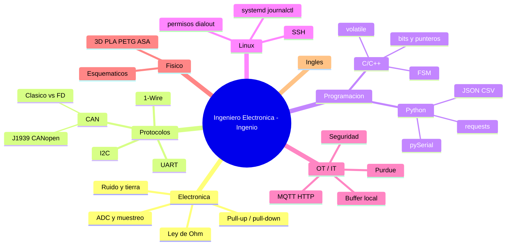
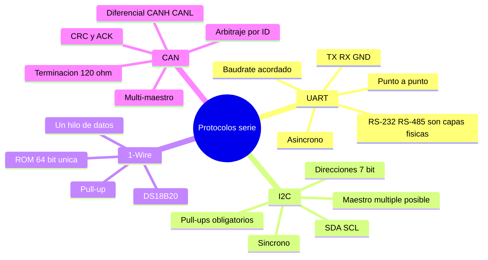
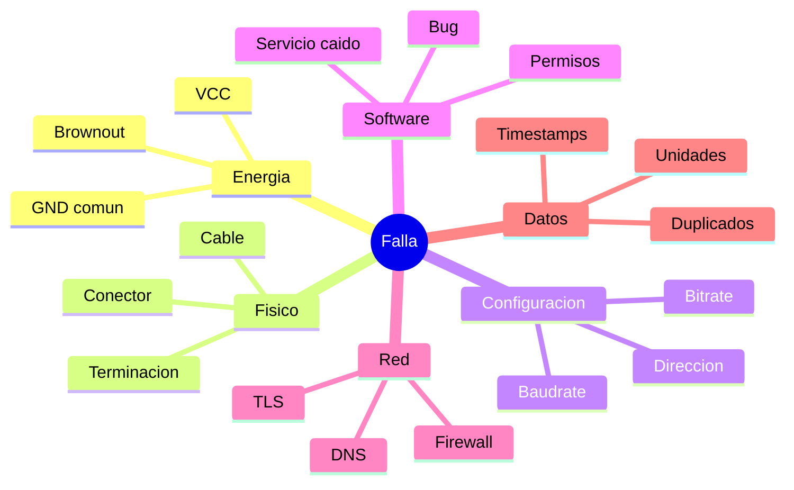
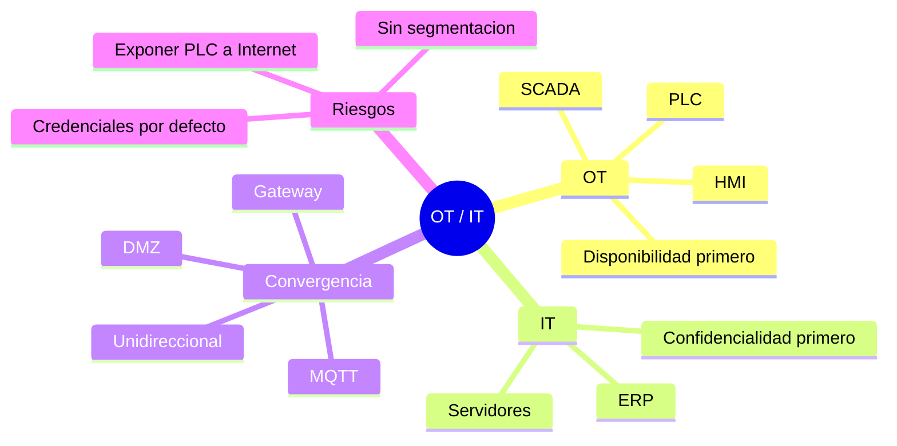

# Mapas mentales

Repasa cada rama en voz alta: si no puedes explicar un nodo en 20 segundos, vuelve al módulo indicado.

## Mapa global de la plaza

## Mapa de protocolos

## Mapa de diagnóstico

## Mapa OT/IT

