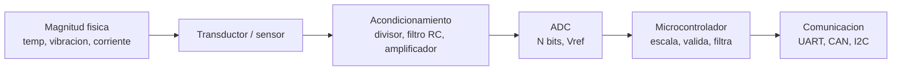

# 01 · Fundamentos de electrónica

> **Resumen ejecutivo (45 s).** Todo sistema de monitoreo transforma una magnitud física (temperatura, vibración, corriente) en una señal eléctrica, la acondiciona (divisor, filtro, amplificador), la convierte a número (ADC) y la valida. Las bases que se preguntan en una prueba: **ley de Ohm y potencia**, **divisores de voltaje**, **resolución del ADC**, **pull-up/pull-down**, **niveles lógicos (3.3 V vs 5 V)** y **ruido/tierra/desacoplamiento**. Si dominas estos seis puntos y sabes hacer las cuentas rápido, cubres el 80 % de las preguntas de fundamentos.



---

## 1. Magnitudes y ley de Ohm

| Magnitud | Símbolo | Unidad | Fórmula útil |
|---|---|---|---|
| Voltaje | V | volt (V) | V = I · R |
| Corriente | I | ampere (A) | I = V / R |
| Resistencia | R | ohm (Ω) | R = V / I |
| Potencia | P | watt (W) | P = V · I = I² · R = V² / R |
| Energía | E | joule / Wh | E = P · t |

- **Serie:** R_total = R1 + R2 (misma corriente, el voltaje se reparte).
- **Paralelo:** 1/R_total = 1/R1 + 1/R2 (mismo voltaje, la corriente se reparte).
- **Divisor de voltaje:** `Vout = Vin · R2 / (R1 + R2)`.
- **LED con resistencia:** `R = (Vcc − Vf) / I_led`. Ej.: Vcc = 5 V, Vf ≈ 2 V, I = 10 mA → R = 300 Ω (se usa el valor comercial próximo, 330 Ω → I ≈ 9.1 mA).

### Ejercicio resuelto: potencia en una resistencia
Un sensor se alimenta con 12 V a través de una resistencia de 470 Ω. ¿Qué potencia disipa?
`I = 12 / 470 = 25.5 mA`, `P = V·I = 12 · 0.0255 = 0.306 W`. Una resistencia de 1/4 W (0.25 W) **no** sirve; se elige 1/2 W o más (con margen, la práctica común es usar ≤ 50 % de la potencia nominal).

---

## 2. Señales analógicas y digitales

| | Analógica | Digital |
|---|---|---|
| Valores | Continuos | Discretos (0/1, niveles) |
| Ejemplo | NTC, 4–20 mA, salida 0–5 V | Interruptor, encoder, bus I2C |
| Sensibilidad al ruido | Alta | Baja (margen de ruido) |
| Interfaz MCU | ADC | GPIO / periférico serie |

- **Entrada digital (DI):** lee 0 o 1. Ej.: final de carrera, presostato, contacto de relé.
- **Salida digital (DO):** manda 0 o 1. Ej.: LED, relé (vía transistor/driver), buzzer.
- **Entrada analógica (AI):** ADC. Ej.: temperatura NTC, presión 0.5–4.5 V, 4–20 mA.
- **Salida analógica (AO):** DAC o PWM filtrado. Ej.: consigna 0–10 V a variador.
- Muchos MCU **no** tienen DAC; el **PWM** con filtro RC aproxima una salida analógica.

---

## 3. ADC, DAC, resolución y muestreo

**Resolución (LSB):** `LSB = Vref / 2^N`.

| Bits (N) | Niveles (2^N) | LSB con Vref = 3.3 V |
|---|---|---|
| 8 | 256 | 12.9 mV |
| 10 | 1024 | 3.22 mV |
| 12 | 4096 | 0.806 mV |
| 16 | 65536 | 0.0503 mV |

**Conversión:** `V = ADC · Vref / (2^N − 1)` (o `/2^N`, según la convención del fabricante; **verifica en el datasheet**). La diferencia es de 1 LSB y rara vez importa, pero **pregunta si lo mencionas**.

**Resolución ≠ exactitud.** Un ADC de 12 bits tiene 4096 pasos, pero su exactitud real depende de ruido, offset, ganancia, referencia y linealidad (INL/DNL). Cuenta los "bits efectivos" (ENOB) cuando haya ruido.

**Frecuencia de muestreo:**
- **Nyquist:** `fs ≥ 2 · f_max` de la señal útil. En la práctica se muestrea 5–10× la frecuencia máxima de interés.
- **Aliasing:** componentes por encima de fs/2 aparecen como frecuencias falsas más bajas. Se previene con un **filtro anti-aliasing** (paso bajo) *antes* del ADC.
- **Vibración:** una máquina con componentes hasta 2 kHz necesita fs ≥ 4 kHz (mejor 5–10 kHz). Muestrear a 1 Hz "temperatura" y "vibración" con la misma estrategia es un error clásico.

**DAC:** convierte un código digital a voltaje. `Vout = código · Vref / 2^N`.

### Ejercicio resuelto: ADC de 12 bits, Vref = 3.3 V, lectura = 2048
`V = 2048 · 3.3 / 4095 ≈ 1.650 V`.
Si el sensor es un LM35 (10 mV/°C): `T = 1.650 / 0.010 = 165 °C` → **fuera de rango plausible** (rango LM35 típico −55…150 °C). Ejemplo perfecto para hablar de **validación de plausibilidad**.

---

## 4. Pull-up, pull-down, niveles lógicos

- **Pull-up:** resistencia a Vcc. Deja la línea en **1** cuando nadie la maneja.
- **Pull-down:** resistencia a GND. Deja la línea en **0**.
- Una entrada **flotante** lee valores aleatorios (captura ruido). Es la causa #1 de "el botón hace cosas raras".
- **Open-drain / open-collector:** el dispositivo solo puede *tirar a 0*; el 1 lo pone la pull-up. Base de **I2C** y **1-Wire**, y permite conectar varios dispositivos sin cortocircuito.
- Valores típicos: 4.7 kΩ–10 kΩ para GPIO/1-Wire; I2C se calcula (ver módulo 02). Los MCU suelen incluir pull-ups internas (20–50 kΩ típico; **verifica** en el datasheet), débiles para buses rápidos.

```
  Pull-up (boton a GND)            Pull-down (boton a Vcc)
      Vcc                                Vcc
       |                                  |
      [R 10k]                          [boton]
       |                                  |
       +---- GPIO                         +---- GPIO
       |                                  |
    [boton]                            [R 10k]
       |                                  |
      GND                                GND
  Reposo = 1, presionado = 0        Reposo = 0, presionado = 1
```

**Niveles lógicos (valores típicos, verifica cada dispositivo):**

| Familia | V_OH (mín. alto) | V_IH | V_IL | Nota |
|---|---|---|---|---|
| 5 V TTL | ≥ 2.4 V | ≥ 2.0 V | ≤ 0.8 V | Arduino Uno usa lógica de 5 V |
| 3.3 V LVCMOS | ~ ≥ 2.4 V | ≥ 2.0 V | ≤ 0.8 V | ESP32, STM32, Raspberry Pi |
| 5 V CMOS | ~ 4.4 V | ≥ 0.7·Vcc | ≤ 0.3·Vcc | Depende de la familia |

**Regla práctica:** compatibilidad si `V_OH(salida) ≥ V_IH(entrada)` **y** `V_OL(salida) ≤ V_IL(entrada)`, y la entrada **tolera** el voltaje máximo de la salida. **Raspberry Pi GPIO: 3.3 V, no tolera 5 V.** Conectar el TX de 5 V de un Arduino Uno a un pin de la Pi puede dañarla.

**Adaptación de nivel:**
- 5 V → 3.3 V (unidireccional): divisor resistivo (p. ej. 1 kΩ + 2 kΩ → 5·2/3 = 3.33 V). Solo para señales lentas.
- Bidireccional (I2C): *level shifter* con MOSFET (BSS138) o CI dedicado.
- Empujar un 3.3 V a una entrada de 5 V: a menudo funciona porque V_IH ≈ 0.7·Vcc = 3.5 V no se cumple del todo; **no confíes**, usa shifter.

---

## 5. Sensores activos y pasivos

| | Pasivo (resistivo/variable) | Activo (genera señal / integra electrónica) |
|---|---|---|
| Qué necesita | Excitación externa | Suele ser autoalimentado o con salida acondicionada |
| Ejemplos | NTC, RTD (PT100), galga extensiométrica, potenciómetro | Termopar (genera µV), fotodiodo, piezoeléctrico; en otro uso: sensor "inteligente" con salida digital |
| Salida | Cambio de R → se convierte a voltaje | Voltaje/corriente/digital |

> **Cuidado con la terminología.** "Activo/pasivo" tiene dos usos: (1) *transductor que genera energía por sí mismo* (termopar, piezoeléctrico) vs. *que modula energía externa* (NTC); (2) *sensor con electrónica integrada* (DS18B20) vs. *elemento simple*. Aclara cuál usas al responder.

**Ejemplos con microcontrolador:**

```
NTC 10k + resistor 10k (divisor)       DS18B20 (1-Wire)             Bus I2C (ej. sensor de presion)
     3V3                                 3V3                          3V3
      |                                   |                            |
   [R 10k fija]                        [4.7k]---+                   [4.7k][4.7k]
      +---> ADC                          |      | DQ -> GPIO           |    |
   [NTC 10k]                            DQ------+                   SDA  SCL <-> MCU
      |                                  |
     GND                            VDD, GND, DQ
```

**NTC (ecuación Beta):** `1/T = 1/T0 + (1/β) · ln(R/R0)` con T en kelvin. Ej.: R0 = 10 kΩ a 25 °C (298.15 K), β = 3950 K, R = 5 kΩ → T ≈ 314.6 K = **41.5 °C**.
*Se asume β constante; es una aproximación válida en un rango limitado. Verifica β y tolerancia en el datasheet.*

**Lazo 4–20 mA:** la corriente viaja bien por cables largos y en ambientes ruidosos. Con una resistencia de precisión de 250 Ω se convierte a 1–5 V (4 mA → 1 V, 20 mA → 5 V). Ventaja adicional: **0 mA implica cable roto** (se distingue de 4 mA = valor mínimo). Para un ADC de 3.3 V se usa 165 Ω (0.66–3.3 V), o un divisor/amplificador adecuado.

---

## 6. Ruido, filtrado, tierra y desacoplamiento

**Fuentes de ruido en maquinaria agrícola:** motores/alternador, relés, inyectores, variadores de frecuencia (VFD), arranque de motor (picos), cables largos, humedad/corrosión, vibración mecánica que afloja conectores, ESD, radiofrecuencia (radios, radar).

| Técnica | Qué resuelve | Ejemplo |
|---|---|---|
| **Condensador de desacople** (100 nF cerca de cada pin Vcc, más 10 µF por sección) | Picos de corriente en Vcc, ruido de alta frecuencia | Junto al MCU y al sensor |
| **Filtro RC paso bajo** | Ruido en señales lentas / anti-aliasing | `fc = 1/(2πRC)`; R = 1 kΩ, C = 100 nF → fc ≈ 1.59 kHz |
| **Promedio / mediana digital** | Ruido aleatorio / picos aislados | Mediana de 5 muestras |
| **Par trenzado / blindaje** | Interferencia inducida | CAN, RS-485, sensores analógicos |
| **Tierra en estrella / punto único** | Lazos de tierra | Separar tierra de potencia y de señal, unir en un punto |
| **Aislamiento galvánico** | Lazos de tierra, transitorios | Aisladores digitales, transceptores CAN aislados |
| **TVS / diodo de protección / fusible** | Sobretensiones, polaridad invertida | Entrada de alimentación del vehículo de 12/24 V |
| **Referencia y ADC estables** | Deriva | Vref dedicada, ADC externo |

**Lazo de tierra:** dos puntos que se creen "GND" están a potenciales distintos → circula corriente por el blindaje/tierra y aparece como ruido. Solución: conectar el blindaje a tierra en **un solo extremo** (analógico) o aislar.

**Vehículos:** una batería de 12 V puede tener picos y *load dump* de decenas de voltios en sistemas de 12/24 V. Un regulador lineal "de 5 V con entrada máx. 15 V" puede morir. Pide un DC/DC automotriz con protección o un TVS. *(Detalles cuantitativos: consulta ISO 7637 / ISO 16750 y el datasheet del regulador.)*

### Ejercicio resuelto: filtro RC
Se quiere atenuar ruido > 50 Hz en una señal de temperatura. Elegimos C = 1 µF → `R = 1/(2π·fc·C) = 1/(2π·50·1e-6) ≈ 3.18 kΩ` → usar 3.3 kΩ → `fc = 48.2 Hz`. Recuerda que un filtro RC de primer orden atenúa −20 dB/década; y la impedancia de la fuente + R afecta la carga del ADC (verifica la impedancia máxima de entrada del ADC).

---

## 7. Errores frecuentes y preguntas trampa

1. **Olvidar GND común** entre dispositivos con distinta alimentación → lecturas UART/ADC erráticas.
2. **Entradas flotantes** por olvidar la pull-up/pull-down.
3. **Confundir resolución con exactitud.**
4. **ADC con fuente de alta impedancia** → lectura baja/inestable; buffer con op-amp o menor R.
5. **Pull-up a 5 V en un bus con dispositivos de 3.3 V.**
6. **Alimentar un motor/relé desde el mismo regulador que el MCU** sin desacople.
7. **Trampa:** "¿Un ADC de 16 bits mide con 16 bits de exactitud?" → No: resolución ≠ exactitud.
8. **Trampa:** "¿Puedo conectar 5 V a un GPIO de 3.3 V con una resistencia en serie?" → No es un diseño fiable; usa divisor o shifter y verifica si el pin es *5 V tolerant*.
9. **Trampa:** "¿Por qué 4–20 mA y no 0–20 mA?" → Para distinguir "señal mínima" de "cable roto" (live zero).

## 8. Ejercicios
Ver [`exercises/fundamentals.md`](../exercises/fundamentals.md) (con soluciones en [`answer_key.md`](../exercises/answer_key.md)).

## 9. Verificar en datasheets
V_IH/V_IL, tolerancia a 5 V por pin, corriente máxima por GPIO, resolución/ENOB y Vref del ADC, impedancia de entrada del ADC, β/tolerancia de la NTC, rango de alimentación de cada sensor.
