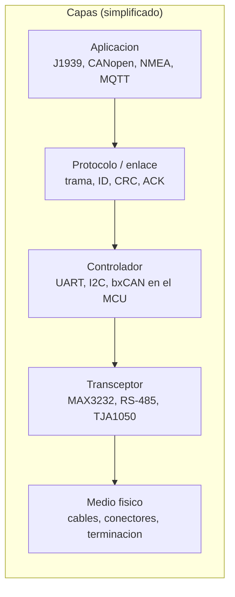
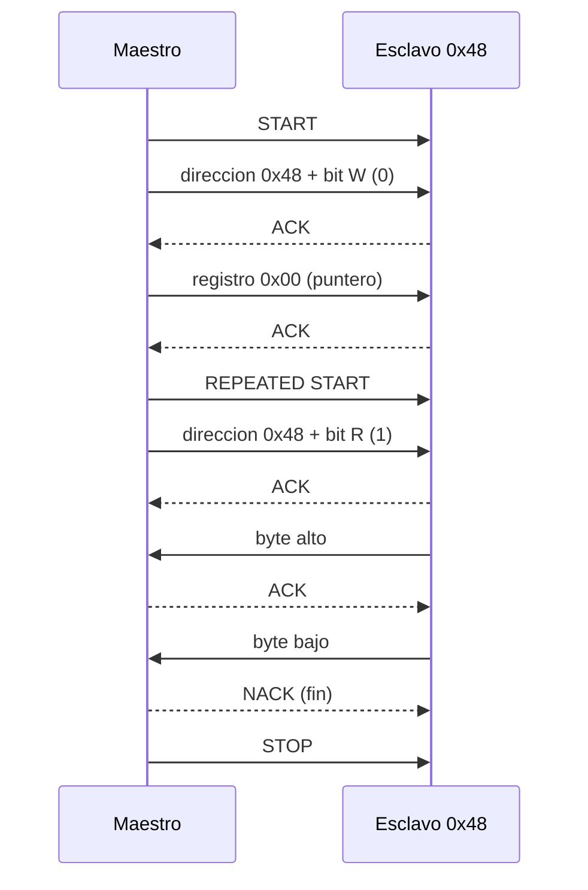
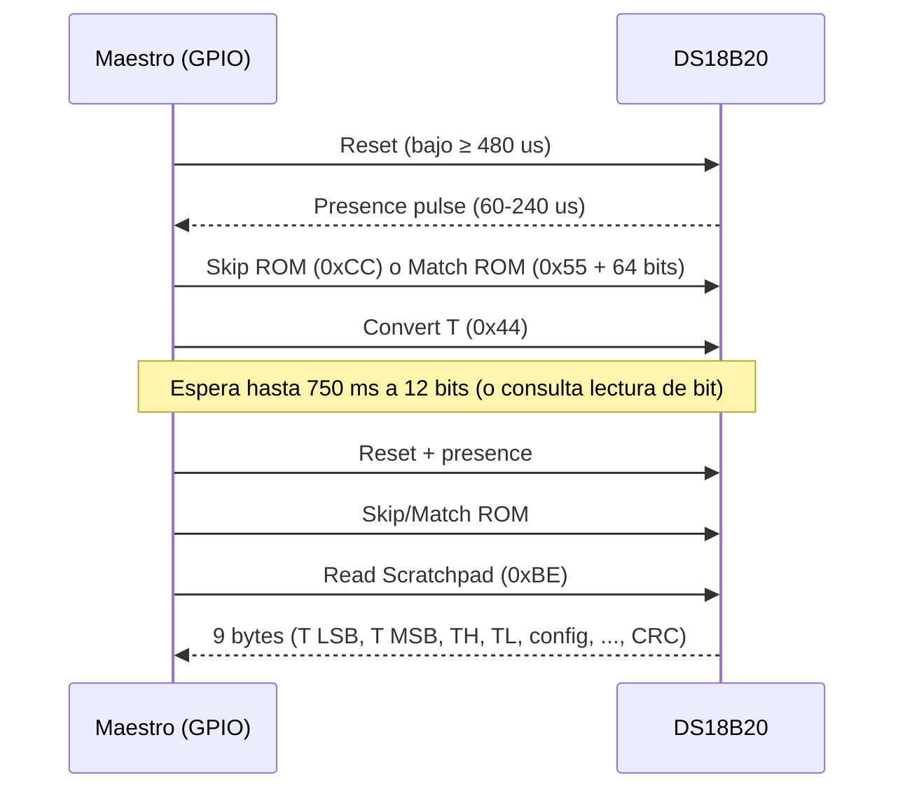
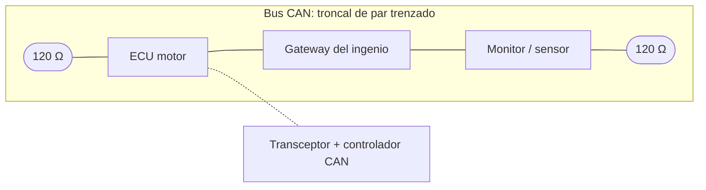
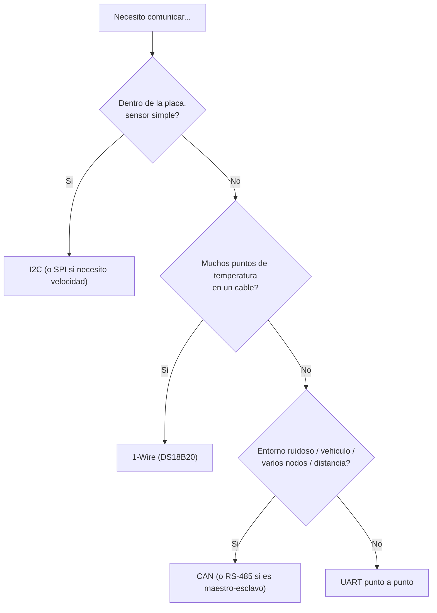

# 02 · Protocolos de comunicación: UART, I2C, 1-Wire y CAN

> **Resumen ejecutivo (60 s).**
> - **UART**: asíncrono, punto a punto, 2 hilos de datos (TX/RX) + GND, ambos lados acuerdan el *baud rate*. Simple; base de GPS, módems, consola. La distancia/eléctrica la define la capa física (TTL, RS-232, RS-485).
> - **I2C**: síncrono, 2 hilos (SDA/SCL) *open-drain* con **pull-ups**, bus compartido con **direcciones** (7 bits). Ideal para sensores en la misma placa; corto alcance.
> - **1-Wire**: un solo hilo de datos + GND, cada dispositivo tiene un **ROM ID de 64 bits** único. Lento pero cómodo: muchos DS18B20 en un mismo cable.
> - **CAN**: par diferencial, multi-maestro, **arbitraje por ID**, robusto contra ruido y con detección de errores integrada. Es el bus de vehículos y maquinaria (J1939/ISOBUS sobre CAN).
>
> Distingue siempre **protocolo** (reglas de la trama), **interfaz física** (niveles/cableado) y **transceptor** (chip que adapta el controlador al medio).



## 0. Protocolo vs interfaz física vs transceptor

| Concepto | Qué es | Ejemplo |
|---|---|---|
| **Protocolo** | Reglas de formato y temporización de los datos | Trama UART 8N1, trama CAN, direccionamiento I2C |
| **Interfaz física** | Niveles eléctricos, conectores, cableado | UART-TTL 3.3 V, RS-232 (±V), RS-485 (diferencial), CAN de ISO 11898-2 |
| **Transceptor** | Circuito que convierte lógica del MCU a niveles del medio | MAX3232 (RS-232), MAX485/SN65HVD (RS-485), TJA1050/SN65HVD230/MCP2551 (CAN) |

Ejemplos de confusión típica:
- **"UART" ≠ "RS-232" ≠ "RS-485".** UART es el bloque que serializa bytes; RS-232 y RS-485 son formas eléctricas de llevarlos más lejos.
- **"CAN" ≠ "J1939".** CAN define capa física y enlace; J1939 define cómo usar los 29 bits del ID y qué significan los datos.
- Un MCU con controlador CAN **necesita un transceptor CAN** externo (salvo integrados especiales). El controlador saca TX/RX lógicos (CANTX/CANRX), no CANH/CANL.

---

## 1. UART

### 1.1 Qué es y cómo funciona
*Universal Asynchronous Receiver/Transmitter.* Envía bytes bit a bit **sin reloj compartido**. Ambos extremos configuran el mismo *baud rate*, bits de datos, paridad y bits de parada.

| Característica | Valor |
|---|---|
| Serial/paralelo | Serial |
| Síncrona/asíncrona | **Asíncrona** |
| Duplex | Full duplex (TX y RX independientes) |
| Topología | **Punto a punto** (multipunto solo con RS-485 y un protocolo superior) |
| Conductores | TX, RX, GND (opcional RTS/CTS para control de flujo) |
| Direccionamiento | Ninguno en UART "puro" |
| Reloj | Ninguno; se recupera con muestreo (típicamente 16× el baud) |

**Trama 8N1** (más común): línea en reposo = 1 (*idle high*).

```
Idle ─┐ ┌─┐ ┌───┐   ┌─────┐ ┌────  bits enviados LSB primero
      └─┘ └─┘   └───┘     └─┘
     START D0 D1 D2 D3 D4 D5 D6 D7 STOP
     (0)                            (1)
  1 start + 8 datos + 1 stop = 10 bits por byte (8N1)
```

- **Baud rate:** símbolos por segundo (en UART, = bits/s). Comunes: 9600, 19200, 38400, 57600, 115200.
- **Velocidad efectiva:** a 115200 baud con 8N1: 115200/10 = **11 520 bytes/s**.
- **Tolerancia de reloj:** los relojes de ambos lados pueden diferir unos pocos % (típico ≤ 2–3 % de error total) antes de corromper bytes. Un cristal impreciso o un RC interno con temperatura → basura. *(Verifica la tolerancia en el datasheet del UART/MCU.)*
- **Paridad:** un bit opcional (par/impar) para detectar 1 bit erróneo. **No corrige.**
- **Control de flujo:** RTS/CTS (hardware) o XON/XOFF (software).

### 1.2 Señalización eléctrica

| Estándar | Niveles | Distancia práctica | Notas |
|---|---|---|---|
| **UART TTL/CMOS** | 0/3.3 V o 0/5 V | Decenas de cm a pocos metros | Entre chips y módulos en la misma máquina |
| **RS-232** | ±3…±15 V (invertido: 1 = negativo) | Hasta unas decenas de metros, según velocidad y cable | Punto a punto; necesita MAX232/MAX3232 |
| **RS-485** | Diferencial A/B | Cientos de metros hasta ~1200 m a baja velocidad (regla práctica) | Multipunto, half-duplex (2 hilos) o full (4); terminación y polarización |
| **RS-422** | Diferencial | Similar a RS-485 | 1 emisor, varios receptores |

> **Cuidado.** Nunca conectes RS-232 directo a un pin de MCU: ±12 V destruye la entrada. Usa MAX3232 o un adaptador USB-serie.

Cruce: **TX de A → RX de B**, **RX de A ← TX de B**, **GND común**.

```
   MCU (3.3 V)                 Modulo GPS (3.3 V)
   TX  ───────────────────────► RX
   RX  ◄─────────────────────── TX
   GND ─────────────────────────GND
   (Alimentacion segun modulo; verifica su rango)
```

### 1.3 Limitantes
- **Velocidad:** depende del reloj del MCU, del cable y del transceptor. TTL a 1 Mbaud o más es posible en cables muy cortos; RS-232/RS-485 varían según transceptor. **No hay un límite universal.**
- **Distancia:** capacidad del cable, ruido, niveles.
- **Overrun:** el software no lee el byte antes de que llegue el siguiente → usa FIFO/DMA/interrupción + buffer circular.

### 1.4 Ventajas/desventajas y aplicaciones
✔ Simple, universal, depurable con cualquier adaptador USB-serie. ✘ Punto a punto, sin direccionamiento, sin detección de errores más allá de paridad/framing (necesita CRC/checksum en la capa superior), sin reloj (baud acordado). **Aplicaciones:** GPS (NMEA), módems GSM/LoRa (comandos AT), consola de depuración, RS-485/Modbus RTU.

### 1.5 Fallos típicos y diagnóstico

| Síntoma | Causa probable | Prueba |
|---|---|---|
| Caracteres corruptos (`ÿâ¤`) | Baud rate distinto, reloj impreciso, formato distinto (7E1 vs 8N1) | Probar bauds comunes; medir un bit con osciloscopio/analizador lógico (`1/baud`) |
| Nada llega | TX/RX sin cruzar, GND no común, nivel incorrecto | Multímetro, loopback (unir TX con RX y enviar) |
| Pierde bytes | Sin FIFO/interrupción, buffer pequeño, sin control de flujo | Revisar flags de overrun; usar DMA/interrupciones |
| Solo funciona a veces | Ruido, cable largo, alimentación débil | Bajar velocidad, blindar, RS-485 |

### 1.6 Dispositivos reales
Módulos GPS (p. ej. familia u-blox NEO, salida NMEA), SIM800/SIM7600 (comandos AT), sensores de material particulado (PMS5003), convertidores USB-serie (FTDI FT232, CP2102, CH340), transceptores RS-485 (MAX485 / SP3485).

### 1.7 Ejemplo: MCU ↔ GPS (NMEA sobre UART)
El GPS emite frases ASCII como:
```
$GPGGA,123519,4807.038,N,01131.000,E,1,08,0.9,545.4,M,46.9,M,,*47
```
Checksum: XOR de todos los caracteres entre `$` y `*`, en hexadecimal de 2 dígitos. El código completo (C, parser con validación de checksum) está en [`examples/c/nmea_parser.c`](../examples/c/nmea_parser.c) y la lectura por pySerial en [`examples/python/05_serial_reader.py`](../examples/python/05_serial_reader.py).

Pseudocódigo del MCU (Arduino, `Serial1` = API del framework Arduino, no C estándar):
```cpp
// Arduino framework (ESP32/Mega). Serial1 conectado al GPS a 9600 baud (valor tipico; verifica el modulo).
void setup() { Serial.begin(115200); Serial1.begin(9600); }
void loop() {
  static char line[96]; static uint8_t n = 0;
  while (Serial1.available()) {             // bytes pendientes en el buffer UART
    char c = Serial1.read();
    if (c == '\n') { line[n] = '\0'; n = 0; procesar(line); }   // frase completa
    else if (n < sizeof(line) - 1 && c != '\r') line[n++] = c;  // evita desbordar el buffer
  }
}
```

---

## 2. I2C

### 2.1 Qué es y cómo funciona
*Inter-Integrated Circuit* (Philips/NXP; especificación UM10204). **Síncrono, serial**, dos líneas *open-drain* con pull-ups: **SDA** (datos) y **SCL** (reloj). Maestro(s) y esclavos; el maestro genera SCL.

| Característica | Valor |
|---|---|
| Serial/paralelo | Serial |
| Síncrona/asíncrona | **Síncrona** (reloj SCL) |
| Duplex | **Half-duplex** (una línea de datos compartida) |
| Topología | **Bus** multipunto (multi-maestro posible) |
| Conductores | SDA, SCL, GND (+ alimentación) |
| Direccionamiento | **7 bits** (127 direcciones, algunas reservadas) o 10 bits |
| Reloj | SCL, generado por el maestro (los esclavos pueden estirarlo: *clock stretching*) |
| Confirmación | ACK/NACK tras cada byte |



- **START:** SDA baja mientras SCL está alto. **STOP:** SDA sube con SCL alto. Los datos solo cambian con SCL bajo.
- **Nivel 0 lo tira un dispositivo; el 1 lo pone la pull-up** → *wired-AND*, permite arbitraje y clock stretching.

### 2.2 Bus con pull-ups (diagrama)

```
        3V3
         |
      [Rp]        [Rp]        Rp ≈ 2.2k–10k segun velocidad y capacitancia del bus
         |          |
SDA ─────┼──────────┼───────────┬─────────────┬─────────────┐
SCL ─────┼──────────┼───────────┼─────────────┼─────────────┤
         │          │        ┌──┴──┐       ┌──┴──┐       ┌──┴──┐
   MCU (maestro)            │0x48 │       │0x68 │       │0x76 │
                            │ ADC │       │ IMU │       │Pres.│
                            └─────┘       └─────┘       └─────┘
   Un par de pull-ups para todo el bus (no una por dispositivo).
   Todos comparten GND y el mismo nivel logico (3V3).
```

**Cálculo de pull-ups (UM10204):**
- Mínimo (limitar corriente): `Rp,min = (Vcc − V_OL,max) / I_OL`, con V_OL,max = 0.4 V e I_OL = 3 mA (modo estándar/rápido) → a 3.3 V: (3.3 − 0.4)/0.003 ≈ **967 Ω**.
- Máximo (limitar tiempo de subida): `Rp,max = t_r / (0.8473 · C_b)`; t_r,max = 1000 ns (100 kHz), 300 ns (400 kHz).
  - 100 kHz, C_b = 100 pF: 1000 ns / (0.8473 · 100 pF) ≈ **11.8 kΩ**.
  - 400 kHz, C_b = 200 pF: 300 ns / (0.8473 · 200 pF) ≈ **1.77 kΩ**.
  → a 400 kHz con 200 pF debe usarse Rp entre ~1 kΩ y ~1.77 kΩ.
- C_b máx. según especificación: 400 pF (modos estándar/rápido). Cada dispositivo, cada cm de cable y de pista suma capacitancia.

### 2.3 Velocidades y factores limitantes

| Modo (UM10204) | Velocidad máx. |
|---|---|
| Standard-mode | 100 kbit/s |
| Fast-mode | 400 kbit/s |
| Fast-mode Plus | 1 Mbit/s |
| High-speed | 3.4 Mbit/s |
| Ultra-fast (unidireccional, sin ACK) | 5 Mbit/s |

Los límites reales dependen de: **capacitancia del bus**, valor de Rp, soporte de cada dispositivo, longitud del cable y ruido. La mayoría de sensores comunes soportan 100/400 kHz (**verifica el datasheet**).
- **Distancia práctica:** decenas de centímetros a ~1 m en la misma placa/chasis. Metros → usa extensores/diferenciales (P82B715, PCA9615) o cambia de bus (CAN/RS-485).

### 2.4 Direccionamiento y conflictos
- Cada esclavo tiene una dirección (fija o con pines `ADDR`/`A0-A2`).
- **Conflicto:** dos dispositivos con la misma dirección (dos MPU-6050 sin pin AD0 distinto) → usa el pin de dirección, un multiplexor I2C (**TCA9548A**) o buses separados.
- Direcciones reservadas: 0x00–0x07 y 0x78–0x7F. `i2cdetect` muestra los rangos válidos escaneados.
- El código y los datasheets suelen escribir la dirección **de 7 bits** (p. ej. 0x48) o **de 8 bits con R/W** (0x90/0x91). Es una trampa habitual: verifica cuál se está usando.

### 2.5 Ventajas, desventajas, aplicaciones
✔ Solo 2 hilos para muchos sensores; ACK por byte; estándar universal. ✘ Corto alcance, sensible a capacitancia y a ruido, bloqueo del bus (un esclavo tira SDA a 0), velocidad moderada. **Aplicaciones:** sensores de temperatura/presión/IMU, EEPROM, RTC, ADC/DAC, pantallas OLED, expansores GPIO.

### 2.6 Fallos típicos y diagnóstico

| Síntoma | Causa probable | Prueba / solución |
|---|---|---|
| `i2cdetect` no muestra nada | Sin pull-ups, cableado SDA/SCL invertido, sin alimentación, I2C no habilitado (Pi) | Medir Vcc, 3V3 en SDA/SCL en reposo; `sudo raspi-config` → I2C |
| Aparece a otra dirección | Pin ADDR, variante del chip | Ver datasheet y `i2cdetect -y 1` |
| Funciona a 100 kHz, falla a 400 kHz | Pull-ups muy altas / capacitancia | Bajar Rp, acortar cables, bajar velocidad |
| Bus atascado (SDA en 0) | Esclavo a medio byte tras reset del maestro | Enviar hasta 9 pulsos de SCL + STOP (*bus recovery*), reiniciar el esclavo |
| NACK a la dirección | Dirección incorrecta, esclavo ocupado/dormido | Revisar dirección de 7 bits vs 8 bits, tiempos de conversión |
| Lecturas basura | Falta esperar conversión, endianness | Leer el datasheet: orden de bytes, tiempos |
| Nivel incorrecto | Sensor de 3.3 V con pull-up a 5 V | Level shifter I2C |

Herramientas: `i2cdetect -y 1`, `i2cdump`, `i2cget`, analizador lógico, osciloscopio.

### 2.7 Dispositivos reales
BME280/BMP280 (Bosch; 0x76/0x77), MPU-6050 (0x68/0x69), ADS1115 (0x48–0x4B), DS3231 (0x68), SHT31 (0x44/0x45), TCA9548A (multiplexor; 0x70–0x77). *Direcciones típicas; verifica en el datasheet/placa.*

### 2.8 Ejemplo: varios sensores en un bus compartido
Código completo en [`examples/python/i2c_multisensor.py`](../examples/python/i2c_multisensor.py) (Raspberry Pi, `smbus2`) y [`examples/c/i2c_register_read.c`](../examples/c/i2c_register_read.c) (mock ejecutable en PC del acceso a registros). Idea:

```python
from smbus2 import SMBus      # pip install smbus2
with SMBus(1) as bus:          # bus 1 = pines GPIO 2 (SDA) y 3 (SCL) en Raspberry Pi
    raw = bus.read_i2c_block_data(0x48, 0x00, 2)   # ADS1115: registro 0 (conversion), 2 bytes
    valor = (raw[0] << 8) | raw[1]                  # big-endian: byte alto primero
```

---

## 3. 1-Wire

### 3.1 Qué es y cómo funciona
Protocolo de Maxim/Analog Devices (Dallas). **Un solo conductor de datos (DQ) + GND**; el bus se mantiene alto por una pull-up y los dispositivos lo tiran a 0 (*open-drain*). Incluso puede alimentar dispositivos por el propio hilo (**parasitic power**). Cada dispositivo trae un **ROM de 64 bits**: 8 bits de *family code*, 48 bits de número de serie, 8 bits de CRC. El DS18B20 tiene código de familia 0x28.

| Característica | Valor |
|---|---|
| Serial/paralelo | Serial |
| Síncrona/asíncrona | Asíncrona con temporización estricta (time slots) iniciada por el maestro |
| Duplex | Half-duplex |
| Topología | Bus (un maestro, múltiples esclavos) |
| Conductores | DQ + GND (+ VDD opcional si no se usa alimentación parásita) |
| Direccionamiento | ROM de 64 bits; *Search ROM* para descubrirlos, *Match ROM* para elegir uno, *Skip ROM* para todos |
| Velocidad | Estándar ≈ 15.4 kbit/s; *overdrive* ≈ 125 kbit/s (según dispositivo; el DS18B20 opera a velocidad estándar) |



### 3.2 Conexión y terminación

```
        3V3
         |
      [4.7k]       (pull-up tipica; verifica datasheet y longitud de cable)
         |
 MCU GPIO ──────┬────────────┬────────────┐
                │DQ          │DQ          │DQ
             ┌──┴──┐      ┌──┴──┐      ┌──┴──┐
             │ #1  │      │ #2  │      │ #3  │   VDD a 3V3 y GND en cada uno (modo normal)
             └─────┘      └─────┘      └─────┘
```
- **Modo normal:** VDD conectado a 3.0–5.5 V. **Recomendado** en instalaciones largas o con muchos sensores.
- **Modo parásito:** VDD a GND, alimentado desde DQ; necesita *strong pull-up* durante la conversión. Frágil con cables largos.

### 3.3 DS18B20 (datos que se preguntan)
Rango −55…+125 °C, exactitud ±0.5 °C en −10…+85 °C (típica del datasheet), resolución configurable 9–12 bits (0.5, 0.25, 0.125, 0.0625 °C), conversión máx. 93.75 ms (9 bits) a 750 ms (12 bits). **El valor de reset al encender es +85 °C**: si lees 85.0 exactamente, probablemente es un valor no actualizado (leíste antes de terminar la conversión). *(Verificar en el datasheet vigente.)*

**Conversión:** el scratchpad da un entero de 16 bits con signo, LSB = 1/16 °C: `T = raw / 16.0`. Ej.: `0x0191` = 401 → 25.0625 °C; `0xFF5E` (complemento a 2) = −162 → −10.125 °C.

Ejemplos completos: [`examples/c/ds18b20_decode.c`](../examples/c/ds18b20_decode.c) (decodificación y CRC-8 Maxim, ejecutable en PC) y [`examples/python/ds18b20_linux.py`](../examples/python/ds18b20_linux.py) (Raspberry Pi con el driver `w1-therm`).

Lectura en Raspberry Pi (driver del kernel):
```bash
# /boot/firmware/config.txt (o /boot/config.txt en versiones anteriores):  dtoverlay=w1-gpio   -> GPIO4 por defecto
ls /sys/bus/w1/devices/            # 28-xxxxxxxxxxxx = cada DS18B20 (family 0x28)
cat /sys/bus/w1/devices/28-*/w1_slave
# 4b 01 4b 46 7f ff 05 10 e1 : crc=e1 YES
# 4b 01 4b 46 7f ff 05 10 e1 t=20687          # 20.687 C
```
`crc=e1 YES` → checksum válido; `NO` → lectura corrupta, descartar.

### 3.4 Limitaciones
- **Distancia/número de dispositivos:** depende de topología (lineal mejor que estrella), capacitancia del cable, pull-up y tiempos; el DS18B20 se usa a decenas de metros con buenas prácticas, pero **no hay límite universal**. Cable con par trenzado/CAT5 y pull-up ajustada ayudan; hay maestros/repetidores con *active pull-up* (DS2482).
- Temporización crítica: en MCU sin hardware 1-Wire se usa *bit-banging* con interrupciones deshabilitadas (afecta otras tareas) → usar UART como 1-Wire, DS2482 o el driver del kernel en Linux.
- Velocidad baja; conversión lenta (750 ms).

### 3.5 Fallos típicos

| Síntoma | Causa | Prueba |
|---|---|---|
| No detecta dispositivos | Sin pull-up, DQ mal cableado, sin alimentación | Medir 3.3 V en DQ en reposo |
| Lee −127 °C / 85 °C | −127: sensor desconectado (bus en 1 siempre); 85: valor por defecto/sin convertir | Validar CRC, presence pulse; esperar conversión |
| Lecturas intermitentes | Cable largo, ruido, alimentación parásita | Alimentación normal (VDD), pull-up menor, blindaje |
| Dos sensores con el mismo valor | Se leyó con Skip ROM con varios en el bus | Usar Match ROM |
| CRC inválido | Ruido/temporización | Reintentar, reducir carga del bus |

*Nota:* en Linux con `w1-therm`, −127 °C aparece cuando la lectura de bus es 0xFF (sin dispositivo); valida siempre CRC.

### 3.6 Aplicaciones
Temperaturas distribuidas (silos, tuberías, bombas, cárteres), etiquetas iButton, EEPROM 1-Wire. Ideal cuando **muchos puntos de medición lentos** deben compartir cable.

---

## 4. CAN

### 4.1 Qué es y cómo funciona
*Controller Area Network* (Bosch, 1986; **ISO 11898**). Bus **serial multi-maestro** con **broadcast**: cada mensaje lleva un **identificador (ID)** que indica *qué es* el mensaje y su **prioridad** (no a quién va). Todos los nodos escuchan y filtran por ID. Diseñado para automoción; muy robusto al ruido.

| Característica | Valor |
|---|---|
| Serial/paralelo | Serial |
| Síncrona/asíncrona | Asíncrona con resincronización por *bit stuffing* y bit timing (sin línea de reloj) |
| Duplex | Half-duplex (cada nodo escucha mientras transmite; parte del arbitraje) |
| Topología | **Bus lineal** con troncal y derivaciones cortas (*stubs*) |
| Conductores | CANH, CANL (par trenzado), GND/referencia y alimentación según conector; a veces blindaje |
| Nodos | Decenas; depende del transceptor (típicamente hasta ~110 según la hoja del transceptor y la carga del bus) |
| Direccionamiento | **Por contenido**: ID de 11 bits (estándar) o 29 bits (extendido) |
| Velocidad | Hasta 1 Mbit/s en CAN clásico (ISO 11898-2 alta velocidad); CAN FD más rápido en la fase de datos |



### 4.2 Señalización eléctrica (ISO 11898-2, alta velocidad)
- Par diferencial: **CANH** y **CANL**. Reposo (*recesivo*, lógico 1): ambos ≈ 2.5 V (diferencia ≈ 0 V). *Dominante* (lógico 0): CANH ≈ 3.5 V y CANL ≈ 1.5 V (diferencia ≈ 2 V).
- **Dominante gana a recesivo** en el bus (*wired-AND* lógico) → base del arbitraje.
- Ventaja del diferencial: el ruido de modo común se cancela.
- **Terminación:** una resistencia de **120 Ω en cada extremo del bus** (dos en total, en los extremos físicos del troncal, **no** en cada nodo). Con el bus apagado se miden ≈ **60 Ω** entre CANH y CANL (dos 120 Ω en paralelo). 120 Ω corresponde a la impedancia característica típica del cable. *Ajustes como terminación dividida (split termination) o redes específicas dependen del diseño; la topología manda.*

```
   Nodo A            Nodo B            Nodo C
    │  │              │  │              │  │
CANH ──┼──────────────┼──┼──────────────┼──┼── CANH
   │   │              │  │              │  │
 [120Ω]               │  │              │  [120Ω]
   │   │              │  │              │  │
CANL ──┴──────────────┴──┴──────────────┴──┴── CANL
   ↑ extremo del bus                        ↑ extremo del bus
   Terminadores SOLO en los 2 extremos. Los nodos intermedios NO llevan 120 Ω.
   Stubs (derivaciones) lo mas cortos posible.
```

### 4.3 La trama CAN clásica (campos)
`SOF | ID (11/29) | RTR/IDE | DLC (4) | Datos (0-8 bytes) | CRC (15+delim) | ACK (slot+delim) | EOF | IFS`

- **Bit stuffing:** tras 5 bits iguales consecutivos se inserta un bit opuesto (para mantener sincronía). Seis bits iguales seguidos = error de stuffing.
- **CRC de 15 bits**, **ACK slot:** cualquier receptor que recibe bien la trama tira el ACK a dominante. Si nadie lo hace → error de ACK (típico al conectar un solo nodo).
- **Datos:** 0–8 bytes en CAN clásico.

**Arbitraje:** si dos nodos transmiten a la vez, cada uno compara el bit que envía con el que lee. Quien envía recesivo (1) y lee dominante (0) pierde y se retira **sin destruir la trama del ganador**. **ID menor = mayor prioridad** (más ceros al principio). Sin colisión destructiva → determinista para el mensaje de mayor prioridad.

**Manejo de errores:** 5 tipos (bit, stuffing, CRC, forma, ACK). Contadores **TEC/REC** → estados **Error Active** → **Error Passive** (> 127) → **Bus-off** (TEC > 255, el nodo se desconecta hasta reiniciarse/recuperarse).

### 4.4 Velocidad, distancia y factores limitantes
La velocidad y la longitud se relacionan (retardo de propagación debe caber en el *bit time*):

| Velocidad (CAN clásico) | Longitud de bus aproximada (regla práctica) |
|---|---|
| 1 Mbit/s | ~ 40 m |
| 500 kbit/s | ~ 100 m |
| 250 kbit/s | ~ 250 m |
| 125 kbit/s | ~ 500 m |

*Valores orientativos de referencia común; el límite real depende del cable, del transceptor, de los stubs, del punto de muestreo y del número de nodos. Diseña con el datasheet del transceptor y ISO 11898-2.*

Todos los nodos deben usar **el mismo bitrate** (y punto de muestreo compatible). Un nodo con bitrate equivocado genera *error frames* y puede degradar el bus.

### 4.5 CAN clásico vs CAN FD

| | CAN clásico | CAN FD (Flexible Data-rate) |
|---|---|---|
| Carga útil | 0–8 bytes | 0–64 bytes |
| Bitrate | Único (hasta 1 Mbit/s) | Fase de arbitraje al bitrate nominal; **fase de datos más rápida** (varios Mbit/s según transceptor) |
| CRC | 15 bits | 17/21 bits (más largo por trama larga) |
| Bits nuevos | — | FDF, BRS (*bit rate switch*), ESI |
| Compatibilidad | — | **Un nodo clásico en un bus FD que envía tramas FD genera errores**; ambos deben soportar FD |

Un controlador CAN FD puede hablar también CAN clásico. Los transceptores deben soportar la velocidad de la fase de datos (SN65HVD/TCAN con "FD" en la hoja).

### 4.6 CAN, CANopen y J1939 (y ISOBUS)

| | Qué define | Capas | Uso típico |
|---|---|---|---|
| **CAN** (ISO 11898) | Capa física + enlace (tramas, arbitraje, CRC) | 1-2 | La base |
| **CANopen** (CiA 301) | Protocolo de capa de aplicación: *object dictionary*, NMT (estados), PDO (datos de proceso), SDO (configuración), heartbeat | 7 | Automatización industrial, motion control, equipos médicos |
| **SAE J1939** | Aplicación para vehículos pesados: ID de 29 bits = **prioridad + PGN + dirección de origen**; datos mapeados en **SPN**; direcciones dinámicas; transporte de mensajes largos (TP hasta 1785 bytes) | 2-7 | Camiones, tractores, motores diésel, generadores; a 250 kbit/s típicamente |
| **ISOBUS (ISO 11783)** | Agricultura: basado en J1939 (250 kbit/s), añade terminal virtual, control de implementos | 2-7 | Tractor + implemento |

**Ejemplo J1939:** el PGN 65262 (0xFEEE, *Engine Temperature 1*) contiene, entre otros, temperatura del refrigerante del motor (SPN 110). Para decodificar hay que consultar SAE J1939-71 (documento de pago). **Este repositorio usa ejemplos didácticos con IDs "de práctica"**, no inventes valores; confirma PGN/SPN en las especificaciones o en un archivo DBC del fabricante.

Estructura del ID J1939 de 29 bits: `Prioridad (3) | Reservado/DP (2) | PF (8) | PS (8) | SA (8)` → PGN se forma a partir de DP, PF y PS (PS es destino si PF < 240, o parte del PGN si PF ≥ 240). Ver ejemplo en [`examples/python/can_j1939_decode.py`](../examples/python/can_j1939_decode.py).

### 4.7 Fallos típicos y diagnóstico ("CAN no comunica")

| Síntoma | Causa | Prueba |
|---|---|---|
| Ningún dato, error de ACK | Un solo nodo activo, otro apagado, bitrate distinto | Confirmar al menos 2 nodos; mismo bitrate |
| Resistencia distinta de ~60 Ω (bus apagado) | Faltan/sobran terminadores (120 Ω → 120 Ω entre CANH/CANL = un solo terminador; 40 Ω = tres) | Multímetro entre CANH-CANL sin alimentación |
| Error frames continuos | Bitrate incorrecto, ruido, cable defectuoso | `candump -e`, osciloscopio |
| CANH/CANL invertidos | Cableado | Osciloscopio: dominante debe subir CANH |
| Bus-off | Errores repetidos | `ip -details link show can0` |
| Nivel de recesivo ≠ ~2.5 V | Transceptor sin alimentación, corto | Medir con multímetro |
| Mensajes incompletos | Sin lectura suficiente rápida, filtros, buffer | Ajustar filtros, DMA |

En Linux (SocketCAN):
```bash
sudo ip link set can0 type can bitrate 250000    # mismo bitrate que el bus
sudo ip link set up can0
candump can0                                     # ver tramas (paquete can-utils)
cansend can0 123#DEADBEEF                        # enviar (solo en bancos de prueba)
ip -details -statistics link show can0           # contadores de error, estado (ERROR-ACTIVE/PASSIVE/BUS-OFF)
```
**Seguridad:** en maquinaria real **escucha (listen-only)**; enviar tramas a un bus de vehículo puede causar comportamientos peligrosos. Con `ip link set can0 type can bitrate 250000 listen-only on` se evita transmitir/ACK.

### 4.8 Dispositivos reales
Controladores: MCP2515 (SPI) + transceptor MCP2551/TJA1050; STM32 (bxCAN/FDCAN), ESP32 (TWAI) con SN65HVD230/TJA1051. Adaptadores USB-CAN (PEAK PCAN-USB, CANable). En Raspberry Pi: HAT con MCP2515 o USB-CAN.

### 4.9 Ventajas/desventajas
✔ Robusto al ruido, arbitraje sin pérdidas, detección de errores, multi-maestro, cableado ligero, ecosistema industrial/automotriz. ✘ Carga útil pequeña (8 B), requiere terminación y cuidado de topología, seguridad ausente por defecto (sin autenticación), depurar exige herramientas (analizador CAN).

---

## 5. Tabla comparativa

| Protocolo | Sincronización | Serial/paralelo | Líneas de señal | Reloj | Topología | Cantidad de dispositivos | Direccionamiento | Velocidad típica | Distancia típica | Duplex | Ventajas | Limitaciones | Aplicación ideal |
|---|---|---|---|---|---|---|---|---|---|---|---|---|---|
| **UART** | Asíncrona | Serial | TX, RX (+GND) | No | Punto a punto | 2 (o multipunto en RS-485 con protocolo superior) | Ninguno | 9600–115200 baud típico; hasta Mbaud según hardware | Pocos metros TTL; hasta cientos de m con RS-485 | Full | Simple, universal | Sin direcciones, sin CRC nativo, baud acordado | GPS, módems, consola |
| **I2C** | Síncrona | Serial | SDA, SCL (+GND) | Sí (SCL) | Bus | Decenas (limitado por 400 pF y direcciones) | 7/10 bits | 100 kHz / 400 kHz típicos; hasta 1 MHz+ según modo | Decenas de cm a ~1 m | Half | 2 hilos, muchos sensores, ACK | Corto alcance, capacitancia, conflictos de dirección | Sensores en la misma placa |
| **1-Wire** | Asíncrona (slots) | Serial | DQ (+GND) | No (temporizado por el maestro) | Bus | Muchos (según cable y timing) | ROM 64 bits | ~15 kbit/s (estándar) | Decenas de metros con buenas prácticas | Half | 1 hilo, ID único, alimentación parásita | Lento, timing crítico, cable largo | Temperaturas distribuidas |
| **CAN** | Asíncrona con resincronización | Serial | CANH, CANL | No | Bus lineal con terminadores | Decenas | ID 11/29 bits (por contenido) | 125 kbit/s–1 Mbit/s (clásico); FD mayor | Cientos de m a baja velocidad | Half | Robusto, arbitraje, CRC, multi-maestro | 8 B por trama (FD 64), terminación, sin seguridad nativa | Vehículos, maquinaria, industria |

> Estos valores son **típicos**; consulta el estándar y el datasheet del transceptor. La velocidad y la distancia no son límites universales.

**Mapa de decisión rápida:**



---

## 6. Preguntas de entrevista (con respuesta)

1. **¿Por qué I2C necesita pull-ups?** Las líneas son *open-drain*: los dispositivos solo tiran a 0; las resistencias devuelven la línea a 1. Sin ellas el bus nunca sube.
2. **¿Cómo elegirías la pull-up?** Entre `(Vcc−0.4)/3 mA` y `t_r/(0.8473·C_b)`. A 3.3 V, 400 kHz, 200 pF: ~1 kΩ–1.8 kΩ.
3. **¿Por qué CAN usa terminadores de 120 Ω y dónde van?** Adaptan la impedancia del cable (evitan reflexiones); van en los **dos extremos**. Con el bus apagado se miden ~60 Ω.
4. **¿Cómo se resuelve la contención en CAN?** Arbitraje bit a bit: el ID menor (más bits dominantes) gana sin perder tiempo; los demás reintentan.
5. **¿Diferencia entre UART y RS-485?** UART es el periférico/protocolo asíncrono; RS-485 es la capa eléctrica diferencial que permite multipunto y largas distancias.
6. **¿Qué significa −127 °C en un DS18B20 en Linux?** Lectura sin dispositivo (bus a 1 constante). **¿Y 85 °C?** Valor de reset: lectura sin conversión válida.
7. **¿Por qué no debo conectar directamente RS-232 al MCU?** Niveles ±3…±15 V dañan el pin; usar MAX3232.
8. **¿Cómo detectarías si dos dispositivos I2C tienen la misma dirección?** Se ven/pisan datos; `i2cdetect` muestra una sola dirección; se usa ADDR, TCA9548A o buses distintos.
9. **¿CAN FD es compatible con CAN clásico?** El controlador FD puede hablar clásico, pero un nodo clásico no entiende las tramas FD: todos deben ser FD si se usan tramas FD.
10. **¿Qué es J1939?** Capa de aplicación sobre CAN (29 bit: prioridad, PGN, SA) para vehículos pesados, a menudo a 250 kbit/s.
11. **UART: te llegan caracteres raros. ¿Pasos?** Baud/formato, TX↔RX, GND común, niveles, reloj del MCU, ruido; osciloscopio y loopback.
12. **¿Por qué un bus I2C puede quedarse "colgado"?** Un esclavo mantiene SDA a 0 tras un reinicio a medio byte; se libera con pulsos de SCL/reset.

## 7. Ejercicios
[`exercises/protocols.md`](../exercises/protocols.md).

## 8. Verificar en datasheets / estándares
UM10204 (I2C), datasheet DS18B20, ISO 11898-1/-2 (CAN), CiA 301, SAE J1939-21/-71/-81, ISO 11783; datasheet de cada transceptor (TJA1050/TJA1051, SN65HVD230, MAX3232, SP3485). Ver [`REFERENCES.md`](../REFERENCES.md).
