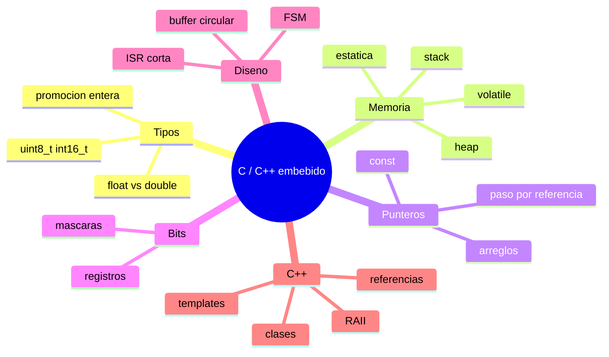

# 03 · C y C++ para sistemas embebidos

> **Resumen ejecutivo (60 s).** En firmware, C/C++ significa: **tipos de ancho fijo** (`uint8_t`), **operaciones de bits** para registros, **punteros** para buffers y periféricos, **`volatile`** para variables que cambian fuera del flujo normal (ISR/hardware), **memoria estática** (evitar `malloc` en el lazo principal) y **máquinas de estados** no bloqueantes. Tú vienes de Python: los puntos de choque son **tipos y overflow**, **punteros/arreglos**, **tiempos de vida (stack vs heap)** y **que nadie te avisa cuando lees fuera de límites**. Cada ejemplo de este módulo está en [`examples/c/`](../examples/c) y [`examples/cpp/`](../examples/cpp), y se compiló y ejecutó en PC (ver Control de calidad en el README).



---

## 1. Tipos, variables, operadores y conversiones

| Tipo (`<stdint.h>`) | Tamaño | Rango | Uso típico |
|---|---|---|---|
| `uint8_t` / `int8_t` | 8 bits | 0…255 / −128…127 | Bytes, registros, flags |
| `uint16_t` / `int16_t` | 16 bits | 0…65535 / −32768…32767 | Lecturas ADC, RPM |
| `uint32_t` / `int32_t` | 32 bits | 0…4.29·10⁹ | Timestamps ms (`millis()`), contadores |
| `float` | 32 bits (IEEE-754, usualmente) | ~7 dígitos | Temperaturas; en MCU sin FPU es lento |
| `double` | 64 bits (en AVR suele ser 32) | ~15 dígitos | Cálculos en PC |

- `int` **no tiene tamaño fijo** (16 bits en AVR, 32 bits en ARM/PC). Por eso se usan los tipos de `<stdint.h>` para datos de hardware y protocolos.
- **Promoción entera:** en expresiones, `uint8_t`/`int8_t` se promueven a `int`. `uint8_t a = 200, b = 100; int s = a + b;` → 300 (no 44). Al guardarlo en `uint8_t` sí se trunca (`44`).
- **Signo:** comparar `int` con `unsigned` convierte el negativo a unsigned enorme (fuente de bugs). Activa `-Wall -Wextra -Wconversion`.
- **División entera:** `7 / 2 = 3`; usa `7 / 2.0f` o convierte (`(float)7 / 2`).
- **Overflow:** *unsigned* hace wrap-around (definido); *signed* overflow es **comportamiento indefinido**.
- **Timers con desbordamiento:** `if ((uint32_t)(now - last) >= period)` funciona aunque `now` dé la vuelta (aritmética sin signo).
- Operadores: aritméticos `+ - * / %`, comparación `== != < >`, lógicos `&& || !` (cortocircuito), bit `& | ^ ~ << >>`, asignación compuesta `+= |= &= <<=`, ternario `?:`.
- Trampa: `=` vs `==`; `&` vs `&&`; `if (x & 0x01 == 0)` se evalúa como `x & (0x01 == 0)` (precedencia). Usa paréntesis.

## 2. Control de flujo, funciones y arreglos

```c
for (size_t i = 0; i < n; ++i) { ... }   // recorrer un arreglo
while (!(status & READY)) { }            // espera activa (busy-wait): evita sin timeout
switch (state) { case A: ... break; default: ... }
```
- **Funciones:** parámetros por valor (copia). Para modificar el llamador → puntero (C) o referencia (C++).
- **Arreglos:** `int a[5];` índices 0…4. El nombre decae a puntero al primer elemento al pasar a una función; **se pierde el tamaño** → pásalo aparte (`size_t n`). C **no** verifica límites.
- `sizeof a / sizeof a[0]` da el número de elementos solo en el ámbito donde `a` es arreglo, no en un parámetro.

## 3. Strings y estructuras
- Un *string* C es un arreglo de `char` terminado en `'\0'`. `char s[8] = "abc";` ocupa 8 bytes.
- Funciones: `strlen`, `strcmp`, `strncpy` (no siempre añade `\0`), `snprintf` (seguro con tamaño), `strtof`/`strtol` (conversión con detección de error). **Evita** `gets`, `strcpy`, `sprintf` sin límites.
- `struct` agrupa campos: ver `Measurement` en [`04_state_machine.c`](../examples/c/04_state_machine.c). Ojo con **padding/alineación** al enviar structs por red o CAN: no hagas `write(fd, &s, sizeof s)` esperando un formato estable; serializa campo a campo (o usa `__attribute__((packed))` conociendo el costo y la portabilidad).
- **Endianness:** ARM y x86 son little-endian; muchos protocolos/registros (I2C sensores, redes) usan big-endian. Serializa explícitamente.

## 4. Punteros, referencias y memoria

```c
int x = 10;
int *p = &x;    // p guarda la direccion de x
*p = 20;        // x vale 20 (desreferenciar)
```
- **Puntero nulo:** `NULL` (C) / `nullptr` (C++); verifica antes de desreferenciar.
- **Aritmética de punteros:** `p + 1` avanza `sizeof(*p)` bytes.
- **Punteros a hardware:** `#define GPIOA_ODR (*(volatile uint32_t *)0x40020014u)` (dirección de ejemplo; **depende del MCU**, se toma del datasheet o del CMSIS).
- **`const`:** `const int *p` (dato de solo lectura), `int *const p` (puntero fijo), `const int *const p` (ambos). En embebido, `const` en globales suele dejarlos en Flash (ahorra RAM).
- **C++ referencias:** `void f(int &x)` es un alias no nulo. `const T&` evita copias.
- **Paso por valor vs referencia:** ver [`01_sensor_classes.cpp`](../examples/cpp/01_sensor_classes.cpp): `by_value` no cambia el original; `by_ref`/`by_ptr` sí.

### Stack, heap y memoria estática

| Región | Qué vive ahí | Ciclo de vida | Riesgo |
|---|---|---|---|
| **Estática/global** (`.data`, `.bss`) | Variables globales y `static` | Todo el programa | Uso de RAM fijo (bueno para embebido) |
| **Stack** | Variables locales, direcciones de retorno | Hasta que la función retorna | *Stack overflow* (recursión, arreglos locales grandes); devolver puntero a local (dangling) |
| **Heap** | `malloc/free`, `new/delete` | Hasta liberar | Fragmentación, fugas, tiempos no deterministas, fallo de asignación |

Regla embebida: **asigna todo estáticamente o al inicio**; evita `malloc` en el lazo periódico. En Linux/PC sí es habitual.

## 5. `static`, `enum`, `struct`, `const`
- `static` en una función local: conserva valor entre llamadas (`static uint32_t seq;`). `static` a nivel de archivo: visibilidad limitada a ese `.c` (encapsulamiento).
- `enum`: constantes con nombre (`typedef enum { ST_INIT, ST_RUN } State;`). Mejor que "números mágicos".
- `const`/`constexpr` en lugar de `#define` cuando sea posible (tipado); macros con paréntesis: `#define SQUARE(x) ((x)*(x))`, y cuidado con efectos secundarios (`SQUARE(i++)`).

## 6. Operadores de bits y máscaras (registros)

| Operación | Expresión | Ejemplo |
|---|---|---|
| Poner bit n en 1 | `reg \|= (1u << n)` | `reg \|= 1u<<3` |
| Poner bit n en 0 | `reg &= ~(1u << n)` | `reg &= ~(1u<<3)` |
| Invertir bit n | `reg ^= (1u << n)` | |
| Leer bit n | `(reg >> n) & 1u` | |
| Escribir un campo | `reg = (reg & ~MASK) \| (val << SHIFT)` | ver `05_bit_manipulation.c` |

- `>>` sobre valores **con signo** negativos es dependiente de la implementación (en la práctica, aritmético). Prefiere `uint`.
- `1 << 31` con `int` es UB; usa `1u << n` o `1UL`.
- Ver [`05_bit_manipulation.c`](../examples/c/05_bit_manipulation.c): salida verificada (`0x80`, `0xD0`, `0xD4`, `0xD5`, `0x55`; `raw=401 → 25.0625 °C`; `1850 rpm` → LE `3A 07`, BE `07 3A`).

## 7. `volatile`: qué significa y qué NO garantiza

**Qué significa:** le dice al compilador que el valor **puede cambiar sin que el código lo modifique** (registro de hardware, variable modificada en ISR). El compilador **no puede optimizar** ni cachear lecturas/escrituras: cada acceso escrito en el código se realiza.

```c
volatile uint8_t data_ready = 0;         // la ISR lo pone en 1
void UART_IRQHandler(void) { data_ready = 1; }
int main(void) { while (!data_ready) { } /* sin volatile el compilador podria convertirlo en un bucle infinito */ }
```

**Qué NO garantiza:**
- **No es atomicidad.** Un `volatile uint32_t` en un MCU de 8/16 bits puede leerse "a mitades" si una ISR lo cambia (dato roto). Protege con sección crítica (deshabilitar interrupciones brevemente) o tipos atómicos.
- **No es sincronización entre hilos** (en Linux con hilos usa mutex/`std::atomic`).
- **No ordena** accesos entre distintas ubicaciones para la CPU/caché (memory barriers).
- No hace la variable "segura" para ISR/main compartidos si son estructuras.

## 8. Manejo de errores y validación de entradas
- C no tiene excepciones: se usan **códigos de retorno** (`bool`/enum) y parámetros de salida (`float *out`). Ver `average()` en [`06_buggy_code.c`](../examples/c/06_buggy_code.c).
- **Valida todo dato externo:** longitud, rango, checksum, formato (ver parser). No confíes en la UART ni en un sensor.
- C++ añade excepciones (`throw`), pero en firmware suelen deshabilitarse (`-fno-exceptions`); usa `std::optional`, `enum class` de error o `expected`-like.
- `assert` para invariantes de programador; **no** para manejar errores del mundo real.
- `errno` + `strtol`/`strtof` con puntero `end` para detectar conversiones fallidas.

## 9. Diferencias relevantes entre C y C++

| Aspecto | C | C++ |
|---|---|---|
| Paradigma | Procedimental | Multiparadigma (clases, templates, RAII) |
| Referencias | No (solo punteros) | Sí (`T&`) |
| Cadenas | `char[]` | `std::string` (usa heap) o `char[]` |
| Memoria | `malloc/free` | `new/delete`, smart pointers, RAII |
| Errores | Códigos de retorno | Excepciones (a menudo desactivadas en embebido) |
| `bool` | `<stdbool.h>` | Integrado |
| Sobrecarga de funciones | No | Sí |
| Compatibilidad | — | C++ no es superconjunto exacto de C (p. ej. `void*` implícito, VLAs, `restrict`) |
| Enlazado | Símbolos sin decoración | Name mangling (usa `extern "C"` para mezclar) |

Regla práctica en MCU: usa C++ *moderado* (clases, `constexpr`, templates estáticos, RAII) y evita heap dinámico, excepciones y RTTI.

## 10. Compilación, linking y errores comunes

```
fuente.c --(preprocesador: #include, #define)--> --(compilador)--> objeto.o --(linker)--> ejecutable
```
- `gcc -std=c11 -Wall -Wextra -O2 -o prog prog.c` (PC). Cross-compilación: `arm-none-eabi-gcc` (STM32), toolchain Xtensa (ESP32), `avr-gcc` (Arduino Uno).
- Errores típicos:
  - `undefined reference to 'foo'` → **linker**: definiste el prototipo pero no la función, o falta `-lm`/un `.c`.
  - `implicit declaration of function` → falta `#include` o prototipo.
  - Definir una variable global en un `.h` incluido en varios `.c` → *multiple definition* (usa `extern` en el `.h` y define en un `.c`).
  - *Include guards* (`#ifndef X_H`) o `#pragma once` para evitar inclusión múltiple.
  - Warnings que hay que tratar como errores: `-Wall -Wextra -Werror` en CI.
  - Sanitizers en PC: `-fsanitize=address,undefined` cazan desbordes y UB.

## 11. Conceptos de programación embebida
- **Sin sistema operativo (bare-metal)** vs **RTOS** (FreeRTOS, Zephyr) vs **Linux**.
- **ISR (rutina de interrupción):** corta; solo marca banderas/copia datos a un buffer; el procesamiento va al lazo principal. No `printf`/`malloc` dentro.
- **Lazo cooperativo:** `while(1){ leer; procesar; enviar; }` sin `delay()` bloqueante: usa `millis()`/timers.
- **Watchdog:** reinicia si el software se cuelga (ver módulo 06).
- **Determinismo y tiempo:** medir el peor caso, no el promedio.
- **Memoria:** `const` a Flash, buffers estáticos, cuidado con la pila.
- **Portabilidad al hardware:** separar la capa de acceso al hardware (HAL) de la lógica (probable en PC, como los ejemplos).

> **Ojo con las APIs de plataforma.** `Serial.print`, `digitalRead`, `millis()` son de **Arduino**; `HAL_UART_Transmit` de **STM32 HAL**; `uart_write_bytes` de **ESP-IDF**; `pico/stdlib.h` del **Pico SDK**. No pertenecen al estándar de C/C++. Cada ejemplo lo indica.

---

## 12. Programas del módulo (bloque por bloque)

| # | Archivo | Qué hace | Entrada → Salida | Complejidad | Errores potenciales |
|---|---|---|---|---|---|
| 1 | [`01_temperature_stats.c`](../examples/c/01_temperature_stats.c) | Clasifica temperaturas (NORMAL/WARNING/CRITICAL/INVALID) | `float` → enum | O(1) por muestra | Umbrales fijos; 85.0 puede ser valor de reset |
| 2 | mismo | Promedio, mínimo y máximo | arreglo + `n` → `TempStats` | O(n) tiempo, O(1) memoria | División por 0 si no hay válidas (se controla) |
| 3 | mismo | Detección de inválidos: NaN, −127, fuera de rango | `float` → `bool` | O(1) | Comparar `float` con `==` (aquí es un centinela exacto) |
| 4 | [`02_circular_buffer.c`](../examples/c/02_circular_buffer.c) | Buffer circular con sobrescritura | `push`/`pop` | O(1) | Carrera ISR/main sin protección |
| 5 | [`03_serial_parser.c`](../examples/c/03_serial_parser.c) | Parser `$id,valor*CS` por máquina de estados | byte a byte → mensaje | O(n) | Desbordamiento de buffer, checksum, resincronización |
| 6 | [`04_state_machine.c`](../examples/c/04_state_machine.c) | FSM: INIT→SELF_TEST→SAMPLING→VALIDATE→TRANSMIT (+DEGRADED, NO_LINK, FAULT, SAFE) | ticks → transiciones | O(1) por tick | Estados sin salida, bloqueos |
| 7 | mismo | `struct Measurement` con `quality` | — | — | Padding si se serializa crudo |
| 8 | [`05_bit_manipulation.c`](../examples/c/05_bit_manipulation.c) | Bits/máscaras/campos, empaquetado LE/BE, DS18B20 | — | O(1) | `1<<31`, precedencia, endianness |
| 9 | [`06_buggy_code.c`](../examples/c/06_buggy_code.c) | 5 bugs comentados y su corrección | — | — | Ver abajo |

**Salidas verificadas** (compilado con `zig cc -std=c11 -Wall -Wextra`, sin advertencias):
```
01: validas=6 invalidas=3 promedio=88.33 min=78.50 max=110.20
02: sobrescritas=2, elementos=4 ; pop: 30 40 50 60
03: OK  id=T1 valor=85.25
06: promedio=21.67 ; etiqueta ok=1 -> sensor-7 ; ok=0 (truncada) -> sensor-
```

### Código defectuoso (resumen) — versión completa en `06_buggy_code.c`
```c
float average(int *data, int n) {
    int sum;                       // BUG 1: sin inicializar
    for (int i = 0; i <= n; i++)   // BUG 2: <= lee fuera de limites
        sum += data[i];
    return sum / n;                // BUG 3: division entera (pierde decimales) y n==0
}
char *make_label(int id) {
    char buf[8];
    sprintf(buf, "sensor-%d", id); // BUG 4: overflow con ids grandes
    return buf;                    // BUG 5: puntero a memoria local (dangling)
}
```
Corrección: inicializar (`long sum = 0`), `i < n`, división en `float` y validar `n > 0`, `snprintf` con tamaño, y que el **llamador** provea el buffer.

### El parser, por bloques (`03_serial_parser.c`)
1. **Estados** `WAIT_START → IN_BODY → CS_HI → CS_LO`. Consume 1 byte por llamada (adecuado para una ISR o lectura no bloqueante).
2. **`IN_BODY`:** acumula el cuerpo y el XOR; un `$` inesperado resincroniza (mensajes cortados); si el cuerpo excede el tamaño, descarta.
3. **`CS_HI/CS_LO`:** convierte dos dígitos hex; compara el checksum.
4. **`decode_body`:** `strchr` separa id y valor, `strtof` con puntero `end` detecta basura (`"abc"` falla).
5. Resultado: solo el mensaje con checksum correcto y valor numérico se acepta.

### La FSM, por bloques (`04_state_machine.c`), salida real
```
t=5  SAMPLING  -> VALIDATE  (valor=300.0 q=0)
t=6  VALIDATE  -> DEGRADED  (valor=300.0 q=2)   # lectura absurda: se marca BAD y sigue
t=19 TRANSMIT  -> NO_LINK   (valor=85.0 q=0)    # 2 fallos de envio seguidos
t=22 NO_LINK   -> SAMPLING  (valor=85.0 q=0)    # el enlace vuelve
```
Diagrama: [`diagrams/state_machine_firmware.mmd`](../diagrams/state_machine_firmware.mmd) y [`diagrams/archify/lifecycle_firmware.html`](../diagrams/archify/lifecycle_firmware.html).

### C++ (`01_sensor_classes.cpp`)
`RingBuffer<T,N>` (plantilla, memoria estática), `std::optional` para lecturas inválidas, `const T&`, RAII (`PortGuard`), paso por valor/referencia/puntero. Salida verificada: `a=1 b=99 c=99`; el destructor imprime "cierra" al final aunque haya retornos tempranos.

### Arduino
[`arduino_temp_monitor.ino`](../examples/cpp/arduino_temp_monitor/arduino_temp_monitor.ino) requiere el framework Arduino y las bibliotecas OneWire/DallasTemperature. **No se ejecutó en hardware en este repositorio.**

---

## 13. Errores frecuentes y preguntas trampa
1. `sizeof` de un arreglo pasado como parámetro → tamaño del puntero, no del arreglo.
2. `char c = 200;` (con `char` firmado, −56).
3. Comparar `float` con `==` (usa tolerancia; excepto centinelas exactos).
4. `uint8_t i; for (i = 0; i < 256; i++)` → bucle infinito.
5. Modificar un literal de cadena (`char *s = "abc"; s[0]='x'`) → UB.
6. Usar variable local de ISR sin `volatile`; o creer que `volatile` = atómico.
7. `#define` con efectos secundarios; falta de paréntesis.
8. Trampa: "¿`i++` o `++i`?" en C da igual para enteros; en C++ con iteradores `++i` puede evitar una copia.
9. Trampa: "¿Puedo llamar a `printf` dentro de una ISR?" → No (lento, no reentrante, puede bloquear).
10. Trampa: "¿`malloc` en un MCU?" → Posible, pero riesgo de fragmentación; en el lazo periódico, no.

## 14. Ejercicios y verificación
Ver [`exercises/programming.md`](../exercises/programming.md). **Verifica en datasheet/HAL:** direcciones de registros, tamaño de `int`, alineación, ancho de `float`, soporte de FPU.
