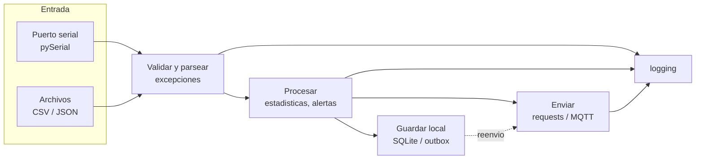

# 04 · Python para adquisición, gateways y servicios

> **Resumen ejecutivo (45 s).** Python es tu terreno fuerte; en la prueba lo que se evalúa es (1) **manejo de datos de sensores** (validar, filtrar, estadísticas), (2) **robustez**: excepciones, timeouts, reintentos, logging, (3) **E/S**: archivos CSV/JSON, puerto serial (pySerial), HTTP (requests), y (4) la diferencia entre un **script** (corre y termina) y un **servicio** (corre para siempre, sobrevive a fallos, registra y reinicia). Los 10 programas de este módulo están en [`examples/python/`](../examples/python) y se ejecutaron en Python 3.13 (sin hardware, usando simuladores).



---

## 1. Fundamentos que se preguntan

| Tema | Lo esencial | Trampa |
|---|---|---|
| Tipos | `int` (sin límite), `float` (64 bits), `str`, `bool`, `None`, `bytes` | `bool` es subclase de `int` (`True + 1 == 2`) → al validar tipos excluye `bool` |
| Control | `if/elif/else`, `for`, `while`, `break/continue`, `for…else` | Modificar una lista mientras se itera |
| Colecciones | `list` (ordenada, mutable), `tuple` (inmutable), `dict` (clave→valor), `set` (únicos, sin orden) | Valores por defecto mutables: `def f(x, acc=[])` → compartido entre llamadas |
| Comprehensions | `[t for t in temps if t < 100]`, `{k: v for ...}`, generadores `(… for …)` (perezosos) | Comprehensions con demasiada lógica |
| Funciones | Parámetros posicionales/nombrados/por defecto, `*args/**kwargs`, retorno múltiple (tupla) | Argumentos mutables por defecto |
| Excepciones | `try/except/else/finally`, `raise … from e`, excepciones propias | `except:` pelado oculta errores (incluye `KeyboardInterrupt` si es `BaseException`) |
| Archivos | `with open(...) as f:` cierra siempre; `encoding="utf-8"`; `newline=""` para CSV | Olvidar cerrar, rutas relativas al *cwd* |
| Módulos | `import`, `if __name__ == "__main__":`, paquetes con `__init__.py` | Nombrar tu archivo como un módulo estándar (`serial.py`, `json.py`) |
| Entornos virtuales | `python -m venv .venv` · `source .venv/bin/activate` (Windows: `.venv\Scripts\activate`) · `pip install -r requirements.txt` · `pip freeze > requirements.txt` | Instalar globalmente con `sudo pip` (rompe el sistema) |

**Valores por defecto mutables (clásico de entrevista):**
```python
def add(x, acc=[]):   # MAL: la lista se crea UNA vez
    acc.append(x); return acc
def add_ok(x, acc=None):
    acc = [] if acc is None else acc
    acc.append(x); return acc
```

**Comparación `is` vs `==`:** `==` compara valor, `is` compara identidad (usa `is None`).

**Redondeo y `float`:** `0.1 + 0.2 != 0.3`. Compara con tolerancia (`math.isclose`) y no uses `float` para dinero.

## 2. Clases y dataclasses
```python
from dataclasses import dataclass
from datetime import datetime, timezone

@dataclass(frozen=True)          # frozen -> inmutable; genera __init__, __repr__, __eq__
class Measurement:
    device_id: str
    sensor: str
    value: float
    unit: str
    ts: datetime
    quality: str = "good"
```
`dataclasses.asdict(m)` → dict listo para `json.dumps` (ojo: `datetime` no es serializable por defecto → `.isoformat()`).

## 3. JSON, CSV y serialización

| Formato | Ventajas | Desventajas | Uso |
|---|---|---|---|
| **JSON** | Legible, universal, HTTP/MQTT | Más grande, sin tipos de fecha ni bytes | Telemetría, APIs |
| **CSV** | Excel/pandas, simple | Sin tipos, sin anidamiento | Exportaciones, históricos |
| **Binario** (`struct`, MessagePack, protobuf) | Compacto y rápido | No legible | Tramas CAN/serial, enlaces de bajo ancho de banda |
| **SQLite** | Transaccional, sin servidor, ideal para buffer local | Un escritor a la vez | Cola *store & forward* |

`struct` para tramas binarias: `struct.unpack("<HhB", data)` → little-endian `uint16, int16, uint8`.

## 4. Series de tiempo (procesamiento)
- **Timestamps:** almacena en **UTC** (ISO-8601 con `Z` o `+00:00`), convierte a hora local solo al mostrar (Guatemala es UTC−6, sin horario de verano; **verifica** con la base de zonas horarias `zoneinfo`).
- **Ventana móvil** con `collections.deque(maxlen=N)` (ver `02_sensor_statistics.py`).
- **Mediana móvil** elimina picos aislados; **media móvil** suaviza ruido gaussiano (pero retrasa la señal).
- **Detección de valores atípicos:** z-score o rango intercuartil; **con pocas muestras el z-score es poco fiable**.
- **Remuestreo/alineación:** los sensores no muestrean sincronizados; se alinean por tiempo (pandas `resample`).
- **Huecos:** distingue "sin datos" de "cero"; usa `None`/`NaN`, no un `0` inventado.
- pandas/numpy son útiles pero pesados para MCU/gateways pequeños; con librería estándar se hace lo básico.

## 5. Logging y diagnóstico
`print` no tiene niveles ni timestamps ni rotación. Ver [`10_logging_errors.py`](../examples/python/10_logging_errors.py):
- Niveles: `DEBUG < INFO < WARNING < ERROR < CRITICAL`.
- `log.exception()` dentro de `except` incluye el *traceback*.
- `RotatingFileHandler` limita el tamaño; en Linux con systemd basta escribir a stdout y leer con `journalctl`.
- Usa argumentos perezosos (`log.debug("x=%r", x)`) en lugar de f-strings en rutas calientes.

## 6. Scripts vs servicios de larga duración

| Aspecto | Script | Servicio |
|---|---|---|
| Vida | Termina | Meses sin reiniciar |
| Errores | Se detiene y ves el traceback | **Nunca debe morir** por un dato malo; captura, registra, continúa |
| Recursos | Se libera al salir | Fugas de memoria/archivos/sockets se acumulan |
| Reinicio | Manual | `systemd` (`Restart=on-failure`), watchdog |
| Configuración | Argumentos | Archivo/variables de entorno; recarga |
| Señales | Ctrl+C | `SIGTERM`: cerrar limpio (vaciar buffers, cerrar puertos) |
| Logs | Consola | Archivo/journal rotados |
| Tiempo | `time.sleep` | `time.monotonic()` para intervalos; NTP para hora |
| Concurrencia | Secuencial | Hilos/`asyncio` para E/S; cola entre lector y enviador |

Esqueleto de servicio robusto (patrón usado por los ejemplos):
```python
import logging, signal, time
running = True
def stop(*_): global running; running = False           # SIGTERM/SIGINT -> salida ordenada
signal.signal(signal.SIGTERM, stop); signal.signal(signal.SIGINT, stop)

def main():
    log = logging.getLogger("gateway")
    while running:
        try:
            ciclo()                                       # leer -> validar -> guardar -> enviar
        except Exception:                                 # un dato malo no debe tumbar el servicio
            log.exception("error en el ciclo")
            time.sleep(1)                                 # evita un bucle de errores a 100 % de CPU
    log.info("cerrando limpio")
```
Servicio en producción: ver [`examples/linux/gateway.service`](../examples/linux/gateway.service).

Concurrencia mínima: **un hilo lee el puerto y encola**, otro **envía**; se comunican con `queue.Queue` (segura entre hilos). El GIL no impide el paralelismo de E/S (los hilos se liberan al esperar), pero sí el de CPU pura.

---

## 7. Programas del módulo (con salidas verificadas)

Todos: Python 3.13, ejecutados en Windows; solo [`05`](../examples/python/05_serial_reader.py) requiere `pyserial` y [`06`](../examples/python/06_post_to_api.py) requiere `requests`. Instalar: `pip install pyserial requests`.

| # | Archivo | Qué hace |
|---|---|---|
| 1 | [`01_filter_out_of_range.py`](../examples/python/01_filter_out_of_range.py) | Separa lecturas válidas y rechazadas con el motivo |
| 2 | [`02_sensor_statistics.py`](../examples/python/02_sensor_statistics.py) | Estadísticas, media móvil, detección de picos |
| 3 | [`03_read_csv.py`](../examples/python/03_read_csv.py) | Lee CSV, descarta filas malas, resume por sensor |
| 4 | [`04_parse_json.py`](../examples/python/04_parse_json.py) | Parsea y valida mensajes JSON |
| 5 | [`05_serial_reader.py`](../examples/python/05_serial_reader.py) | Lee líneas JSON de un puerto serial (demo `loop://`) |
| 6 | [`06_post_to_api.py`](../examples/python/06_post_to_api.py) + [`mock_api_server.py`](../examples/python/mock_api_server.py) | POST con reintentos, backoff e idempotencia |
| 7 | [`07_timeout_detector.py`](../examples/python/07_timeout_detector.py) | ONLINE/OFFLINE por silencio |
| 8 | [`08_store_and_forward.py`](../examples/python/08_store_and_forward.py) | Cola SQLite y reenvío en orden |
| 9 | [`09_alerts_thresholds.py`](../examples/python/09_alerts_thresholds.py) | Alertas con confirmación e histéresis |
| 10 | [`10_logging_errors.py`](../examples/python/10_logging_errors.py) | Logging con rotación y `exception()` |

### Programa 1 — filtrar fuera de rango
**Paso a paso:** `classify_reading` prueba en orden `None` → tipo → NaN/inf → centinela (−127) → rango. El orden importa: `math.isnan("abc")` lanzaría `TypeError`, por eso el tipo se valida antes. `filter_readings` hace una pasada O(n).
```
validas   : [78.5, 80.1, 96.3, 85.0]
rechazadas:  -127.0 -> sensor desconectado (DS18B20) | None -> sin dato | 'abc' -> tipo invalido: str
             nan -> NaN/inf | 200.0 -> fuera de rango [-40.0, 150.0]
```
*Observa* que 85.0 pasa: no se puede saber solo por valor si es el "reset" del DS18B20 (ver módulo 02).

### Programa 2 — estadísticas
`compute_stats` devuelve `None` si no hay datos (evita `ZeroDivisionError`/`StatisticsError`). `deque(maxlen=3)` implementa la ventana sin crecer.
```
Stats(n=8, mean=81.5625, median=79.9, stdev=5.1237..., min=78.0, max=95.0)
media movil(3): [78.0, 78.75, 79.2, 79.8, 80.1, 85.07, 85.13, 84.9]
picos (indices): [5]
```

### Programa 3 — CSV
`csv.DictReader` mapea columnas por nombre; el generador entrega filas ya convertidas y **cuenta/reporta las malas por `stderr`** (líneas 5 y 9 del archivo de ejemplo). `defaultdict(list)` agrupa por (dispositivo, sensor).
```
bomba02    vib_rms      n= 3 min=   2.10 max=   7.90 prom=   4.10
tractor01  rpm          n= 2 min=1850.00 max=1862.00 prom=1856.00
tractor01  temp_motor   n= 4 min=  78.50 max=  80.40 prom=  79.38
```

### Programa 4 — JSON
Excepción propia `InvalidMessage`; valida presencia, tipos (excluyendo `bool`), `quality`, y timestamp ISO (`Z`→`+00:00`). Salida: un mensaje `OK` y tres `MAL` (falta `ts`, JSON inválido, timestamp inválido).

### Programa 5 — serial
`serial.serial_for_url("loop://")` permite probar sin hardware; con un puerto real usa `/dev/ttyUSB0` (Linux) o `COM3` (Windows). `readline()` con `timeout=1.0` devuelve `b''` al vencer → se emite `None` para que el llamador use el detector de silencio (programa 7). El texto de arranque (`boot v1.2`) se descarta como línea inválida.

### Programa 6 — API REST
Lo importante: **timeout siempre**, **backoff exponencial con jitter**, **no reintentar 4xx**, y **idempotencia** con `(device_id, seq)`. Con el servidor de prueba iniciado con `--fail-first 2`:
```
intento 1: servidor respondio 503
intento 2: servidor respondio 503
resultado: {'accepted': 1, 'duplicates': 0}
reenvio  : {'accepted': 0, 'duplicates': 1} <- idempotente
```

### Programa 7 — timeout
Reloj inyectable (`clock=`) para probar sin esperar; `time.monotonic()` en producción. Salida: `tractor01: ONLINE`, `bomba02: ONLINE`, `tractor01: OFFLINE (silencio 6.0 s > 5.0 s)`, `bomba02: OFFLINE`, luego `tractor01: ONLINE` al volver.

### Programa 8 — guardar durante desconexión
Escribe **primero** en SQLite (`INSERT` + `commit`), envía en lotes y **borra solo tras confirmación**; conserva orden por `id` autoincremental y el `ts` original.
```
pendientes sin red: 7 | enviados: 0
enviados al volver la red: 7 | pendientes: 0
seq recibidos en orden: [1, 2, 3, 4, 5, 6, 7]
```

### Programa 9 — alertas
Confirmación de 3 muestras (evita falsos positivos por ruido) e histéresis de 3 °C (evita "rebote" de alarma). Con la serie de ejemplo: `RAISE` en la muestra 5 (96, 97, 98) y `CLEAR` en la 9 (91.9 < 92).

### Programa 10 — logging
Consola a nivel INFO, archivo con `DEBUG`, rotación 200 kB × 3. `log.exception` imprime el traceback del `float('abc')`.

---

## 8. Comunicación serial con pySerial — apuntes rápidos
```python
import serial                               # pip install pyserial  (el paquete se importa como "serial")
with serial.Serial("/dev/ttyUSB0", 115200, timeout=1) as ser:
    ser.write(b"AT\r\n")                    # bytes, no str
    line = ser.readline().decode(errors="replace").strip()
```
- `timeout=None` bloquea para siempre; `timeout=0` no bloquea. `ser.in_waiting` = bytes disponibles.
- Cada `open()`/`close()` en Arduino con DTR **reinicia** la placa (algunas): espera ~2 s tras abrir.
- Errores: `SerialException` (puerto ocupado / sin permisos → grupo `dialout`).
- `read(n)` ≠ `readline()`; `readline()` depende de `\n`.

## 9. HTTP con `requests` — apuntes rápidos
- `requests.get(url, params={...}, timeout=5)`; `.raise_for_status()` lanza en 4xx/5xx; `.json()` decodifica.
- Usa `requests.Session()` para reutilizar conexiones y poner cabeceras (Authorization).
- Códigos: 200 OK, 201 Created, 400 mal formado, 401/403 auth, 404, 409 conflicto, 422 validación, 429 límite, 500 error, 503 no disponible.
- **Verifica certificados** (TLS): no uses `verify=False` en producción.

## 10. Errores frecuentes y preguntas trampa
1. Sin `timeout` en `requests`/`serial` → programa colgado.
2. `except Exception: pass` → errores silenciosos.
3. Usar `time.time()` para medir intervalos (salta si cambia el reloj) → `time.monotonic()`.
4. Guardar timestamps sin zona horaria o en hora local.
5. Confundir `bytes` y `str` en la serial (`b"OK"` vs `"OK"`).
6. Reintentar sin backoff → tormenta de peticiones cuando el servidor se recupera.
7. Reintentar sin idempotencia → duplicados.
8. No cerrar archivos/puertos (usa `with`).
9. Trampa: "¿Diferencia entre lista y tupla?" mutable/inmutable, tuplas hashables → claves de dict.
10. Trampa: "¿Por qué `is` con `None`?" `None` es singleton; `==` puede sobrecargarse.
11. Trampa: "¿Cómo evitas perder datos cuando cae la red?" outbox persistente + reintentos + idempotencia.

## 11. Ejercicios
[`exercises/programming.md`](../exercises/programming.md). **Verifica:** versión de Python del gateway, dependencias y su licencia, soporte de tu SBC.
