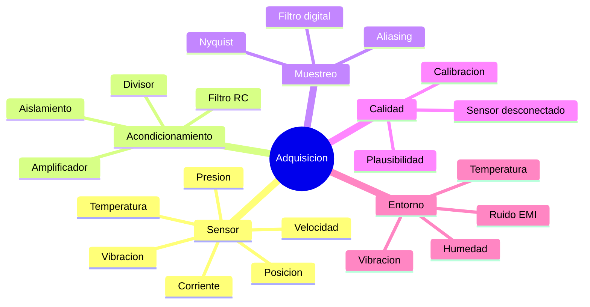

# 05 · Sensores y adquisición de datos

> **Resumen ejecutivo (45 s).** Un buen sistema de adquisición no solo *lee* números: **elige el sensor según el entorno**, **acondiciona y muestrea correctamente** (Nyquist, anti-aliasing), **calibra**, **valida plausibilidad** y **marca la calidad** del dato. Distingue **exactitud** (cercanía al valor real), **precisión/repetibilidad** (dispersión de medidas repetidas) y **resolución** (mínimo cambio detectable). Un sensor desconectado nunca debe parecer una lectura válida.



## 1. Catálogo de sensores para maquinaria agrícola

| Magnitud | Sensores comunes | Salida típica | Notas de selección | Trampas |
|---|---|---|---|---|
| **Temperatura** | DS18B20 (digital 1-Wire), termistor NTC, RTD PT100/PT1000, termopar tipo K, LM35 | Digital / resistencia / µV / mV | DS18B20: fácil y multipunto, rango limitado (verifica −55…+125 °C); termopar K: altas temperaturas (escape), requiere compensación de unión fría y amplificador; PT100: exacto y estable, más costoso | Autocalentamiento de la NTC, tiempo de respuesta lento si está dentro de vaina, mala fijación térmica |
| **Presión** | Transductores piezorresistivos (0.5–4.5 V ratiométrico, 4–20 mA), presostatos | Analógica o 4–20 mA | Elige rango con margen (p. ej. trabajar por debajo del ~75 % del fondo de escala), compatibilidad de fluido (aceite, agua) | Picos de presión (usa amortiguador), sensor sumergido en fluido incompatible |
| **Vibración** | Acelerómetros MEMS (I2C/SPI), piezoeléctricos IEPE, sensores de velocidad de vibración | Digital / analógica | MEMS económico para tendencia; IEPE para análisis serio de rodamientos (mayor ancho de banda) | Montaje flojo distorsiona; ancho de banda insuficiente |
| **Corriente** | Resistencia *shunt* + amplificador, sensor Hall (ACS712 y similares), transformador de corriente (CT) | mV / V / mA | Hall: aislado; CT: solo AC; shunt: preciso pero no aislado | Offset del Hall, saturación, ruido de conmutación (VFD) |
| **Velocidad (RPM)** | Sensor Hall de efecto, inductivo, encoder óptico, señal de la ECU (CAN) | Pulsos (frecuencia) | Contar flancos con interrupción o timer de captura | Rebotes, ruido que agrega pulsos falsos, polvo |
| **Posición** | Potenciómetro, LVDT, encoder, sensor Hall angular, inclinómetro | Analógica / pulsos / digital | Consideración de la vida útil mecánica | Desgaste, juego mecánico |
| **Nivel / humedad** | Ultrasonido, capacitivo, flotador; higrómetro capacitivo (BME280/SHT31) | Digital / analógica | El agua condensada afecta electrónica descubierta | Condensación, lodo |
| **Ubicación** | GPS/GNSS | UART (NMEA) | Cielo abierto; alimentación y antena | Cañaverales/edificios degradan la señal |

*Rangos y exactitudes: **verifica en el datasheet del modelo exacto**. Aquí se dan órdenes de magnitud didácticos.*

## 2. Analógicos vs digitales

| | Analógico | Digital |
|---|---|---|
| Ventajas | Simple, rápido, barato | Inmune al ruido en el cable, calibrado de fábrica, ID único, multi-sensor por bus |
| Desventajas | Sensible a ruido, necesita ADC y calibración, cable largo problemático | Velocidad/tiempo de conversión fijo, dependencia del protocolo, más complejo el firmware |
| Uso | Señales rápidas (vibración), lazos 4–20 mA | Temperatura, presión, IMU con I2C/SPI/1-Wire |

## 3. Exactitud, precisión, resolución, repetibilidad

```
        Objetivo = valor real                  Alta precision, baja exactitud (sesgo)
        ·  ·                                         ·  ·
         ·⊙·   Alta exactitud y precision           ·  ·  ····  <- agrupadas pero lejos del centro
        ·  ·
```

| Término | Definición | Ejemplo |
|---|---|---|
| **Exactitud** (accuracy) | Diferencia entre lo medido y el valor real | ±0.5 °C |
| **Precisión / repetibilidad** | Dispersión de medidas repetidas en iguales condiciones | σ = 0.05 °C |
| **Resolución** | Mínimo cambio que el sistema reporta | 0.0625 °C (12 bits DS18B20) |
| **Sensibilidad** | Cambio de salida por unidad de entrada | 10 mV/°C (LM35) |
| **Linealidad** | Cuánto se aleja la respuesta de una recta | |
| **Deriva (drift)** | Cambio lento con tiempo/temperatura | |
| **Histéresis** | Diferencia al subir vs bajar | |

Un sensor puede tener **resolución de 0.01 °C y exactitud ±1 °C**: se ven cambios pequeños pero el valor absoluto puede estar desviado.

## 4. Calibración
- **Un punto (offset):** `T_real = T_medida + b`. Útil si solo hay desviación fija.
- **Dos puntos (offset + ganancia):** con puntos de referencia (hielo 0 °C, agua en ebullición; corregida por altitud) se calcula `m` y `b` de `y = m·x + b`.
- **Ecuación de calibración en firmware/gateway** con coeficientes por sensor, **guardados con la fecha** y responsable. Recalibrar periódicamente.
- Un instrumento de referencia **trazable** es el criterio profesional. *(Los procedimientos formales se rigen por normas del laboratorio; esto es solo fundamentos.)*

**Ejemplo (calibración de dos puntos):** un sensor lee 0.8 °C en hielo (real 0.0) y 99.2 °C en agua hirviendo (real 100.0, supuesto nivel del mar). `m = (100−0)/(99.2−0.8) = 1.0163`, `b = 0 − 1.0163·0.8 = −0.813`. Ahora `T = 1.0163·x − 0.813`; comprobación: `x = 99.2 → 100.0` ✓.

## 5. Muestreo, aliasing y filtrado
- **Nyquist:** `fs > 2·f_max`. Ejemplo: vibración con contenido útil hasta 2 kHz → `fs ≥ 4 kHz` (práctica: 5–10 kHz).
- **Aliasing:** una señal de 7 kHz muestreada a 10 kHz aparece como |10−7| = 3 kHz. No se puede deshacer en digital → **filtro anti-aliasing analógico antes del ADC**.
- **Temperatura:** cambia lento (constantes de tiempo de segundos–minutos) → 1 muestra/s sobra; muestrear a 1 kHz solo agrega ruido y consumo.
- **Filtros digitales:** media móvil (ruido blanco), **mediana** (picos aislados), **EMA** `y = α·x + (1−α)·y_prev` (barata, sin buffer), pasa-bajas Butterworth.
- **Sobremuestreo y promedio:** promediar N muestras reduce el ruido aleatorio ~1/√N.
- **Rebote (debounce)** en entradas digitales de contactos mecánicos: por software (tiempo mínimo estable) o hardware (RC + Schmitt).

## 6. Conversión de unidades (y errores clásicos)
| De → a | Fórmula |
|---|---|
| °C → °F | `F = C · 9/5 + 32` |
| °C → K | `K = C + 273.15` |
| bar → kPa | `kPa = bar · 100` |
| psi → bar | `bar = psi · 0.0689476` |
| rpm → Hz | `Hz = rpm / 60` |
| ADC → voltaje | `V = cuentas · Vref / (2^N − 1)` |
| 4–20 mA → % | `% = (mA − 4) / 16 · 100` |
| Voltaje 0.5–4.5 V → presión | `P = (V − 0.5)/4.0 · P_fs` (sensor ratiométrico) |

**Ejemplo:** sensor de presión 0–10 bar, salida 4–20 mA, lectura 12 mA → `(12−4)/16 = 50 %` → 5 bar.
**Regla:** convierte en **una sola capa** (ej. el gateway) y **envía siempre la unidad en el mensaje** (ver módulo 11). El caso Mars Climate Orbiter es el ejemplo clásico de un error de unidades.

## 7. Detección de sensor desconectado y plausibilidad

| Técnica | Cómo detecta | Ejemplo |
|---|---|---|
| **Valor imposible** | Fuera de rango físico | Temperatura de motor = −127 °C o 3300 °C |
| **Live-zero** | 0 mA en un lazo 4–20 mA = cable roto | < 3.6 mA (convención NAMUR ~3.6 mA para falla, **verifica** el rango del transmisor) |
| **Saturación ADC** | 0 o máximo (4095) constante | Entrada flotante a GND o a Vcc |
| **Congelamiento** | Valor exacto repetido N veces, σ = 0 | Sensor pegado; dato "congelado" |
| **Tasa de cambio imposible** | Salto > límite físico por segundo | Agua no pasa de 20 °C a 90 °C en 1 s |
| **Correlación** | Inconsistencia con otro sensor | RPM del motor 0 pero corriente alta |
| **ACK/NACK, CRC** | El protocolo falla | I2C NACK, CRC de 1-Wire |
| **Pull-up/down de prueba** | Una entrada con pull conocida indica circuito abierto | Entrada analógica con pull-down débil |

Cada lectura debe llevar `quality`: `good`, `uncertain`, `bad`. Ver módulo 11.

## 8. Selección según el entorno (maquinaria agrícola)

| Condición | Riesgo | Mitigación |
|---|---|---|
| **Vibración** (motor, tractor) | Conectores flojos, fatiga, ruido | Conectores con bloqueo (Deutsch DT, M12), cables con alivio de tensión, resina/sellado, montaje rígido |
| **Humedad, polvo, lodo, lavado a presión** | Corrosión, cortos | IP65/IP67 (verifica el grado real, no solo el del sensor sino del conjunto), prensaestopas, conectores sellados, recubrimiento conformal |
| **Temperatura** (−10…+85 °C en el compartimento del motor o más) | Deriva, falla de componentes | Componentes de grado automotriz/industrial (verifica rango), ubicación lejos del escape |
| **UV y sol** | Degradación de plásticos | ASA, protección, cableado con cubierta UV |
| **EMI** (alternador, relés, variadores) | Ruido en señales analógicas | Par trenzado, blindaje, filtrado, señales digitales/4–20 mA, CAN |
| **Alimentación de 12/24 V con picos** | Daño por *load dump*, polaridad invertida | DC/DC automotriz, TVS, fusible, diodo de protección |
| **Sustancias (aceite, combustible, melaza/azúcar)** | Ataque químico | Material de sensor y sellos compatibles |

## 9. Ejemplo integral: adquisición de datos de una máquina agrícola (tractor)
Variables típicas y cómo adquirirlas:

| Variable | Fuente | Interfaz | Frecuencia sugerida* |
|---|---|---|---|
| RPM del motor, temperatura del refrigerante, presión de aceite, consumo | **ECU vía CAN (J1939)** | CAN 250 kbit/s | 1 Hz (o el ciclo del PGN, p. ej. 10–100 ms) |
| Temperatura de cárter/hidráulico | DS18B20 en vaina | 1-Wire | 1 muestra/5 s |
| Vibración de bomba/rodamiento | Acelerómetro | I2C/SPI, ventana de 0.1–1 s | Muestreo alto en ventana, reporte RMS cada 10 s |
| Posición | GNSS | UART NMEA | 1 Hz |
| Voltaje de batería | Divisor a ADC | ADC | 1 Hz |
| Horas de motor | Calculado de RPM > 0 | Software | Acumulado |
\* Ejemplos didácticos; **depende del requisito**.

Flujo: **MCU** muestrea sensores locales y ordena tramas → **gateway** escucha CAN (listen-only) y UART, decodifica J1939, valida, agrega `device_id` y `ts` → publica por MQTT/HTTP con buffer. Detalle completo en [`docs/15_caso_realista_arquitectura.md`](15_caso_realista_arquitectura.md).

## 10. Errores frecuentes y preguntas trampa
1. Muestrear vibración a 1 Hz.
2. Ignorar `-127`/`85` del DS18B20 (valida CRC).
3. No indicar unidad ni calidad.
4. Llamar "precisión" a la resolución del ADC.
5. Cable analógico largo junto a cables de potencia.
6. No alimentar el sensor con la tensión especificada (un sensor 0.5–4.5 V ratiométrico necesita 5 V estables: la salida depende de Vcc).
7. Trampa: "¿Filtrar más siempre es mejor?" → No: añade retardo y puede ocultar eventos rápidos.
8. Trampa: "¿Cuál es la frecuencia de muestreo correcta?" → depende de la señal, del objetivo (tendencia vs análisis espectral) y del ancho de banda del sensor.

## 11. Ejercicios
[`exercises/fundamentals.md`](../exercises/fundamentals.md). **Verifica** exactitud/rango/IP/temperatura de operación/alimentación en el datasheet del sensor real.
