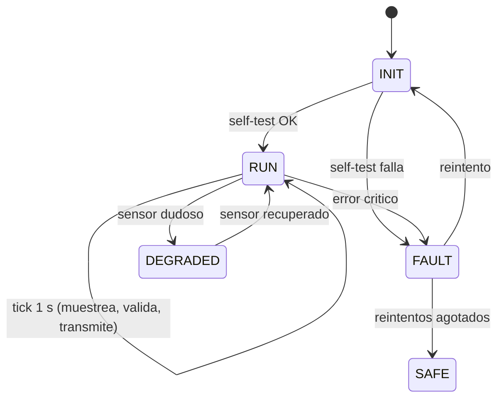

# 06 · Sistemas embebidos

> **Resumen ejecutivo (60 s).** Un sistema embebido hace pocas cosas, siempre, con recursos limitados y a veces sin nadie cerca. Las decisiones que se preguntan: **microcontrolador (MCU) vs microprocesador (MPU) vs SBC**, **polling vs interrupciones**, **timers/PWM/GPIO**, **watchdog**, **máquina de estados** y **diseño no bloqueante**. Un firmware robusto **detecta sus propios fallos y se recupera solo**. Raspberry Pi = Linux (flexible, no determinista); Arduino/STM32/ESP32 = MCU (tiempo real "duro" más fácil, poco recurso).

## 1. MCU vs MPU vs SBC

| | Microcontrolador (MCU) | Microprocesador (MPU) | SBC (Single-Board Computer) |
|---|---|---|---|
| Qué integra | CPU + Flash + RAM + periféricos en un chip | Solo CPU (memoria y periféricos externos) | Placa completa con MPU/SoC, RAM, almacenamiento, red |
| SO | Bare-metal o RTOS | Linux/otros | Linux |
| Recursos | KB–MB de RAM, MHz–cientos de MHz | GB de RAM, GHz | GB, GHz |
| Tiempo real | Fácil (determinista) | Difícil | Difícil (Linux estándar no es tiempo real) |
| Consumo | µW–mW en reposo | Alto | Alto (W) |
| Ejemplos | ATmega328P, STM32, ESP32, RP2040 | Intel/AMD, Cortex-A | Raspberry Pi, BeagleBone |

## 2. Raspberry Pi vs Arduino vs ESP32

| | **Arduino (Uno/Nano, ATmega328P)** | **ESP32** | **Raspberry Pi (4/5/Zero)** | **Raspberry Pi Pico (RP2040)** |
|---|---|---|---|---|
| Tipo | MCU 8 bits | MCU 32 bits con Wi-Fi/BT | SBC con Linux | MCU 32 bits |
| Lógica | 5 V (Uno) / 3.3 V (otros) | 3.3 V | 3.3 V | 3.3 V |
| Sistema | Bare-metal | Bare-metal / FreeRTOS (ESP-IDF, Arduino) | Linux | Bare-metal / FreeRTOS |
| Conectividad | Ninguna nativa | Wi-Fi, Bluetooth (CAN: periférico TWAI con transceptor externo) | Ethernet, Wi-Fi, USB | USB (Wi-Fi solo en Pico W) |
| ADC | 10 bits | 12 bits (no lineal; calibrar) | **No tiene** (usa ADC externo) | 12 bits |
| Fortalezas | Simple, económico, muy documentado | Wi-Fi barato, dos núcleos, muchos periféricos | Python, bases de datos, gateway, cámaras | Bajo costo, PIO programable |
| Debilidades | Poca RAM, lento | ADC ruidoso, consumo de Wi-Fi | Corrupción de SD ante cortes de energía, sin RT duro, sin ADC | Sin radio (salvo W) |
| Caso ideal | Nodo sensor simple | Nodo inalámbrico | **Gateway/edge** | Nodo determinista barato |

*Datos generales conocidos; **verifica** hoja de datos de la versión exacta.*

> **Arquitectura recomendada**: nodos MCU (determinismo + sensores) + gateway Linux (protocolos, red, buffer, logs). No uses la Pi para leer un ADC rápido, ni un Arduino para ser un servidor.

**Tarjeta SD en Raspberry Pi:** los cortes de energía pueden corromper el sistema de archivos. Mitigaciones: fuente estable/UPS, almacenamiento SSD/eMMC, sistema de archivos de solo lectura + `overlayfs`, escritura de datos en lotes, `sync`.

## 3. GPIO, interrupciones, timers y PWM

- **GPIO:** pin configurable como entrada (con/sin pull) o salida (push-pull/open-drain). Límites de corriente por pin (típicamente decenas de mA; **verifica**): un relé/motor se maneja con **transistor/MOSFET/driver** y **diodo de rueda libre**, no directo del pin.
- **Interrupción (IRQ/ISR):** el hardware pausa el código principal y ejecuta una rutina corta. Buenas prácticas: mantenerla brevísima, sin `printf`, sin bloquear, variables compartidas `volatile` y acceso atómico; **debounce**.
- **Polling vs interrupciones:**

| | Polling | Interrupción |
|---|---|---|
| Idea | El lazo pregunta periódicamente | El hardware avisa |
| Ventaja | Simple, determinista, fácil de depurar | Respuesta rápida, ahorra CPU/energía |
| Desventaja | Puede perder eventos rápidos; gasta CPU | Complejidad, condiciones de carrera, latencia impredecible si hay muchas |
| Uso | Sensores lentos (1 Hz), botones con debounce | Pulsos de RPM, UART RX, eventos raros y rápidos |
| Híbrido | ISR marca una bandera / llena un buffer; el lazo lo procesa | |

- **Timer:** contador de hardware. Sirve para tiempos periódicos (`tick` de 1 ms), medir pulsos (captura), generar PWM, timeouts.
- **PWM (Pulse Width Modulation):** señal periódica con *duty cycle* variable. `V_prom = duty · Vcc`. Se usa para brillo de LED, velocidad de motor DC, servos (pulsos 1–2 ms cada 20 ms), y como "DAC" con filtro RC. La **frecuencia** decide el ruido audible/eficiencia; el **duty** la potencia.

Ejemplo: contar RPM con interrupciones — un sensor Hall con 1 pulso por vuelta; la ISR incrementa un contador (`volatile uint32_t`); el lazo cada 1 s calcula `rpm = pulsos·60` (con 1 pulso/rev), toma copia atómica y resetea.

## 4. Watchdog y recuperación
**Watchdog timer (WDT):** contador que reinicia el MCU si el software no lo "alimenta" (*kick/feed*) a tiempo.
- **Dónde alimentarlo:** en el lazo principal **después de comprobar que las tareas críticas progresaron**, no en una ISR (una ISR podría seguir corriendo con el lazo colgado).
- **Ventana (window watchdog):** exige que el kick ocurra dentro de una ventana (ni muy pronto ni tarde).
- **Al reiniciar:** leer la causa del reset (`reset cause`: power-on, watchdog, brown-out), registrarla y contar reinicios; si hay reinicios repetidos → modo seguro.
- **Brown-out detector (BOD):** reinicia si Vcc baja del umbral (evita comportamiento erratico).
- **Recuperación:** reintentar inicialización de periféricos; reiniciar buses colgados (I2C: pulsos de SCL); *timeouts* en **toda** operación de E/S; salida segura para actuadores.
- **Un watchdog no arregla mal diseño**: solo evita quedarse colgado. Si reinicia cada 10 s, hay un bug o un problema de alimentación.

## 5. Máquinas de estados
Modela el comportamiento como estados y transiciones: fácil de razonar, probar y depurar. Ver [`04_state_machine.c`](../examples/c/04_state_machine.c), [`state_machine_firmware.mmd`](../diagrams/state_machine_firmware.mmd) y el diagrama interactivo [`lifecycle_firmware.html`](../diagrams/archify/lifecycle_firmware.html).

Buenas prácticas: una **tabla de transiciones** o `switch` con un solo punto de cambio de estado; **cada estado tiene salida** (evento o timeout); estado inicial explícito; registrar cada transición.

## 6. Memoria limitada y eficiencia
- Datos constantes en Flash (`const`, `PROGMEM` en AVR); cadenas de texto con `F("...")` en Arduino.
- Evitar `String` dinámico de Arduino (fragmentación); usar `char[]` con `snprintf`.
- **Enteros en vez de `float`** en MCU sin FPU (punto fijo: temperatura en centésimas `int16_t`).
- Mide: stack watermark (RTOS), mapa de memoria del linker (`.map`), `arm-none-eabi-size`.
- Divisiones y módulos son caros en CPUs simples; usa desplazamientos si aplica.
- Consumo: modos *sleep*, reducir frecuencia, apagar periféricos/sensores entre lecturas.

## 7. Concurrencia y tareas periódicas
| Enfoque | Descripción | Cuándo |
|---|---|---|
| **Super-loop con tiempos** | `if (millis()-t>=T)` por tarea | Proyectos pequeños |
| **Timer tick + planificador cooperativo** | ISR de 1 ms marca banderas | Medios, determinista |
| **RTOS** (FreeRTOS/Zephyr) | Tareas con prioridad, colas, semáforos | Varias tareas concurrentes, tiempo real |
| **Linux** (hilos/procesos/systemd timers) | Multitarea general | Gateways |

Riesgos: **condiciones de carrera** (dato compartido ISR/main), **inversión de prioridad** (mutex + RTOS), **deadlock**, **starvation**. Comparte datos con **colas** o **buffers circulares** de un solo productor/consumidor.

## 8. Diseño de firmware robusto (checklist)
1. Inicialización con **autoprueba**; falla explícita.
2. **Timeouts** en cada espera (I2C, UART, conversiones).
3. **Validar** todo dato externo (sensor, UART, CAN).
4. **Watchdog** correctamente alimentado + registro de causa de reset.
5. Estados de **degradación** (funcionar parcialmente) en lugar de todo-o-nada.
6. Sin `malloc` en tiempo de ejecución; buffers de tamaño fijo.
7. **Versionado** del firmware, reportado en el arranque y en cada heartbeat.
8. **Reintentos con límite** y *backoff*.
9. Configuración persistente con **CRC** y valores por defecto seguros.
10. Actualización remota segura (firmado, rollback) — **requiere diseño y validación propios**.
11. **Registro (log) circular** local de eventos y errores.
12. Alimentación: protección de polaridad, TVS, filtrado, detección de caída de voltaje.

> **Aviso.** Estos son fundamentos didácticos. El firmware que interviene en **control o seguridad** (frenos, aperturas, protecciones) requiere diseño de seguridad funcional (p. ej. IEC 61508/ISO 13849/ISO 25119 en agricultura), análisis de riesgos y validación. Este repositorio trata **monitoreo**, no control crítico.

## 9. Ejemplo: sistema que adquiere temperatura y transmite datos
Combina: sensor DS18B20 → MCU (validación, `quality`) → UART JSON → gateway (timestamp, buffer) → servidor.
- MCU: [`arduino_temp_monitor.ino`](../examples/cpp/arduino_temp_monitor/arduino_temp_monitor.ino) (Arduino: `millis()` sin `delay()`, `seq`, `quality`, JSON por línea).
- Gateway: [`05_serial_reader.py`](../examples/python/05_serial_reader.py) + [`08_store_and_forward.py`](../examples/python/08_store_and_forward.py) + [`06_post_to_api.py`](../examples/python/06_post_to_api.py).
- Diagrama: [`sequence_telemetry.mmd`](../diagrams/sequence_telemetry.mmd).

## 10. Errores frecuentes y preguntas trampa
1. `delay()` largo bloquea todo → usar `millis()`/timers.
2. Alimentar el watchdog en un `Timer ISR` incondicional.
3. Variables compartidas sin `volatile` o sin protección atómica.
4. Cargas inductivas sin diodo → picos que reinician el MCU.
5. Regulador lineal con gran caída y corriente alta → calentamiento.
6. Trampa: "¿Raspberry Pi para control en tiempo real?" → No es lo indicado; Linux no garantiza latencias; usa MCU o PREEMPT_RT con análisis.
7. Trampa: "¿Interrupciones siempre mejor que polling?" → No: para sensores lentos el polling es más simple y determinista.
8. Trampa: "El MCU se reinicia continuamente" → alimentación (brown-out), watchdog, stack overflow, bucle por excepción, código en ISR, pin de reset con ruido.

## 11. Ejercicios y verificación
[`exercises/programming.md`](../exercises/programming.md), [`exercises/fundamentals.md`](../exercises/fundamentals.md). **Verifica** en datasheet: corrientes de GPIO, ancho del watchdog, modos de bajo consumo, disponibilidad de FPU, tamaños de RAM/Flash.
