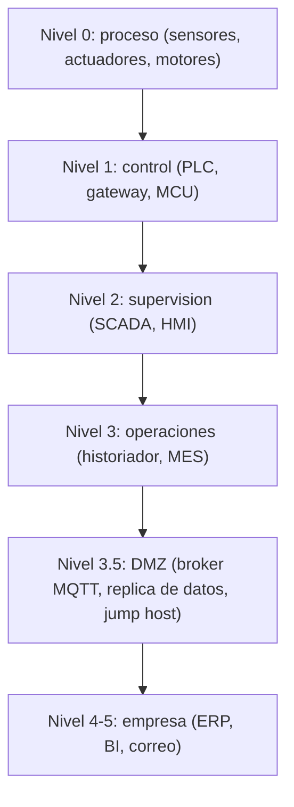
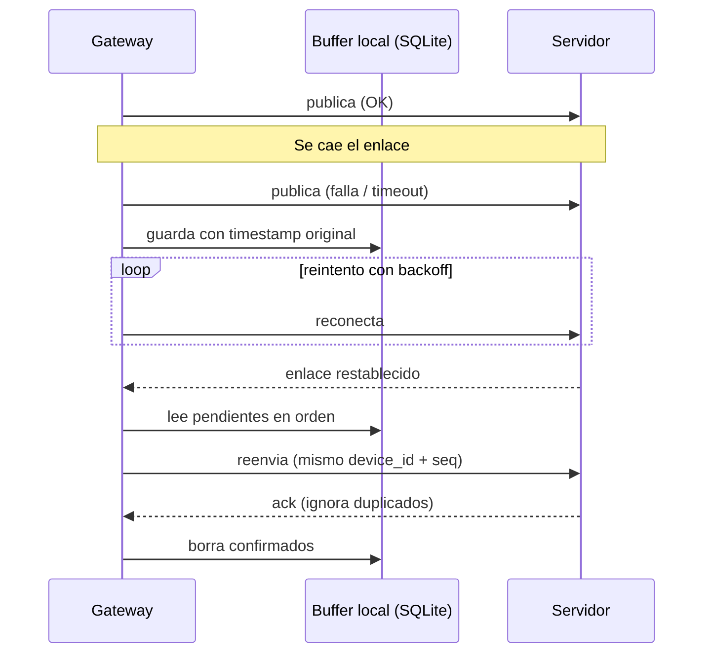

# 07 · Redes OT/IT

> **Resumen ejecutivo (60 s).** **OT** (Operational Technology) controla o supervisa procesos físicos (sensores, PLC, SCADA, motores); prioriza **disponibilidad, seguridad física y determinismo**. **IT** (Information Technology) maneja datos y aplicaciones (servidores, ERP, dashboards); prioriza **confidencialidad e integridad**. La **convergencia** conecta ambos para analizar datos de planta, pero **sin exponer la red de control a Internet**: se **segmenta** (zonas), se usa una **DMZ**, conexiones **salientes/unidireccionales**, **firewall/ACL**, **VPN/TLS** y **autenticación**. El gateway de tu proyecto es justamente la pieza que cruza esa frontera. **Monitoreo ≠ control**: monitorear es *leer*; controlar es *escribir* al proceso, con riesgos y requisitos mucho mayores.

Diagrama interactivo (archify): [`architecture_case.html`](../diagrams/archify/architecture_case.html) · [`dataflow_sensor_to_dashboard.html`](../diagrams/archify/dataflow_sensor_to_dashboard.html) · Mermaid: [`ot_it_architecture.mmd`](../diagrams/ot_it_architecture.mmd), [`architecture_overview.mmd`](../diagrams/architecture_overview.mmd).

## 1. Definiciones

| Término | Qué es | Ejemplo |
|---|---|---|
| **OT** | Hardware/software que monitorea o controla equipos físicos | Sensores, actuadores, PLC, drives, ECU |
| **IT** | Sistemas de información empresarial | Servidores, bases de datos, ERP, correo |
| **PLC** (*Programmable Logic Controller*) | Controlador industrial robusto con ejecución cíclica determinista | Siemens, Allen-Bradley, Schneider Zelio (relés programables) |
| **SCADA** | Supervisión y adquisición de datos: recolecta datos de PLC/RTU, muestra y registra, envía comandos | Ignition, WinCC, Wonderware (marcas y nombres a verificar) |
| **HMI** | Interfaz local operador-máquina (pantalla táctil) | Panel de un tablero |
| **MES** | Sistema de ejecución de manufactura: producción en tiempo real, trazabilidad | Nivel 3 de ISA-95 |
| **ERP** | Planificación de recursos empresariales: finanzas, inventario, compras | SAP, Odoo (nivel 4) |
| **Historiador** | Base de datos de series de tiempo de planta | PI, InfluxDB, TimescaleDB |
| **Gateway** | Traduce/protege entre redes y protocolos (serie/CAN/Modbus ⇄ Ethernet/MQTT) | Raspberry Pi industrial |
| **Servidor / dashboard** | Aplicaciones para almacenar, visualizar y alertar | Grafana, Django app |

## 2. Diferencias OT vs IT

| Aspecto | OT | IT |
|---|---|---|
| Prioridad (tríada CIA) | **Disponibilidad**, seguridad física (*safety*), integridad | Confidencialidad, integridad, disponibilidad |
| Vida útil | 15–30 años | 3–5 años |
| Actualizaciones/parches | Difíciles; ventanas de mantenimiento; sistemas heredados | Frecuentes y automáticos |
| Tiempo real | Latencia/jitter críticos | Tolerante |
| Protocolos | Modbus, CAN/J1939, PROFINET, EtherNet/IP, OPC UA | HTTP, SQL, SMTP |
| Reinicio | A menudo inaceptable | Aceptable |
| Cultura | Ingeniería/mantenimiento | Sistemas/seguridad informática |
| Riesgo de fallo | Daño físico, seguridad de personas, producción | Pérdida de datos, dinero |

## 3. Monitoreo vs control

| | Monitoreo | Control |
|---|---|---|
| Dirección del dato | Planta → sistema (lectura) | Sistema → planta (escritura/comandos) |
| Latencia | Tolerante (segundos) | Estricta (ms) |
| Falla | Se pierden datos (recuperables) | Puede dañar equipo o personas |
| Seguridad requerida | Confiable, autenticada | Alta: safety, validación, permisos, *fail-safe* |
| Conexión a Internet | Salida controlada, unidireccional | **Nunca directa** |
| Este proyecto | ✔ **Es el alcance** | ✘ Fuera de alcance sin diseño validado |

Principio: **empieza solo-lectura**. En CAN, escucha en *listen-only*; en Modbus, usa registros de lectura; no cierres lazos remotos sin diseño de seguridad funcional.

## 4. Modelo Purdue, ISA-95 e IEC 62443 (no son lo mismo)

| Marco | Qué es | Para qué sirve |
|---|---|---|
| **ISA-95 / IEC 62264** | Modelo de integración de sistemas empresariales y de control (jerarquía funcional: niveles 0–4, modelo de actividades y de información) | Definir qué hace cada sistema y cómo intercambiar datos |
| **Modelo Purdue (PERA)** | Modelo de referencia/arquitectura por niveles (0 proceso, 1 control básico, 2 supervisión, 3 operaciones, 3.5 DMZ, 4-5 empresa) | Segmentar redes y ubicar sistemas |
| **IEC 62443 (ISA/IEC 62443)** | Serie de normas de **ciberseguridad** para sistemas de automatización y control: zonas y conductos, niveles de seguridad (SL), requisitos para integradores y fabricantes | Diseñar y certificar la seguridad |

Se **relacionan** pero **no son equivalentes**: ISA-95 dice *qué hay en cada nivel*, Purdue *cómo se dibuja la red por niveles*, IEC 62443 *cómo se protege y qué requisitos cumplir*. Se citan de forma introductoria; **verifica las ediciones vigentes** en las fuentes oficiales (ver [`REFERENCES.md`](../REFERENCES.md)).


En un ingenio pequeño no siempre existen todos los niveles; lo esencial: **el gateway y los sensores no deben ser alcanzables desde Internet ni desde la red corporativa sin control**.

## 5. Segmentación, zonas y seguridad

| Mecanismo | Qué hace | Ejemplo aplicado |
|---|---|---|
| **Segmentación / VLAN** | Separa dominios de difusión y limita movimiento lateral | VLAN de telemetría separada de la de oficinas |
| **Zonas y conductos** (IEC 62443) | Zona = grupo con requisitos de seguridad iguales; conducto = canal controlado entre zonas | Zona "gateways de campo" ↔ conducto TLS ↔ zona "servidor" |
| **DMZ** | Zona intermedia; ningún tráfico directo IT↔OT | El broker vive en la DMZ; OT publica, IT suscribe |
| **Firewall / ACL** | Permite solo lo necesario (deny by default) | OT→DMZ TCP 8883 permitido; todo lo demás bloqueado |
| **Conexión saliente** | El gateway inicia la conexión; no se abren puertos de entrada en OT | Evita NAT/port-forward hacia el campo |
| **Diodo de datos** | Hardware unidireccional | Alta seguridad, más costoso |
| **VPN** (WireGuard, IPsec, OpenVPN) | Túnel cifrado y autenticado para acceso remoto | Mantenimiento remoto |
| **TLS** | Cifrado + integridad + autenticación de servidor (y de cliente con certificados) | MQTT sobre TLS (8883), HTTPS (443) |
| **Autenticación y autorización** | Identidad por dispositivo, mínimo privilegio | Usuario MQTT por máquina con ACL que solo le permite su topic |
| **Gestión de secretos** | No hardcodear contraseñas | Variables de entorno/archivos 600, rotación |
| **Actualizaciones y parches** | Reducir vulnerabilidades | Ventanas de mantenimiento, inventario de versiones |
| **Registro y monitoreo** | Detectar accesos anómalos | Logs centralizados |

### Riesgos de conectar directamente una red de control a Internet
- **Exposición de servicios sin autenticación** (Modbus TCP, MQTT sin credenciales, VNC/HMI, SSH con contraseña por defecto): buscadores tipo Shodan indexan dispositivos industriales expuestos.
- **Credenciales por defecto**, protocolos sin cifrado ni autenticación (Modbus/TCP, CAN).
- **Ransomware y movimiento lateral** desde IT hacia OT.
- **Denegación de servicio** por tráfico no esperado contra dispositivos frágiles.
- **Manipulación de comandos** → daño físico.
- **Sin parches** por ser equipos heredados.
- **Falta de trazabilidad.**
Mitigación: no exponer, salida solamente, DMZ, VPN/TLS, ACL, mínimo privilegio, monitoreo.

## 6. Disponibilidad, latencia, integridad y pérdida de datos
- **Disponibilidad:** ¿el sistema sigue funcionando? → redundancia, buffers locales, watchdog.
- **Latencia:** retraso extremo a extremo. Telemetría → segundos aceptables. Control → ms.
- **Jitter:** variación de la latencia.
- **Integridad:** datos íntegros y no alterados → CRC/checksum en bus, TLS/HMAC en red, validación en servidor.
- **Pérdida de datos:** QoS, buffer local, reintentos, `seq` para detectar huecos.
- **Ancho de banda/costo:** en enlaces celulares se cobra por datos: batch, compresión, envío por excepción (*report by exception*).

## 7. Protocolos de transporte y aplicación

### TCP vs UDP
| | TCP | UDP |
|---|---|---|
| Conexión | Orientado a conexión (handshake) | Sin conexión |
| Entrega | Fiable, ordenada, con retransmisión | Sin garantía |
| Overhead / latencia | Mayor | Menor |
| Uso | HTTP, MQTT, SSH, SQL | DNS, streaming, syslog, mensajes donde la pérdida es tolerable (o con protocolo propio: CoAP) |

### HTTP/REST vs MQTT
| | **HTTP/REST** | **MQTT** (OASIS 3.1.1 y 5.0) |
|---|---|---|
| Modelo | Petición/respuesta (cliente-servidor) | **Publicar/suscribir** con un *broker* |
| Transporte | TCP (HTTP/1.1, HTTP/2) | TCP (puerto 1883; TLS 8883) |
| Conexión | Suele ser efímera por petición | Persistente, liviana |
| Overhead | Cabeceras de texto | Cabecera mínima (2 bytes) |
| Dirección de datos | Cliente inicia siempre (el servidor no empuja sin polling/WebSocket) | Bidireccional: el broker empuja a los suscriptores |
| Calidad de servicio | La define la aplicación | **QoS 0** (máx. una vez), **1** (al menos una), **2** (exactamente una) |
| Extras | Códigos de estado, caché, herramientas universales | Retain, **LWT**, sesiones persistentes, wildcards `+`/`#` |
| Idóneo | APIs, consultas, envío en lotes, integración simple | Telemetría continua, muchos dispositivos, redes inestables |

Detalles MQTT: los topics son jerarquías (`ingenio/costa-sur/tractor01/telemetry`); `+` = un nivel, `#` = todos los niveles siguientes. **QoS 1 puede duplicar** → idempotencia. **Retain** conserva el último valor en el topic. **LWT** avisa de desconexiones anómalas. **Keep-alive** detecta conexiones caídas.

Ejemplo de diseño de topics:
```
ingenio/<sitio>/<maquina>/telemetry     JSON con mediciones
ingenio/<sitio>/<maquina>/status        online/offline (retain + LWT)
ingenio/<sitio>/<maquina>/cmd           comandos (evitar al inicio: monitoreo primero)
```
Código: [`mqtt_publisher.py`](../examples/python/mqtt_publisher.py) (plantilla no ejecutada contra broker) y el cliente HTTP con reintentos [`06_post_to_api.py`](../examples/python/06_post_to_api.py) (ejecutado con el servidor local).

## 8. ¿Qué ocurre cuando se pierde Internet?

Requisitos: (1) **buffer persistente** con límite y política (qué se descarta si se llena: lo más viejo o lo menos importante, con contador de descartes), (2) **reintentos con backoff+jitter**, (3) **timestamp del momento de la medición** (no del envío), (4) **reloj confiable** (NTP o RTC; ¿qué pasa si el reloj arranca en 1970?), (5) **idempotencia**, (6) **heartbeat** para saber que el dispositivo está vivo, (7) **límite de ancho de banda** al vaciar la cola (no saturar el enlace), (8) **alerta local** si la desconexión dura demasiado. Caso completo: [`docs/14_casos_practicos.md`](14_casos_practicos.md) (Caso D) y [`sequence_offline_recovery.html`](../diagrams/archify/sequence_offline_recovery.html).

## 9. Ejemplo de arquitectura: tractores, bombas y motores

| Nivel | Componentes |
|---|---|
| Campo (0) | Sensores DS18B20/vibración; ECU tractor (CAN J1939); variador de bomba (Modbus RTU sobre RS-485, lectura) |
| Control/edge (1) | Nodos MCU + gateway Linux por máquina; **sin escrituras** al proceso |
| Red de campo | LTE/4G o Wi-Fi hacia el ingenio; VPN/TLS |
| DMZ (3.5) | Broker MQTT con TLS y ACL; réplica de datos |
| Servidor (3-4) | PostgreSQL/TimescaleDB, API, dashboard (Grafana/Django), reglas de alerta |
| Usuarios | Mantenimiento, operación, gerencia |

Ver el diagrama: [`architecture_case.html`](../diagrams/archify/architecture_case.html) y el caso realista en [`15_caso_realista_arquitectura.md`](15_caso_realista_arquitectura.md).

## 10. Errores frecuentes y preguntas trampa
1. Abrir un puerto en el router hacia el gateway "para acceder rápido".
2. Un solo VLAN para todo; sin ACL.
3. MQTT sin autenticación ni TLS.
4. Confundir `QoS 1` con "sin duplicados".
5. Timestamps del servidor en lugar del origen.
6. Trampa: "¿Purdue e IEC 62443 son lo mismo?" → No (referencia de niveles vs normas de seguridad).
7. Trampa: "¿HTTP o MQTT?" → depende: MQTT para flujo continuo y redes malas; HTTP para lotes y simplicidad de integración.
8. Trampa: "¿Podemos controlar la máquina desde el dashboard?" → no sin análisis de riesgo, autenticación fuerte, safety y validación.

## 11. Ejercicios y verificación
[`exercises/ot_it.md`](../exercises/ot_it.md). **Verifica:** ediciones de ISA-95/IEC 62443, versión de MQTT del broker, políticas de la red del ingenio, datos personales/regulaciones aplicables.
