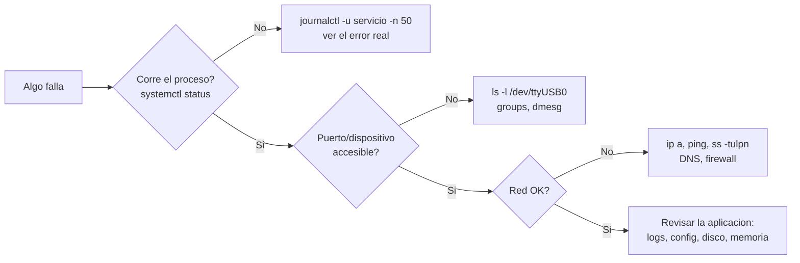

# 08 · Linux para gateways y diagnóstico

> **Resumen ejecutivo (60 s).** En un gateway Linux (típicamente Raspberry Pi OS/Debian/Ubuntu) tu día a día es: **navegar y editar archivos**, **entender permisos** (`rwx`, usuario/grupo), **ver procesos y servicios** (`ps`, `top`, `systemctl`, `journalctl`), **buscar** (`grep`, `find`), **red** (`ss`, `ping`, `ip`, `ssh`, `scp`), **puertos seriales** (`/dev/ttyUSB0`, grupo `dialout`) y **automatizar** (bash, cron/systemd timers). Reglas de oro: *todo es un archivo*, *el error casi siempre está en el log*, *no uses `sudo` para "hacer que funcione" sin entender por qué falló*. Los ejemplos están en [`examples/linux/`](../examples/linux) (sintaxis verificada con `bash -n`; ejecución completa depende de un Linux real).



## 1. Sistema de archivos y rutas

```
/            raiz
├── bin, usr/bin     programas
├── etc/             configuracion (ej. /etc/systemd/system)
├── home/usuario/    datos del usuario (~)
├── var/log/         logs (y journal en /var/log/journal)
├── dev/             dispositivos (ttyUSB0, ttyACM0, i2c-1, spidev0.0)
├── proc, sys/       informacion del kernel (ej. /sys/bus/w1/devices)
├── opt/             software adicional (ej. /opt/gateway)
├── tmp/             temporales
└── mnt, media/      montajes (USB, discos)
```
- **Ruta absoluta** (`/opt/gateway/app.py`) vs **relativa** (`./app.py`, `../datos`). `~` = home. `.` = directorio actual, `..` = padre.
- Sensible a mayúsculas. Los espacios en nombres requieren comillas.

## 2. Navegación y manipulación de archivos

| Comando | Qué hace | Ejemplo |
|---|---|---|
| `pwd` | Directorio actual | |
| `ls -lah` | Lista larga, ocultos, tamaños legibles | `ls -lah /dev/tty*` |
| `cd` | Cambiar directorio | `cd /var/log` · `cd -` (anterior) |
| `mkdir -p` | Crear directorios (con padres) | `mkdir -p /opt/gateway/data` |
| `cp -r` / `mv` / `rm -r` | Copiar / mover-renombrar / borrar | `rm -rf` **con extremo cuidado** |
| `cat`, `less`, `head -n`, `tail -n`, `tail -f` | Ver contenido / paginar / primeras / últimas / seguir | `tail -f /var/log/syslog` |
| `nano`, `vim` | Editores | `nano config.ini` |
| `wc -l` | Contar líneas | `wc -l datos.csv` |
| `df -h`, `du -sh *` | Espacio de discos / tamaño de directorios | `df -h /` |
| `tar -czf` / `tar -xzf` | Comprimir / extraer | `tar -czf backup.tgz datos/` |
| `ln -s` | Enlace simbólico | |
| `file`, `stat` | Tipo y metadatos | |

## 3. Permisos, usuarios y grupos

```
-rwxr-xr--  1  gateway  dialout  4096  Mar  1 10:00  script.sh
│└┬┘└┬┘└┬┘     dueño    grupo
│ │  │  └── otros: r-- (solo lectura)
│ │  └───── grupo: r-x (leer y ejecutar)
│ └──────── dueño: rwx
└────────── tipo: - archivo, d directorio, l enlace, c dispositivo de caracteres
```
- Valores: `r=4, w=2, x=1` → `chmod 754 script.sh` = `rwxr-xr--`. `chmod +x script.sh` lo hace ejecutable.
- `chown usuario:grupo archivo` cambia dueño/grupo.
- `sudo` ejecuta como root; **mínimo privilegio**: usuario de servicio dedicado sin login interactivo.
- `id`, `groups`, `whoami` muestran identidad; `sudo usermod -aG dialout $USER` añade al grupo (**cerrar sesión y volver a entrar** para que aplique).
- En directorios, `x` permite entrar/atravesar; `r` listar.
- **Umask** define permisos por defecto de archivos nuevos.

## 4. Procesos, servicios y señales

| Comando | Uso |
|---|---|
| `ps aux \| grep gateway` | Ver procesos |
| `top` / `htop` | CPU y memoria en vivo (`q` para salir; `htop` es más cómodo, hay que instalarlo) |
| `kill PID` (SIGTERM) · `kill -9 PID` (SIGKILL, último recurso) · `pkill nombre` | Terminar procesos |
| `Ctrl+C` (SIGINT) · `Ctrl+Z` (suspende) · `bg`/`fg` · `&` | Control de trabajos |
| `nohup cmd &` | Sigue corriendo al cerrar la terminal (mejor: servicio systemd) |

**Señales:** SIGTERM (15) pide cerrar limpio; SIGKILL (9) mata sin aviso; SIGHUP recarga en muchos demonios; SIGINT (Ctrl+C). Un programa robusto **maneja SIGTERM** (ver `04_python.md`).

### systemctl y journalctl
```bash
systemctl status gateway.service      # estado, PID, ultimas lineas del log
sudo systemctl start|stop|restart gateway.service
sudo systemctl enable --now gateway.service   # arrancar al boot y ahora
systemctl list-units --type=service --state=failed   # servicios fallidos
journalctl -u gateway.service -n 50 --no-pager    # ultimas 50 lineas
journalctl -u gateway.service -f                  # seguir en vivo
journalctl -u gateway.service --since "1 hour ago"
journalctl -p err -b                              # errores del boot actual
journalctl -k                                     # mensajes del kernel
```
Unidad de ejemplo: [`gateway.service`](../examples/linux/gateway.service). Tras editar una unidad: `sudo systemctl daemon-reload`.

## 5. Búsqueda y texto

| Comando | Ejemplo | Explicación |
|---|---|---|
| `grep` | `grep -rn "ERROR" /var/log/` · `grep -i` · `grep -v` · `grep -c` | Busca texto (recursivo, con líneas, ignorar caso, invertir, contar) |
| `find` | `find /opt -name "*.py" -mtime -1` · `find . -size +100M` | Busca archivos por nombre/fecha/tamaño |
| Tuberías | `dmesg \| grep -i usb \| tail` | Encadena la salida de un comando en el siguiente |
| Redirección | `cmd > out.txt` (sobrescribe) · `>>` (añade) · `2>&1` (stderr a stdout) | |
| `awk`, `sed`, `cut`, `sort`, `uniq -c` | `awk -F, '{s+=$4} END {print s/NR}' datos.csv` | Procesamiento de columnas |

## 6. Red y diagnóstico

| Comando | Para qué |
|---|---|
| `ip a` (o `ip addr`) | Interfaces y direcciones |
| `ip route` | Puerta de enlace |
| `ping -c 3 host` | Alcance IP/latencia |
| `ss -tulpn` | Sockets en escucha (TCP/UDP), puertos y procesos (`-p` requiere sudo para otros usuarios) |
| `curl -v https://host` / `curl -I` | Probar HTTP(S) y ver cabeceras/certificado |
| `nc -zv host 1883` | Probar un puerto TCP |
| `dig host` / `nslookup host` | DNS |
| `traceroute host`, `mtr` | Ruta |
| `sudo tcpdump -i eth0 port 1883` | Capturar tráfico (diagnóstico avanzado) |
| `timedatectl` | Hora, zona y sincronización NTP (`System clock synchronized: yes`) |
| `nmcli`, `iwconfig`/`iw` | Wi-Fi |

Puertos frecuentes: 22 SSH, 80 HTTP, 443 HTTPS, 1883 MQTT, 8883 MQTT/TLS, 502 Modbus/TCP, 5432 PostgreSQL, 123/UDP NTP, 53 DNS.

## 7. Variables de entorno y PATH
```bash
echo "$PATH"                     # directorios donde se buscan ejecutables
export API_URL="https://..."     # visible para procesos hijos (solo esta sesion)
env | grep API                   # ver
which python3 ; type -a python3  # cual se ejecuta
```
- Persistir: `~/.bashrc`, `/etc/environment`, o `EnvironmentFile=` en systemd. **No guardes secretos en el repositorio.**
- **cron y systemd** tienen un entorno mínimo: usa rutas absolutas.

## 8. Puertos seriales: `/dev/ttyUSB*` y `/dev/ttyACM*`

| Nodo | Suele indicar |
|---|---|
| `/dev/ttyUSB0` | Convertidores USB-serie (FTDI, CH340, CP210x, PL2303) |
| `/dev/ttyACM0` | Dispositivos CDC-ACM (Arduino Uno R3/Leonardo/Mega, RP2040 Pico, módems) |
| `/dev/ttyAMA0`, `/dev/ttyS0`, `/dev/serial0` | UART de hardware de la Raspberry Pi (`serial0` es un alias) |
| `/dev/i2c-1` | Bus I2C 1 |
| `/dev/spidev0.0` | SPI |

**Permisos:** `ls -l /dev/ttyUSB0` → normalmente `crw-rw---- root dialout`. El grupo es **`dialout`** en Debian/Ubuntu/Raspberry Pi OS; **otras distribuciones usan `uucp` o `tty`**: comprueba con `ls -l`. Solución:
```bash
sudo usermod -aG dialout $USER     # y CERRAR SESION / reiniciar
```
**Los nombres cambian:** con dos adaptadores, `ttyUSB0`/`ttyUSB1` dependen del orden de conexión → usa reglas `udev` o los enlaces estables en `/dev/serial/by-id/`:
```bash
ls -l /dev/serial/by-id/           # nombres estables por fabricante y numero de serie
```
**Herramientas:** `screen /dev/ttyUSB0 115200` (salir: `Ctrl+A` luego `K`), `minicom -D /dev/ttyUSB0 -b 115200`, `picocom`, `stty -F /dev/ttyUSB0 -a`. `dmesg | tail` muestra `ch341-uart converter now attached to ttyUSB0` al conectar. Script de diagnóstico: [`01_serial_setup_check.sh`](../examples/linux/01_serial_setup_check.sh).

**Raspberry Pi UART:** el UART principal puede estar ocupado por la consola serie; se desactiva en `raspi-config` (Interface Options → Serial Port: login shell = No, hardware = Sí). El Pi 3/4 tiene un "mini UART" con reloj dependiente de la CPU en algunos modos: usa `/dev/serial0` y **verifica** la configuración de Bluetooth (`dtoverlay`).

**Sin permiso o "device busy":** `fuser -v /dev/ttyUSB0` (quién lo usa). `ModemManager` puede tomar puertos con módems: `sudo systemctl stop ModemManager` para probar. `brltty` en algunos Ubuntu se apropia de CH340 → `sudo apt remove brltty`.

## 9. Instalación de dependencias y entornos Python
```bash
sudo apt update && sudo apt install -y python3-venv python3-pip i2c-tools can-utils git
python3 -m venv /opt/gateway/.venv               # entorno aislado
source /opt/gateway/.venv/bin/activate
pip install -r requirements.txt                  # pyserial requests paho-mqtt smbus2
pip freeze > requirements.txt                    # congelar versiones
deactivate
```
- Debian/Raspberry Pi OS recientes marcan Python del sistema como "externally managed" (PEP 668): `pip install` global falla → **usa venv** (o `apt install python3-xxx`).
- `sudo pip install` puede romper paquetes del sistema. Evítalo.
- Habilitar interfaces en Pi: `sudo raspi-config` (I2C, 1-Wire, Serial). Verificar: `ls /dev/i2c-*`, `i2cdetect -y 1`.

## 10. SSH y transferencia de archivos
```bash
ssh usuario@192.168.1.50                       # conectar
ssh -p 2222 usuario@host                       # otro puerto
ssh-keygen -t ed25519 -C "mi-laptop"           # generar clave (privada NO se comparte)
ssh-copy-id usuario@host                       # copiar la clave publica al servidor
scp datos.csv usuario@host:/opt/gateway/data/  # copiar (SCP)
rsync -avz --progress ./app/ usuario@host:/opt/gateway/app/   # sincronizar (solo cambios)
ssh -L 8080:localhost:3000 usuario@host        # tunel local: abre localhost:8080 -> puerto 3000 remoto
```
Buenas prácticas: **autenticación por clave**, deshabilitar login de root y de contraseña (`PasswordAuthentication no` en `/etc/ssh/sshd_config`; probar antes de cerrar la sesión abierta), `fail2ban`, cambiar el usuario `pi` por defecto, acceso solo por VPN. Errores: `Permission denied (publickey)` → clave/usuario/permisos de `~/.ssh` (700) y `authorized_keys` (600); `Connection refused` → sshd no corre/puerto/firewall; `Connection timed out` → red/firewall.

## 11. Bash básico y automatización
```bash
#!/usr/bin/env bash
set -euo pipefail                       # falla ante errores, variables no definidas y errores en pipes
NAME="${1:-gateway}"                    # argumento con valor por defecto
if systemctl is-active --quiet "$NAME"; then echo "activo"; else echo "caido"; fi
for f in /opt/gateway/data/*.csv; do    # bucle sobre archivos
  echo "procesando $f"; wc -l "$f"
done
```
- Siempre **comillar variables** (`"$var"`). `$?` = código de salida del último comando (0 = éxito).
- **cron:** `crontab -e` → `*/5 * * * * /ruta/script.sh >> /var/log/x.log 2>&1` (ver [`03_cron_backup.sh`](../examples/linux/03_cron_backup.sh)). Formato: `min hora dia mes dia_semana`.
- **systemd timers**: alternativa moderna (logs en `journalctl`, `Persistent=true` ejecuta lo perdido si el equipo estuvo apagado).
- **Idempotencia** de scripts: que puedan ejecutarse varias veces sin efectos raros.

## 12. Diagnóstico de procesos que fallan (método)
```
1. systemctl status X           -> ¿active/failed? ¿codigo de salida (status=1/FAILURE, 203/EXEC, 217/USER...)?
2. journalctl -u X -n 100       -> traceback / mensaje de error
3. Ejecutar a mano como el mismo usuario:  sudo -u gateway /opt/gateway/.venv/bin/python /opt/gateway/gateway.py
4. ¿Rutas? ¿permisos? ¿variables de entorno? ¿dependencias (pip)? ¿puerto ocupado (ss -tulpn)? ¿disco lleno (df -h)?
5. Corregir -> systemctl daemon-reload (si cambio la unidad) -> restart -> verificar con status/journal
```
| Síntoma en el log | Causa probable |
|---|---|
| `status=203/EXEC` | `ExecStart` con ruta incorrecta o sin permiso de ejecución |
| `status=217/USER` | Usuario inexistente |
| `PermissionError: /dev/ttyUSB0` | Usuario no en `dialout` |
| `ModuleNotFoundError` | Se ejecuta con otro Python/venv |
| `Address already in use` | Otro proceso usa el puerto (`ss -tulpn`) |
| `No space left on device` | Disco/`inodes` llenos (`df -h`, `df -i`) |
| Reinicios cíclicos (`start request repeated too quickly`) | Fallo al arrancar; ver `RestartSec` y el error real |
| `Killed` (OOM) | Sin memoria (`dmesg \| grep -i oom`) |

## 13. Comandos con salida esperada (ejemplos)
```console
$ ls -l /dev/ttyUSB0
crw-rw---- 1 root dialout 188, 0 Mar  1 10:00 /dev/ttyUSB0

$ id
uid=1000(pi) gid=1000(pi) groups=1000(pi),20(dialout),27(sudo),...

$ systemctl is-active gateway.service
active

$ ss -tulpn | grep 1883
tcp   LISTEN 0  100  0.0.0.0:1883  0.0.0.0:*  users:(("mosquitto",pid=812,fd=5))

$ i2cdetect -y 1
     0  1  2  3  4  5  6  7  8  9  a  b  c  d  e  f
40: -- -- -- -- -- -- -- -- 48 -- -- -- -- -- -- --
60: -- -- -- -- -- -- -- -- 68 -- -- -- -- -- 76 --
```
*(Salidas ilustrativas; los números y nombres variarán en tu equipo.)*

## 14. Errores frecuentes y preguntas trampa
1. `chmod 777` "para que funcione".
2. Añadir al grupo `dialout` y no volver a iniciar sesión.
3. Usar `kill -9` primero.
4. Ejecutar scripts con cron sin rutas absolutas ni redirección.
5. Instalar librerías globalmente en lugar de un venv.
6. Trampa: "El script funciona a mano pero no con systemd/cron" → entorno, usuario, `WorkingDirectory`, PATH.
7. Trampa: "¿Diferencia entre `>` y `>>`?" sobrescribir vs añadir.
8. Trampa: "¿Por qué `sudo` en un script?" → privilegios innecesarios; usar grupos/udev.
9. Trampa: "¿`ttyUSB0` cambió de número tras reiniciar?" → usar `/dev/serial/by-id/` o reglas udev.

## 15. Ejercicios y verificación
[`exercises/linux.md`](../exercises/linux.md). **Verifica** en tu distribución: nombre del grupo del puerto serial, versión de systemd, ruta de `config.txt` (`/boot/firmware/config.txt` en versiones recientes de Raspberry Pi OS), soporte del kernel para SocketCAN.
