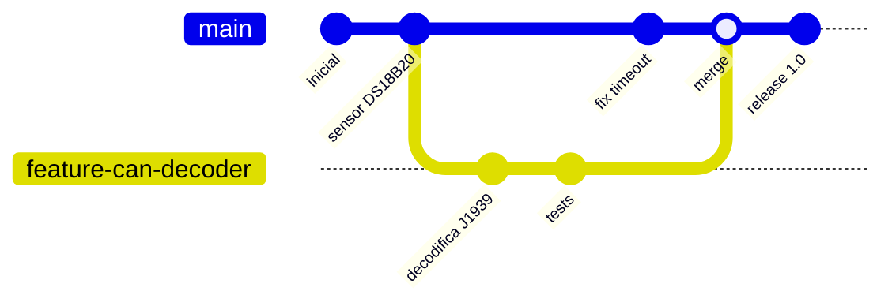

# 09 · Git y control de versiones

> **Resumen ejecutivo (30 s).** **Git** es el sistema de control de versiones (local y distribuido); **GitHub** es un servicio web que aloja repositorios Git y añade colaboración (pull requests, issues, CI). Flujo diario: `git pull` → crear rama → editar → `git add` → `git commit` → `git push` → *pull request*. Un **commit** es una foto inmutable con mensaje; una **rama** es un puntero móvil a commits; un **remoto** (`origin`) es otra copia del repositorio.



## 1. Conceptos
| Concepto | Explicación |
|---|---|
| **Repositorio** | Carpeta con historial (`.git/`) |
| **Working tree / Staging (index) / Repositorio** | Tus archivos → lo que se incluirá en el próximo commit (`git add`) → historial (`git commit`) |
| **Commit** | Instantánea con autor, fecha, mensaje y hash SHA |
| **Branch** | Línea de desarrollo; `main` es la principal por convención |
| **HEAD** | Dónde estás parado (rama/commit actual) |
| **Remote** | Repositorio remoto (`origin`) |
| **Tag** | Etiqueta de un commit (versiones: `v1.0.0`) |
| **Merge** | Une historias (puede crear commit de fusión) |
| **Rebase** | Reaplica commits sobre otra base (historial lineal; **no reescribas historia compartida**) |
| **Fork / Pull Request** | Conceptos de GitHub para colaborar |

**Git ≠ GitHub:** Git funciona sin internet y sin GitHub. GitHub/GitLab/Bitbucket/Gitea son plataformas que alojan remotos.

## 2. Comandos esenciales
```bash
git clone https://github.com/org/repo.git   # copiar un repositorio remoto
git status                                  # que cambio, que esta en staging
git add archivo.py            # o: git add -p (elegir trozos) ; evita "git add ." sin revisar
git commit -m "Agrega decodificador J1939"  # guardar cambios en el historial local
git log --oneline --graph --decorate -n 15  # historial compacto
git diff                                    # cambios sin staging ; git diff --staged (con staging)
git fetch                                   # trae cambios remotos SIN modificar tu trabajo
git pull                                    # fetch + merge (o --rebase)
git push origin main                        # sube commits (o: git push -u origin mi-rama la primera vez)
git switch -c feature/x                     # crear y cambiar de rama  (antes: git checkout -b)
git switch main ; git merge feature/x       # fusionar
git branch -d feature/x                     # borrar rama fusionada
```
`fetch` vs `pull`: `fetch` solo descarga; `pull` = `fetch` + integrar.

## 3. Flujo de trabajo básico (feature branch)
```
1. git switch main && git pull                 # partir de lo ultimo
2. git switch -c feature/timeout-detector      # rama de trabajo
3. ...editar, probar...
4. git add -p && git commit -m "Detecta timeout de comunicacion"   # commits pequenos y con sentido
5. git push -u origin feature/timeout-detector
6. Abrir Pull Request -> revision -> merge a main
7. git switch main && git pull && git branch -d feature/timeout-detector
```
**Mensajes de commit:** imperativo, concisos: "Agrega…", "Corrige…"; explica el *por qué* en el cuerpo si no es obvio.

## 4. `.gitignore`
Lista de archivos que Git **no** rastrea. Ejemplo para este tipo de proyecto:
```gitignore
__pycache__/
*.pyc
.venv/
.env                 # secretos: NUNCA al repositorio
*.log
*.db
build/               # binarios y artefactos de compilacion
*.o
*.elf
*.hex
.vscode/
data/*.csv
```
Si un archivo ya fue commiteado, `.gitignore` no lo quita: `git rm --cached archivo`. **Un secreto commiteado queda en el historial**: rota la credencial (no basta con borrarla en un commit nuevo).

## 5. Resolución de conflictos
Ocurre cuando dos ramas cambian las mismas líneas.
```
<<<<<<< HEAD
TIMEOUT_S = 5
=======
TIMEOUT_S = 10
>>>>>>> feature/timeout
```
Pasos: (1) `git status` muestra "both modified"; (2) abre el archivo, **decide** el contenido final (no siempre uno u otro) y elimina los marcadores; (3) `git add archivo`; (4) `git commit` (o `git rebase --continue`); (5) **prueba**. `git merge --abort` cancela. Herramientas: `git mergetool`, editor con vista de 3 vías. Prevención: ramas pequeñas y cortas, `pull` frecuente, comunicación.

## 6. Recuperar versiones anteriores
| Necesidad | Comando | Nota |
|---|---|---|
| Ver un archivo de otro commit | `git show abc123:ruta/archivo.py` | |
| Restaurar un archivo a como estaba | `git restore --source=abc123 ruta/archivo.py` | Modifica tu working tree |
| Descartar cambios sin commit de un archivo | `git restore archivo.py` | **Irreversible** para esos cambios |
| Sacar del staging | `git restore --staged archivo.py` | |
| Deshacer un commit ya publicado (seguro) | `git revert abc123` | Crea un commit inverso; no reescribe historia |
| Mover la rama local a un commit anterior | `git reset --hard abc123` | **Destructivo**; solo en trabajo no compartido |
| Explorar un commit viejo | `git switch --detach abc123` | Sin modificar la rama |
| Recuperar "commits perdidos" | `git reflog` | Historial de movimientos de HEAD, útil tras un `reset` erróneo |
| Encontrar el commit que introdujo un bug | `git bisect start; git bisect bad; git bisect good <commit>` | Búsqueda binaria |
| Guardar temporalmente | `git stash` / `git stash pop` | |

**Ejemplo integral (colaboración y recuperación):**
```console
# Ana y Beto trabajan en el gateway
ana$  git switch -c feature/buffer && ... && git push -u origin feature/buffer
beto$ git switch main && git pull && git switch -c fix/timeout
beto$ ...commit... && git push -u origin fix/timeout        # PR y merge a main
ana$  git fetch && git merge origin/main                    # trae el fix a su rama; resuelve conflicto si aparece
# Se descubre que un commit rompio la lectura serial
ana$  git log --oneline -n 5
      a1b2c3d Cambia baudrate a 9600         <- sospechoso
ana$  git revert a1b2c3d && git push                        # revierte sin reescribir historia
ana$  git tag -a v1.0.1 -m "Restaura baudrate 115200"
```

## 7. Buenas prácticas para código de dispositivos
- **Un repositorio por proyecto**; firmware, gateway, documentación y esquemáticos con estructura clara.
- Versiona **configuración (plantillas)**, no secretos; `config.example.ini` en el repositorio, `config.ini` en `.gitignore`.
- Los **binarios** (`.hex`, `.bin`) van a *releases* o CI, no al historial; los archivos 3D (`.stl`, `.3mf`) y los fuentes de diseño (`.step`, `.f3d`) sí conviene versionarlos (pesados → Git LFS si crece).
- **Etiqueta las versiones de firmware** y guarda la relación *versión ↔ hash de commit*.
- Un `README` con cómo compilar, cargar y probar.
- Commits atómicos y ramas por funcionalidad; revisión por pares.

## 8. Errores frecuentes y preguntas trampa
1. Commitear contraseñas/tokens.
2. `git add .` incluyendo archivos temporales o binarios.
3. `git push --force` a una rama compartida.
4. Confundir `git revert` (seguro) con `git reset --hard` (destructivo).
5. Trabajar directo en `main` sin revisión.
6. Trampa: "¿Diferencia entre `merge` y `rebase`?" merge conserva la historia real con un commit de unión; rebase la reescribe linealmente (no para ramas compartidas).
7. Trampa: "¿Cómo deshaces un commit que ya hiciste `push`?" `git revert`.
8. Trampa: "Borré una rama sin querer" → `git reflog` y `git branch rescatada <hash>`.

## 9. Ejercicios
[`exercises/programming.md`](../exercises/programming.md) (sección Git). **Verifica** las políticas de tu equipo (nombres de ramas, PRs, firmas de commits).
