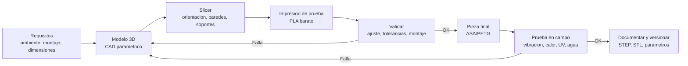

# 10 · Esquemáticos y diseño 3D

> **Resumen ejecutivo (60 s).** Un **esquemático** muestra *qué* está conectado (lógica eléctrica); un **PCB** muestra *dónde* y *cómo* (geometría, capas, pistas); un **modelo 3D** muestra la *forma física* (carcasa, soporte). Para leer un esquemático: busca primero **alimentación y tierra**, luego **entradas/salidas**, después **el flujo de señal** de izquierda a derecha. En impresión 3D para maquinaria agrícola, el material manda: **PLA** se ablanda con el calor y el sol; **PETG** es un compromiso; **ASA/ABS** aguantan mejor temperatura y UV (ASA es la mejor opción de exterior), pero son más difíciles de imprimir. Diseña con **tolerancias**, **orientación de capas** y **amortiguación de vibración** en mente.

## 1. Símbolos y referencias en esquemáticos

| Símbolo (texto) | Componente | Prefijo de referencia | Nota |
|---|---|---|---|
| `─/\/\/─` (zigzag) o rectángulo | Resistencia | **R** (R1, R2…) | Valor en Ω, potencia, tolerancia |
| `─┤├─` (dos placas) | Condensador | **C** | Polarizados: marca `+` |
| Bobina | Inductor | **L** | |
| Triángulo con barra | Diodo (ánodo → cátodo) | **D** | LED: con flechas; Zener, Schottky, TVS |
| Círculo con 3 terminales (B, C, E) / (G, D, S) | Transistor BJT / MOSFET | **Q** | Flecha indica tipo (NPN/PNP; canal N/P) |
| Rectángulo con pines | Circuito integrado | **U** (o IC) | Pin 1 con punto/muesca |
| Rectángulo o círculo con pines | Conector | **J** / **P** / **CN** | |
| Interruptor / pulsador | Switch | **SW** / **S** | |
| Relé | | **K** / **RL** | Con diodo de rueda libre |
| Cristal / oscilador | | **Y** / **X** | |
| Fusible | | **F** | |
| Puntos de prueba | | **TP** | |
| Símbolos de alimentación | `+3V3`, `+5V`, `VCC`, `VDD`, flechas hacia arriba | | Nets de alimentación |
| Símbolos de tierra | `GND` (tres barras decrecientes), tierra de chasis, tierra analógica `AGND` | | Distinguir **GND** de **tierra de chasis/PE** |

**Cruces de cables:** un **punto** en el cruce = conexión; sin punto = no hay conexión (en algunos dibujos se usa un "salto"). Las **etiquetas de net** (mismo nombre) conectan sin dibujar el cable.

## 2. Cómo leer un esquemático (método en 6 pasos)
1. **Identifica el propósito** (título, hoja, bloque funcional, revisión).
2. **Encuentra la alimentación** de cada CI: pines `VDD/VCC` y `GND`, **desacoplos** (100 nF junto al pin), reguladores y su origen (12/24 V de batería, protección de polaridad, fusible).
3. **Ubica entradas y salidas**: conectores (J1: sensores, J2: alimentación, J3: CAN), pines de MCU usados.
4. **Sigue el flujo de señal**: sensor → acondicionamiento → ADC/GPIO → MCU → transceptor → conector.
5. **Revisa lo "pasivo importante":** pull-ups (I2C/1-Wire), terminación CAN (120 Ω con jumper), divisores, filtros RC, protecciones (TVS, diodos).
6. **Comprueba niveles y compatibilidad**: 3.3 V vs 5 V, corrientes, polaridad, pines de reset/boot.

### Ejemplo: esquema textual de un nodo MCU (referencia, conexiones en tabla)
Este es un diagrama **conceptual** (didáctico) — verifica pines, límites y protecciones con los datasheets antes de construir.

| Referencia | Componente | Conexiones |
|---|---|---|
| J1 | Conector de alimentación 12 V | Pin 1 → F1; Pin 2 → GND |
| F1 | Fusible | J1.1 → D1 |
| D1 | Diodo (protección de polaridad inversa) / o MOSFET | F1 → entrada de U1 |
| TVS1 | TVS (protección de sobretensión) | Entrada de U1 → GND |
| U1 | Convertidor DC/DC 12 V → 3.3 V (rango de entrada automotriz) | VOUT = +3V3 |
| C1, C2 | Filtros de entrada/salida de U1 (según datasheet) | |
| U2 | MCU (p. ej. ESP32-WROOM / STM32) | Vdd ← +3V3; desacoplo 100 nF por pin |
| J2 | Conector 1-Wire (3 pines: +3V3, DQ, GND) | DQ → GPIO4; R1 (4.7 kΩ) entre DQ y +3V3 |
| J3 | Conector I2C/sensor (+3V3, SDA, SCL, GND) | SDA/SCL → GPIO; R2, R3 (2.2–4.7 kΩ) pull-ups a +3V3 |
| U3 | Transceptor CAN (p. ej. TJA1051T/3, SN65HVD230) | TXD/RXD → CAN TX/RX del MCU; Vcc = 3.3 V o 5 V según modelo; CANH/CANL → J4 |
| R4 | Terminador 120 Ω con *jumper* (JP1) | Entre CANH y CANL, **solo si el nodo está en un extremo del bus** |
| J4 | Conector CAN (CANH, CANL, GND) | |

```
 12V ─[F1]─►|─┬────[U1 DC/DC]──► +3V3 ─┬─────────► MCU Vdd (+100nF por pin)
              TVS↓                     ├─[4.7k]─┬─ DQ (1-Wire)
              GND                      ├─[4.7k]─┬─ SDA         ( pull-ups I2C: valor segun bus )
                                       └─[4.7k]─┬─ SCL
 MCU CAN_TX ─► U3 ─► CANH ──┬── J4         [120Ω + JP1] entre CANH y CANL (solo en extremos)
 MCU CAN_RX ◄─ U3 ◄─ CANL ──┘
```

## 3. Esquemático vs PCB vs modelo 3D

| | Esquemático | PCB (layout) | Modelo 3D |
|---|---|---|---|
| Muestra | Conexiones lógicas | Posición, capas, pistas, huellas | Forma y volumen físicos |
| Herramientas | KiCad, Altium, Eagle/Fusion | KiCad (PCB editor), Altium | Fusion 360, FreeCAD, SolidWorks, OpenSCAD, Tinkercad |
| Archivos | `.kicad_sch`, `.sch` | `.kicad_pcb`, Gerber | `.step` (intercambio), `.stl`/`.3mf` (impresión) |
| Preguntas típicas | ¿A qué pin va X? | ¿Ancho de pista para 2 A? ¿tierra continua? | ¿Cabe la PCB? ¿Tolerancias? |

- **Huella (footprint):** patrón de pads de un componente en la PCB. **Encapsulado (package):** cuerpo físico: `0603`, `SOIC-8`, `TQFP-48`, `SOT-23`, `DIP-8`, `TO-92`. La misma función eléctrica puede venir en diferentes encapsulados.
- **Conectores** en maquinaria: preferir con **bloqueo mecánico** (Deutsch DT/DTM, M8/M12, Molex Micro-Fit con seguro), evitar Dupont/jumpers en vibración.
- **Reglas de PCB** básicas: plano de tierra continuo, desacople cerca del pin, separar potencia y señal analógica, pares diferenciales (CAN) con trazas juntas, **ancho de pista** según corriente (usar la calculadora IPC-2221 y verificar), distancias de aislamiento según voltaje.

## 4. Tolerancias y holguras en impresión 3D (FDM)
- Las piezas impresas **no salen exactas**: contracción, "elephant foot", agujeros más pequeños de lo modelado.
- Reglas iniciales (ajústalas a tu **Ender 3** calibrada; **imprime una prueba de tolerancias**):
  - Holgura entre piezas móviles o de encaje suave: **0.2–0.4 mm** por lado.
  - Agujeros: modelar ~**0.1–0.3 mm** más grandes que el tornillo (M3 → Ø3.2–3.4 mm).
  - Encaje por presión: **0.05–0.15 mm**; aumentan con calor/creep.
  - Espesor de pared: múltiplos del ancho de línea (con boquilla 0.4 mm → 1.2 mm = 3 perímetros; 2 mm+ para carcasas).
  - **Insertos de latón roscados** (calor) para tornillería reutilizable; evita roscar plástico repetidamente.
  - Altura de capa 0.2 mm típico; 0.12–0.16 mm para más precisión.
- Cuando la pieza sea crítica: **prototipar con PLA barato** para validar geometría y luego imprimir en ASA/PETG.

## 5. Selección de material para exteriores y maquinaria

| Propiedad (valores orientativos; **verifica el datasheet de tu filamento**) | **PLA** | **PETG** | **ABS** | **ASA** |
|---|---|---|---|---|
| Temperatura de ablandamiento (Tg / HDT) | ~55–60 °C (**se deforma en un vehículo al sol**) | ~70–80 °C | ~95–105 °C | ~95–105 °C |
| Resistencia UV / intemperie | Baja | Media | Baja–media (amarillea) | **Buena** |
| Resistencia química / humedad | Baja (higroscópico, degrada) | Buena (aceites diluidos, agua) | Media (ataca la acetona) | Media |
| Resistencia al impacto / flexibilidad | Frágil | Buena, algo flexible | Buena | Buena |
| Facilidad de impresión | **Muy fácil** | Fácil (hilos/stringing) | Difícil (warping, requiere cámara cerrada, humos) | Difícil (similar al ABS) |
| Contracción / warping | Baja | Baja–media | Alta | Alta |
| Requisitos Ender 3 estándar | Cama 60 °C, boquilla ~200 °C | Cama ~75–80 °C, boquilla ~230–240 °C | Cama 100 °C, **cámara cerrada** | Igual que ABS |
| Uso recomendado | Prototipos, soportes de bancada/interior | Carcasas y soportes de uso general en exteriores moderados | Interior de compartimento del motor con temperatura moderada, con cuidado | **Exterior, sol, cabina, carcasas de sensores** |

- **Consideración térmica en maquinaria:** un vehículo cerrado al sol puede superar los 60–70 °C internamente; PLA falla. Compartimento del motor o cerca del escape → considerar **metal, nylon con fibra, PA-CF, PC** o carcasas comerciales; **no** ASA cerca de temperaturas continuas > ~80–90 °C sin verificar.
- **Humedad:** PLA/PETG/ABS absorben (nylon mucho más); almacena el filamento seco.
- **Alimentación y calor**: el sensor DS18B20 en vaina metálica es mejor que un sensor encapsulado en plástico para temperatura de motor.
- Verifica que el material **no afecte la señal** (antenas RF: evitar rellenos conductivos o metal alrededor de GNSS/Wi-Fi).

## 6. Orientación, soportes, relleno y resistencia
- **Anisotropía FDM:** la pieza es más débil **entre capas** (eje Z). Orienta la pieza para que las cargas queden **a lo largo de las capas**, no perpendicular. Ejemplo: una oreja de fijación con tornillo → imprime "de lado" para que las capas abracen el agujero.
- **Perímetros (paredes)** aportan más resistencia que el infill; 3–4 perímetros suele ser mejor que subir mucho el infill.
- **Infill:** 20–40 % con patrón giroide/cúbico; en carcasas la resistencia viene de paredes y espesor. 
- **Soportes:** evítalos diseñando ángulos ≤ 45° (autosoportados), chaflanes en vez de voladizos; los soportes dejan superficie rugosa.
- **Filetes/redondeos** en esquinas internas reducen concentración de esfuerzos; evita cantos vivos.
- **Nervios (ribs)** rigidizan sin gastar material.
- **Primera capa**: buena adherencia (cama nivelada, limpieza, *brim* si es necesario).
- **Agujeros verticales** salen más redondos que los horizontales; agrega "puentes" sacrificiales si es necesario.

## 7. Vibración, montaje y protección en maquinaria
- **Amortiguar:** soportes de goma/silentblock, arandelas, o carcasa flotante para PCB; evitar resonancias cerca de la frecuencia de trabajo del motor.
- **Fijaciones:** tornillería con **arandelas de seguridad/Loctite** (o insertos), no confíes solo en presión plástica; aplica **alivio de tensión** al cable.
- **Estanqueidad:** junta (silicona/TPU/O-ring), prensaestopas IP68, respiradero (membrana de Gore/PTFE) contra condensación, tapas con tornillos y nervio-labio.
- **Disipación térmica:** deja ventilación (si el IP lo permite) o superficies de disipación; evita el sol directo en pintura oscura.
- **Cableado:** salida del cable **hacia abajo** (goteo), radio de curvatura mínimo, sujeta cada 10–15 cm.
- **Seguridad:** no montes carcasas sueltas cerca de partes móviles; evita cantos que puedan enganchar ropa o cables; verifica normas locales.
- **Servicio:** acceso a conectores y a botón de reset; etiquetas con ID del dispositivo.
- **Puesta a tierra/EMI:** una carcasa plástica no blinda; si hay EMI fuerte, usa carcasa metálica o pintura conductora **con análisis**.

## 8. Flujo de diseño → impresión → validación → iteración



## 9. Ejemplo: carcasa para un sensor en una máquina agrícola
**Caso:** nodo MCU + gateway o sensor de vibración/temperatura montado en la carcasa de una bomba (exterior, sol, salpicaduras, vibración).

| Decisión | Elección (ejemplo) | Razón |
|---|---|---|
| Material | **ASA** (o PETG si es sombra) | UV y temperatura |
| Perímetros / infill | 4 perímetros, 30 % giroide | Rigidez y sellado |
| Espesor de pared | ≥ 2.4 mm (6 líneas de 0.4 mm) | Estanqueidad y golpes |
| Orientación | Base plana sobre la cama; orejas de fijación con capas paralelas al esfuerzo | Resistencia |
| Tapa | Tornillos M3 con **insertos de latón**, junta de silicona/TPU en canal | Sellado, mantenimiento |
| Prensaestopas | PG7/M12 (según cable) con roscado real (no impresa) | Estanqueidad y alivio |
| Montaje | 2 tornillos M5 con arandela de goma + tuerca de seguridad; base plana para el sensor de vibración **rígida** | Vibración |
| Sensor de temperatura | DS18B20 en vaina metálica con pasta térmica, atornillado al cuerpo | Medir la pieza, no el aire |
| Sensor de vibración | MEMS pegado/atornillado rígido al cuerpo de la bomba | Un montaje flojo distorsiona la medición |
| Ventilación | Membrana respiradero | Evita condensación |
| Etiquetado | ID del dispositivo y flechas de orientación | Mantenimiento |

Diseño paramétrico en OpenSCAD (ejemplo mínimo; verifica cotas con la PCB real):
```openscad
// carcasa_sensor.scad — caja con tapa para una PCB de 50x35 mm (ejemplo)
pcb = [50, 35, 1.6];  wall = 2.4;  clear = 0.3;      // holgura por lado
inner = [pcb[0]+2*clear, pcb[1]+2*clear, 20];
module box() difference() {
  cube([inner[0]+2*wall, inner[1]+2*wall, inner[2]+wall]);
  translate([wall, wall, wall]) cube(inner);                       // cavidad
  translate([inner[0]+wall, wall+inner[1]/2, wall+8]) rotate([0,90,0])
    cylinder(d=12.6, h=wall+1, $fn=48);                            // salida de cable (PG7, verifica el diametro)
}
box();
```
**Validar:** ajuste de PCB, giro de prensaestopas, prueba de agua (rociado), vibración en máquina, ciclo térmico al sol, inspección tras 2–4 semanas en campo. **Iterar** y versionar (STEP/STL + parámetros) en Git.

## 10. Errores frecuentes y preguntas trampa
1. Elegir PLA para exteriores/vehículos.
2. Diseñar sin holguras (piezas que no encajan).
3. Orientar una pieza con la carga entre capas.
4. Conectores tipo Dupont en maquinaria (vibración).
5. No liberar la condensación (sensor húmedo por dentro).
6. Trampa: "¿Diferencia entre esquemático y PCB?" lógica vs física.
7. Trampa: "¿Puedes imprimir un soporte de PLA para el motor?" → temperatura, verifica ubicación.
8. Trampa: "Si el esquemático es correcto, ¿el PCB funcionará?" → no: layout, ruido, pistas, desacoplo, tierras, impedancia.
9. Trampa: "¿Qué es `NC` en un pin?" → *No Connect*; no conectar (o según el datasheet).

## 11. Ejercicios y verificación
[`exercises/fundamentals.md`](../exercises/fundamentals.md) (lectura de esquemático), [`mock_exam/exam_60min.md`](../mock_exam/exam_60min.md). **Verifica** datasheet del filamento (Tg/HDT, UV), IP requerido, normas de conectores y de seguridad aplicables.
