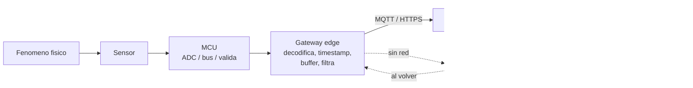

# 11 · Conectividad y telemetría

> **Resumen ejecutivo (60 s).** Telemetría = llevar un dato desde su origen físico hasta donde alguien puede usarlo, **sin perderlo, sin duplicarlo y sabiendo cuándo y en qué unidad se midió**. Cada mensaje debe llevar **`device_id`, `ts` (UTC, del momento de medición), `seq`, `sensor`, `value`, `unit`, `quality`**. El gateway (*edge*) valida, bufferiza y reenvía; el transporte (MQTT o HTTP) debe tolerar **reintentos** → el servidor debe ser **idempotente**. Un buen diseño **sigue funcionando sin Internet** y **se recupera solo**. Un **heartbeat** distingue "no hay novedades" de "el dispositivo murió".

Diagramas: [`dataflow_sensor_to_dashboard.html`](../diagrams/archify/dataflow_sensor_to_dashboard.html) · [`sequence_offline_recovery.html`](../diagrams/archify/sequence_offline_recovery.html) · [`sequence_telemetry.mmd`](../diagrams/sequence_telemetry.mmd)



## 1. De la lectura física al dato almacenado

| Etapa | Qué ocurre | Riesgo | Control |
|---|---|---|---|
| 1. Fenómeno → señal | Transductor | Sensor mal montado | Montaje, calibración |
| 2. Acondicionamiento | Filtro, divisor, aislamiento | Ruido | Filtro, blindaje |
| 3. ADC / bus digital | Cuentas o registros | Aliasing, NACK | Muestreo, CRC |
| 4. MCU | Escala, unidad, plausibilidad, `quality` | Overflow, unidades | Validación, tipos claros |
| 5. Enlace local | UART/CAN → gateway | Corrupción, pérdida | Checksum, `seq` |
| 6. Gateway | Timestamp, `device_id`, agregación, buffer | Reloj incorrecto, disco lleno | NTP/RTC, límites |
| 7. Transporte | MQTT/HTTP | Caída de red, duplicados | QoS, reintentos, idempotencia |
| 8. Servidor | Validación, almacenamiento | Datos inválidos, huecos | Esquema, índices |
| 9. Visualización/alertas | Dashboard | Zona horaria, filtros | UTC, pruebas |

## 2. Gateway, edge computing y cloud

| Capa | Función | Ejemplos |
|---|---|---|
| **Edge / gateway** | Traducir protocolos (CAN/UART/RS-485 → MQTT/HTTP), validar, agregar, bufferizar, alertas locales; funciona sin red | Raspberry Pi, gateway industrial |
| **Servidor local (on-premise)** | Broker, base de datos, dashboards dentro del ingenio | Mosquitto/EMQX, PostgreSQL |
| **Cloud** | Escalabilidad, acceso remoto, analítica | Servicios administrados (verifica costo, latencia, privacidad, políticas) |

**Por qué edge:** reducir tráfico (enviar resúmenes o por excepción), latencia local, autonomía sin conexión, **decisiones locales de alerta**, y filtrado/validación temprana.

## 3. MQTT y HTTP/REST
Ver comparativa en el módulo 07. Guía de elección:
- **Flujo continuo de muchas máquinas, redes celulares inestables, y deseas empujar a suscriptores** → MQTT (QoS 1, LWT, retain).
- **Envíos en lote, consultas históricas, integración con sistemas existentes, simple de depurar con `curl`** → HTTP/REST.
- En muchos sistemas: MQTT hasta el servidor y **HTTP para configuración/consultas**.

## 4. Diseño del payload JSON

```json
{
  "schema": 1,
  "device_id": "tractor01",
  "ts": "2026-03-01T06:00:00.250Z",
  "seq": 10452,
  "fw": "1.4.2",
  "readings": [
    {"sensor": "temp_motor", "value": 82.4, "unit": "C", "quality": "good"},
    {"sensor": "rpm", "value": 1850, "unit": "rpm", "quality": "good"},
    {"sensor": "temp_carter", "value": null, "unit": "C", "quality": "bad", "reason": "crc"}
  ]
}
```

| Campo | Por qué |
|---|---|
| `schema` | Evolucionar el formato sin romper consumidores |
| `device_id` | Identificar la fuente (estable y único) |
| `ts` | **Momento de la medición**, ISO-8601 **UTC** (`Z`). Nunca hora local ambigua |
| `seq` | Contador creciente por dispositivo: detecta pérdidas y permite deduplicar |
| `sensor` + `unit` | Sin unidad el dato es ambiguo (°C vs °F, bar vs psi) |
| `quality` | `good/uncertain/bad`; **nunca enviar un −127 como si fuera dato bueno** |
| `value: null` | Ausencia explícita, no `0` |
| `fw` | Versión de firmware para diagnóstico |

**Tamaño:** JSON es legible pero verboso; en enlaces caros considera abreviar claves, **agrupar** lecturas (lotes), CBOR/MessagePack o binario propio con `struct`. *No optimices antes de medir.*

## 5. Frecuencia de envío

| Estrategia | Descripción | Cuándo |
|---|---|---|
| **Periódica fija** | Cada N segundos | Simplicidad; tendencias |
| **Por excepción (deadband)** | Solo si cambia más de un umbral | Ahorra ancho de banda |
| **Agregada** | Promedio/min/max por ventana (p. ej. 1 min) | Ruido alto o enlace caro |
| **Adaptativa** | Más frecuente en alarma | Diagnóstico de eventos |
| **Por lotes** | Acumula y envía cada X s o N mensajes | HTTP/celular |

Regla: la frecuencia depende de **la dinámica del fenómeno y del uso del dato**, no de "lo más rápido posible". Temperatura de motor: 1/s o menos; vibración: adquirida rápido localmente, **reportada como indicadores** (RMS, picos, espectro reducido), no como forma de onda cruda continua (salvo diagnóstico puntual).

## 6. Heartbeat y detección de desconexión
- **Heartbeat:** mensaje periódico pequeño (`{"device_id":..., "ts":..., "seq":..., "uptime_s":..., "buffer_pending": 12}`).
- **En el servidor:** si no llega nada durante `k × periodo` (p. ej. 3×), el dispositivo pasa a **OFFLINE** (ver [`07_timeout_detector.py`](../examples/python/07_timeout_detector.py)).
- **MQTT:** *keep-alive* del protocolo y **LWT** (el broker publica el mensaje de "offline" si la conexión se cae sin `DISCONNECT`).
- **Distinguir:** dispositivo **vivo pero sensor malo** (llega `quality=bad`) vs **dispositivo muerto** (no llega nada) vs **red caída** (el gateway sigue vivo, tiene `buffer_pending` creciente).
- El *heartbeat* incluye métricas de salud: uptime, motivo del último reset, temperatura de CPU, espacio libre, versión.

## 7. Buffering, reintentos, idempotencia y duplicados
- **Buffer local persistente** (SQLite/archivo circular) con **límite** y política de descarte documentada (lo más antiguo primero, o priorizando alarmas), y **contador de descartes** enviado luego.
- **Reintentos con backoff exponencial + jitter** (1 s, 2 s, 4 s… con tope y aleatoriedad) para no saturar al servidor cuando vuelva.
- **Al vaciar el buffer**, limitar ritmo y mantener **orden**.
- **Idempotencia:** aplicar la misma operación varias veces produce el mismo resultado. Clave natural: **`(device_id, seq)`** (o `(device_id, sensor, ts)`). En SQL: `INSERT ... ON CONFLICT (device_id, seq) DO NOTHING`.
- **Entrega:** MQTT QoS 0 = puede perderse; **QoS 1 = al menos una vez (duplicados posibles)**; QoS 2 = exactamente una (más costoso). HTTP: un `POST` con timeout puede haberse procesado igualmente → reintento = posible duplicado → necesita idempotencia (o cabecera `Idempotency-Key`).
- **Reordenamiento:** los mensajes pueden llegar desordenados; ordenar por `ts`/`seq` al consultar.
- **Reloj:** si el gateway no tiene hora confiable al arrancar (sin RTC/NTP), marca `ts_quality`; la hora del servidor de recepción se guarda aparte (`received_at`).

## 8. Almacenamiento de series de tiempo

| Opción | Cuándo | Nota |
|---|---|---|
| **PostgreSQL** (+ **TimescaleDB**) | Ya usas SQL/Django; consultas relacionales + series | Tu experiencia previa aplica; particiones/hypertables |
| **InfluxDB / Prometheus** | Métricas, alta tasa de escritura | Otros lenguajes de consulta |
| **SQLite** | Buffer/almacenamiento local | Un solo escritor |
| **Archivos CSV/Parquet** | Históricos, análisis offline | |

Esquema básico (PostgreSQL):
```sql
CREATE TABLE measurements (
  device_id   text        NOT NULL,
  seq         bigint      NOT NULL,
  ts          timestamptz NOT NULL,        -- momento de la medicion (UTC)
  received_at timestamptz NOT NULL DEFAULT now(),
  sensor      text        NOT NULL,
  value       double precision,            -- NULL si quality = bad
  unit        text        NOT NULL,
  quality     text        NOT NULL CHECK (quality IN ('good','uncertain','bad')),
  PRIMARY KEY (device_id, seq, sensor)     -- clave de idempotencia
);
CREATE INDEX ON measurements (sensor, ts DESC);
-- inserción idempotente:
INSERT INTO measurements (device_id, seq, ts, sensor, value, unit, quality)
VALUES ('tractor01', 10452, '2026-03-01T06:00:00Z', 'temp_motor', 82.4, 'C', 'good')
ON CONFLICT (device_id, seq, sensor) DO NOTHING;
-- promedio por minuto de las ultimas 6 horas:
SELECT date_trunc('minute', ts) AS minuto, avg(value)
FROM measurements
WHERE sensor = 'temp_motor' AND device_id = 'tractor01' AND quality = 'good' AND ts > now() - interval '6 hours'
GROUP BY 1 ORDER BY 1;
```
**Retención:** datos crudos (1 s) por semanas, agregados (1 min) por meses, y (1 h) por años; usa políticas de retención/downsampling.

## 9. API y cliente Python (ejemplo ejecutable)
- **API de prueba** (solo librería estándar; **no** para producción): [`mock_api_server.py`](../examples/python/mock_api_server.py) implementa `POST /api/v1/measurements` (idempotente por `(device_id, seq)`), `GET /api/v1/measurements`, `GET /health`, y puede simular fallos (`--fail-first N`).
- **Cliente:** [`06_post_to_api.py`](../examples/python/06_post_to_api.py) (timeout, backoff, 4xx sin reintento). Ejecución verificada: con `--fail-first 2` reintenta 2 veces y luego `accepted=1`; el reenvío da `duplicates=1`.
- **Producción:** HTTPS + autenticación (token/mTLS), validación de esquema (Pydantic/`jsonschema`/Django REST Framework), límites de tamaño, limitación de tasa, registro, y pruebas.
```python
# Cliente minimo (resumen)
import requests
r = requests.post("https://api.ejemplo.local/api/v1/measurements",
                  json=payload, timeout=(3.05, 10),                 # (conexion, lectura)
                  headers={"Authorization": f"Bearer {TOKEN}"})
r.raise_for_status()
```

## 10. Sistema que sigue funcionando sin Internet
Requisitos de diseño:
1. **Autonomía local:** el nodo y el gateway siguen **midiendo, validando y alertando localmente** (buzzer/LED/panel/mensaje local).
2. **Buffer persistente** dimensionado: `capacidad = tasa_msgs/s × bytes/msg × tiempo_de_autonomía`. Ej.: 5 mensajes/s × 300 B × 24 h = 5·300·86 400 ≈ **130 MB** (más overhead de SQLite).
3. **Reloj confiable** (NTP cuando hay red; RTC con batería; marcar `ts_quality`).
4. **Reconexión automática** con backoff (`paho` `loop_start` reconecta solo; en HTTP, lazo de reintentos).
5. **Recuperación ordenada** y con límite de ancho de banda; no bloquear la adquisición mientras se vacía.
6. **Idempotencia** en el servidor.
7. **Observabilidad:** `buffer_pending`, `last_success_ts`, contador de descartes en el heartbeat.
8. **Prueba de desconexión:** desconecta la red 10 min, reconecta y verifica que **no falta ni sobra** ningún `seq`.
9. **Persistencia ante cortes de energía:** commits frecuentes, SSD/eMMC o SD industrial, apagado ordenado o UPS.

Verificación en repositorio: [`08_store_and_forward.py`](../examples/python/08_store_and_forward.py) → `pendientes sin red: 7`, `enviados al volver la red: 7`, secuencia `[1..7]` en orden. Diagrama: [`sequence_offline_recovery.html`](../diagrams/archify/sequence_offline_recovery.html).

## 11. Errores frecuentes y preguntas trampa
1. Usar la hora de llegada como hora de medición.
2. Enviar sin `unit` ni `quality`.
3. Sin `seq` → imposible detectar duplicados/pérdidas.
4. Buffer en RAM (se pierde en un reinicio).
5. Reintentar infinitamente sin backoff.
6. Buffer sin límite → llena el disco → el gateway muere.
7. Trampa: "¿MQTT QoS 2 elimina la necesidad de idempotencia?" → reduce duplicados en el protocolo, pero la aplicación, los reinicios y los reenvíos del buffer pueden duplicar igualmente; se diseña idempotente por robustez.
8. Trampa: "¿Cada cuánto envío?" → depende de dinámica, uso y costo.
9. Trampa: "¿Cómo sabes si un dispositivo está muerto o sin cobertura?" → heartbeat + `buffer_pending` al reconectar + LWT.

## 12. Ejercicios y verificación
[`exercises/ot_it.md`](../exercises/ot_it.md), casos en [`14_casos_practicos.md`](14_casos_practicos.md). **Verifica:** versión y opciones de tu broker, límites de mensaje, costos de datos móviles, y requisitos de privacidad/retención de tu organización.
