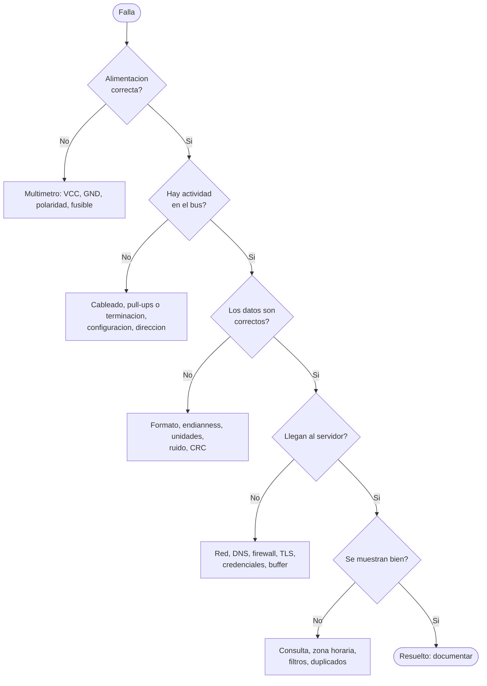
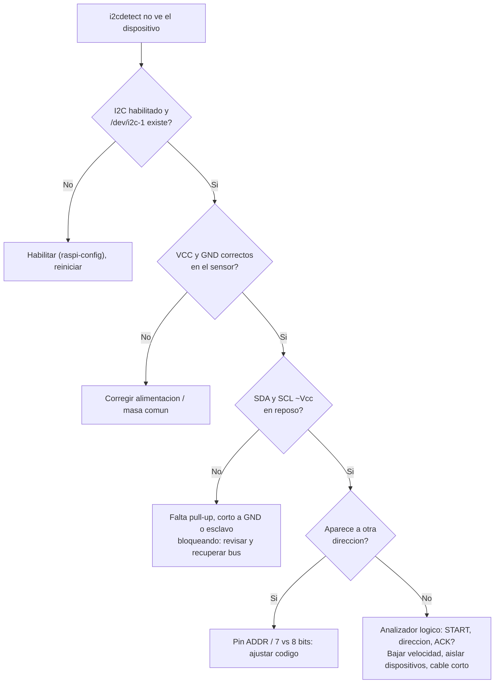
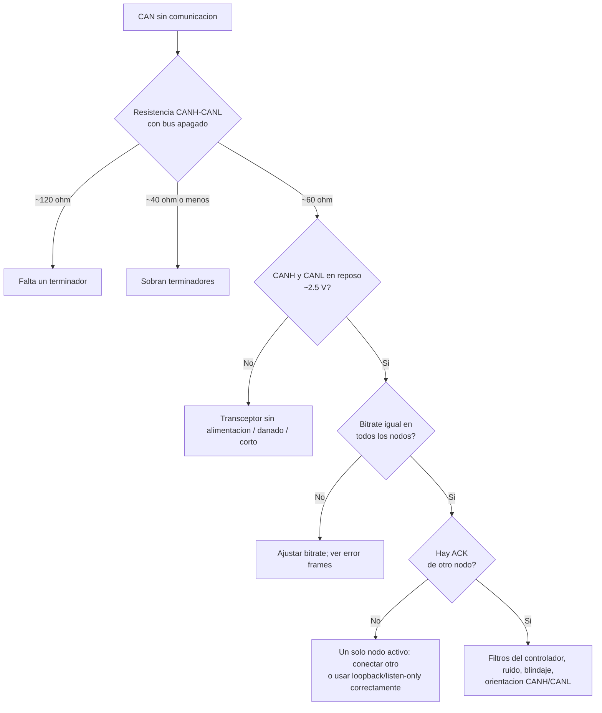
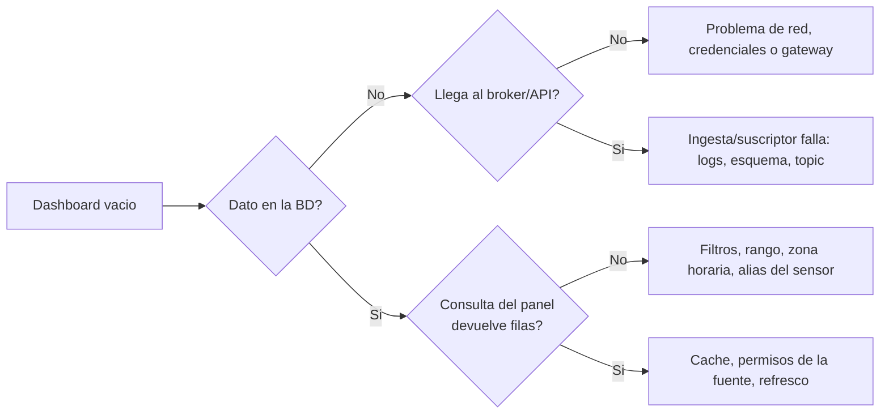

# 12 · Diagnóstico y troubleshooting

> **Resumen ejecutivo (45 s).** Diagnosticar es **acotar**: de lo simple a lo complejo y de lo físico a lo lógico. Orden universal: **1) alimentación y tierra → 2) conexiones físicas → 3) configuración (dirección, baudrate, bitrate) → 4) protocolo (¿hay actividad en el bus?) → 5) software/permisos → 6) red → 7) datos/aplicación**. Cambia **una variable a la vez**, **mide antes de suponer** y **documenta** lo que probaste. En una entrevista, describir el método (hipótesis → prueba → resultado → siguiente hipótesis) vale tanto como la respuesta.

Árbol general: [`troubleshooting_flow.mmd`](../diagrams/troubleshooting_flow.mmd)

**Herramientas base:** multímetro (continuidad, VCC, resistencia CANH-CANL), osciloscopio, **analizador lógico** (Saleae o clones con Sigrok/PulseView), adaptador USB-serie (loopback), `i2cdetect`, `candump`, `dmesg`, `journalctl`, `ss`, `curl`, `ping`, `tcpdump`, fuente de laboratorio.

---

## Escenario 1 — Sensor sin alimentación
| | |
|---|---|
| **Síntomas** | Sin lectura ni respuesta en el bus; LED del módulo apagado; valores constantes (0 o máximo) |
| **Hipótesis** | (a) Fusible/protección abierta; (b) cable/conector flojo; (c) polaridad invertida; (d) regulador dañado o sobrecargado; (e) tensión incorrecta (5 V en sensor de 3.3 V o al revés); (f) masa no común |
| **Pruebas (en orden)** | 1. Inspección visual y conectores. 2. **Multímetro en el sensor**: VCC–GND. 3. Medir en el origen (regulador/fuente): ¿llega? 4. Continuidad de cable (apagado). 5. Comprobar consumo (fuente de laboratorio con límite de corriente). 6. Ver el caso de reinicios por caídas de voltaje bajo carga |
| **Herramientas** | Multímetro, fuente con límite de corriente, cámara térmica/dedo con cuidado |
| **Solución probable** | Reparar conector/fusible; corregir tensión; añadir protección y desacoplo; verificar caída de voltaje en cable largo (`V = I·R`) |

## Escenario 2 — Lectura fuera de rango
| | |
|---|---|
| **Síntomas** | −127 °C, 85 °C constante, 4095 (ADC saturado), 0 constante, valores absurdos |
| **Hipótesis** | (a) Sensor desconectado; (b) valor de reset (DS18B20 = 85 °C); (c) unidades/escala incorrectas; (d) ADC con entrada flotante o Vref errónea; (e) ruido/EMI; (f) fuera del rango real del sensor; (g) calibración/offset; (h) endianness o firma incorrectos |
| **Pruebas** | 1. ¿Es un valor "mágico" (−127, 85, 0xFFFF, 0x7FFF)? 2. Comprobar CRC/estado. 3. Medir la señal cruda con multímetro. 4. Reemplazar el sensor por uno de referencia. 5. Cortocircuitar/abrir la entrada de prueba para ver el comportamiento. 6. Revisar la fórmula de conversión y `int16_t` vs `uint16_t`. 7. Mirar el ruido en osciloscopio |
| **Herramientas** | Multímetro, osciloscopio, logs con valor crudo + convertido |
| **Solución probable** | Validación por CRC y `quality`; corregir escala/tipos; filtrar/blindar; recalibrar |

```mermaid
flowchart TD
    A["Lectura fuera de rango"] --> B{"Es valor magico?<br/>-127, 85, 0, max"}
    B -- Si --> C["Sensor desconectado / sin convertir:<br/>cableado, pull-up, CRC, esperar conversion"]
    B -- No --> D{"Crudo en multimetro<br/>coincide?"}
    D -- No --> E["Ruido, tierra, sensor danado, alimentacion"]
    D -- Si --> F["Error de conversion:<br/>unidades, escala, signo, endianness"]
```

## Escenario 3 — I2C no detecta el dispositivo
| | |
|---|---|
| **Síntomas** | `i2cdetect -y 1` no muestra la dirección; `OSError [Errno 121]` (NACK) o `[Errno 5]`; el bus se queda colgado |
| **Hipótesis** | (a) I2C no habilitado (Pi: `raspi-config`); (b) sin alimentación/GND; (c) SDA/SCL invertidos o en pines equivocados; (d) **sin pull-ups** o valor inadecuado; (e) dirección distinta (pin ADDR, dirección de 7 vs 8 bits); (f) niveles 3.3/5 V; (g) dos dispositivos con la misma dirección; (h) cable largo/capacitancia; (i) esclavo bloqueando SDA |
| **Pruebas** | 1. Habilitar I2C y `ls /dev/i2c-*`. 2. Medir VCC/GND en el sensor. 3. **Medir SDA y SCL en reposo con multímetro: ≈ Vcc** (si es ~0 V → sin pull-up o bus tirado a 0). 4. `i2cdetect -y 1` con solo ese sensor. 5. Revisar dirección en datasheet/silkscreen. 6. Bajar velocidad (`dtparam=i2c_arm_baudrate=50000`). 7. Osciloscopio/analizador: ¿START + dirección + ACK? 8. Aislar dispositivos uno a uno. 9. Recuperación del bus (9 pulsos de SCL) |
| **Herramientas** | `i2cdetect`, `i2cget`, multímetro, analizador lógico/osciloscopio |
| **Solución probable** | Añadir/ajustar pull-ups (2.2–4.7 kΩ), corregir cableado/dirección, level shifter, acortar cables, multiplexor I2C |

## Escenario 4 — UART entrega caracteres corruptos
| | |
|---|---|
| **Síntomas** | `ÿ�`, caracteres aleatorios, mensajes truncados o con errores esporádicos |
| **Hipótesis** | (a) **Baudrate distinto**; (b) formato (bits, paridad, stop) distinto; (c) reloj impreciso del MCU (RC interno) o error de divisor de baudios (p. ej. 115200 con 8 MHz); (d) niveles/ruido; (e) GND no común; (f) cable largo; (g) buffer desbordado (*overrun*); (h) consola serie del sistema interfiriendo (Pi) |
| **Pruebas** | 1. Confirmar baud/formato en **ambos** lados. 2. **Loopback** (TX↔RX) para aislar. 3. Medir la duración de un bit con osciloscopio (`1/baud`): ¿coincide? 4. Enviar un patrón conocido (`0x55` = 01010101 muestra reloj puro). 5. Probar baudios más bajos. 6. Verificar GND y niveles (RS-232 ±V ≠ TTL). 7. Revisar `dmesg`/errores de framing y overrun (`stty`, contadores). 8. Usar cristal en lugar del oscilador RC |
| **Herramientas** | Osciloscopio/analizador lógico (decodificador UART), adaptador USB-serie, `screen`/`minicom` |
| **Solución probable** | Igualar parámetros; usar baudrate compatible con el reloj; añadir GND; RS-485 para distancia; DMA/buffer; checksum |

## Escenario 5 — CAN no comunica
| | |
|---|---|
| **Síntomas** | Sin tramas en `candump`; `ERROR-PASSIVE`/`BUS-OFF`; muchos *error frames*; solo un nodo activo |
| **Hipótesis** | (a) **Bitrate incorrecto**; (b) terminación faltante o excesiva; (c) CANH/CANL invertidos; (d) transceptor sin alimentación / mal cableado (TXD/RXD); (e) sin al menos otro nodo que dé ACK; (f) ruido/cables largos o sin par trenzado; (g) filtros/máscaras del controlador; (h) modo *listen-only* (no transmite); (i) masa de referencia no común |
| **Pruebas** | 1. **Resistencia CANH–CANL con el bus apagado ≈ 60 Ω** (120 Ω → falta un terminador; 40 Ω → sobra uno). 2. Alimentación del transceptor. 3. Voltajes en reposo: CANH ≈ CANL ≈ 2.5 V. 4. `ip -details -statistics link show can0` (estado y contadores). 5. Confirmar bitrate con el fabricante (J1939/ISOBUS típicamente 250 kbit/s; **verifica**). 6. `candump -e` (error frames). 7. Osciloscopio: forma de onda diferencial (~2 V dominante), reflexiones. 8. Probar con dos nodos conocidos en la mesa |
| **Herramientas** | Multímetro, osciloscopio, `candump`, adaptador USB-CAN, analizador CAN |
| **Solución probable** | Ajustar bitrate; corregir terminadores (2 en total); intercambiar CANH/CANL; cable trenzado, derivaciones cortas; verificar transceptor y ACK; escuchar en *listen-only* en maquinaria |

## Escenario 6 — Microcontrolador reinicia continuamente
| | |
|---|---|
| **Síntomas** | Bucle de arranque, mensajes de boot repetidos, LED parpadeando, se reinicia al conectar un sensor/motor/Wi-Fi |
| **Hipótesis** | (a) **Alimentación insuficiente o caídas (brown-out)** — típico con Wi-Fi/motores/relés; (b) watchdog disparándose (bucle bloqueante); (c) desbordamiento de pila/heap; (d) excepción/HardFault (puntero nulo, arreglo fuera de límites); (e) ISR muy larga o mal escrita; (f) pin de reset/boot con ruido; (g) cortocircuito en un periférico; (h) memoria/configuración corrupta |
| **Pruebas** | 1. Leer la **causa de reset** (registro del MCU o log del arranque: `rst:0x...`, `WDT`, `brownout`). 2. Medir Vcc con osciloscopio durante el evento (¿cae?). 3. Alimentar con fuente robusta y desacoplo. 4. Desconectar periféricos uno a uno. 5. Añadir *logs* de progreso/puntos de control. 6. Revisar tamaños de pila y arreglos. 7. Deshabilitar el watchdog **temporalmente** para ver si el programa se cuelga. 8. Depurador/backtrace del HardFault |
| **Herramientas** | Osciloscopio, monitor serie, depurador (SWD/JTAG), logs de causa de reset |
| **Solución probable** | Fuente adecuada + condensadores; separar alimentación de potencia; corregir bug; alimentar el watchdog correctamente; diodo de rueda libre en cargas inductivas |

## Escenario 7 — Raspberry Pi no detecta el puerto serial
| | |
|---|---|
| **Síntomas** | No existe `/dev/ttyUSB0`/`ttyACM0`; `Permission denied`; `device busy`; cambia de número |
| **Hipótesis** | (a) Cable USB solo de carga; (b) puerto/alimentación USB insuficiente; (c) driver ausente; (d) el dispositivo no se enumera; (e) **usuario fuera de `dialout`**; (f) otro proceso lo usa (`ModemManager`, `brltty`, otro script); (g) UART de hardware de la Pi ocupado por la consola serie; (h) nombre distinto (ttyACM vs ttyUSB) |
| **Pruebas** | 1. `lsusb`: ¿aparece el dispositivo? 2. `dmesg \| tail`: ¿"attached to ttyUSBx"? 3. `ls -l /dev/ttyUSB* /dev/ttyACM* /dev/serial/by-id/`. 4. `groups` (¿dialout?). 5. `fuser -v /dev/ttyUSB0`. 6. Probar otro cable/puerto/dispositivo. 7. Para UART GPIO: `raspi-config` (desactivar consola serie, activar hardware) y `ls -l /dev/serial0`. 8. Fuente de 5 V suficiente (subvoltaje → `dmesg` muestra `Under-voltage`) |
| **Herramientas** | `lsusb`, `dmesg`, `ls -l`, `groups`, `fuser`, [`01_serial_setup_check.sh`](../examples/linux/01_serial_setup_check.sh) |
| **Solución probable** | Cambiar cable; `usermod -aG dialout`; detener `ModemManager`/`brltty`; rutas estables (`by-id`); ajustar `raspi-config` |

## Escenario 8 — Programa Linux no inicia
| | |
|---|---|
| **Síntomas** | `systemctl status` = failed; código de salida ≠ 0; "start request repeated too quickly"; funciona a mano pero no como servicio |
| **Hipótesis** | (a) Ruta o intérprete incorrectos (`203/EXEC`); (b) permisos/usuario (`217/USER`, `PermissionError`); (c) dependencias/venv; (d) variables de entorno o archivo de configuración ausentes; (e) puerto ocupado; (f) disco lleno / sin memoria; (g) error de sintaxis o excepción de Python; (h) dispositivo aún no disponible al arrancar |
| **Pruebas** | 1. `systemctl status servicio`. 2. `journalctl -u servicio -n 100`. 3. Ejecutar manualmente **como el mismo usuario y con el mismo intérprete**. 4. Comprobar rutas y permisos (`ls -l`, `namei -l ruta`). 5. `ss -tulpn` (puerto), `df -h`, `free -m`. 6. Revisar `EnvironmentFile`/`WorkingDirectory`. 7. `python -m py_compile archivo.py` |
| **Herramientas** | `systemctl`, `journalctl`, `ss`, `df`, `ls -l`, `strace` (avanzado) |
| **Solución probable** | Corregir `ExecStart`/usuario/grupo; instalar dependencias en el venv correcto; `daemon-reload` y `restart`; ajustar `After=`/`Restart=`/`RestartSec=` |

## Escenario 9 — API inaccesible
| | |
|---|---|
| **Síntomas** | `ConnectionError`, timeout, 502/503/504, `SSL: CERTIFICATE_VERIFY_FAILED`, DNS falla |
| **Hipótesis** | (a) Sin red local; (b) DNS; (c) firewall/ACL o puerto bloqueado; (d) servicio caído; (e) certificado TLS caducado o hora del gateway incorrecta; (f) proxy; (g) credenciales/token; (h) URL/puerto equivocados |
| **Pruebas** | 1. `ip a`, `ping gateway` (LAN). 2. `ping 8.8.8.8` (Internet sin DNS) y `ping dominio` (DNS). 3. `nc -zv host puerto`/`curl -v https://host/health`. 4. Desde otra máquina (¿es global o solo este cliente?). 5. Revisar códigos: 401/403 (auth), 404 (ruta), 5xx (servidor). 6. `date`/`timedatectl` (TLS falla con hora incorrecta). 7. `traceroute`/`mtr`. 8. Logs del servidor |
| **Herramientas** | `ping`, `curl -v`, `nc`, `dig`, `traceroute`, logs |
| **Solución probable** | Arreglar DNS/ruta; abrir el puerto **saliente** necesario (no exponer OT); renovar certificado o sincronizar hora (NTP); reiniciar servicio; corregir token |

## Escenario 10 — Datos llegan al servidor, pero no al dashboard
| | |
|---|---|
| **Síntomas** | El broker/API recibe mensajes; el panel está vacío o desactualizado |
| **Hipótesis** | (a) Consulta/filtros incorrectos (dispositivo/sensor/rango); (b) **zona horaria**/timestamps en el futuro o pasado; (c) el suscriptor no inserta en la BD (error silencioso, restricción, JSON inválido); (d) topic equivocado/wildcard; (e) datos con `quality=bad` filtrados; (f) caché del dashboard/agregación; (g) permisos de la fuente de datos; (h) la BD está en otra instancia |
| **Pruebas** | 1. Verificar el último dato **directo en la BD** (`SELECT ... ORDER BY ts DESC LIMIT 5`). 2. Suscribirse al topic (`mosquitto_sub -v -t '#'` en pruebas). 3. Logs del suscriptor/ingesta. 4. Comparar `ts` vs `now()` (¿desfase de horas = zona horaria?). 5. Ejecutar la consulta del panel a mano. 6. Revisar rango de tiempo del dashboard y auto-refresh. 7. Verificar conteo por minuto para ver huecos |
| **Herramientas** | `psql`, `mosquitto_sub`, logs, la consulta del panel |
| **Solución probable** | Corregir consulta/topic/zona horaria; arreglar el insert (esquema); reiniciar la ingesta; documentar contratos de datos |

## Escenario 11 — Pérdida intermitente de conectividad
| | |
|---|---|
| **Síntomas** | Huecos en la gráfica; reconexiones frecuentes; timeouts esporádicos; "funciona por horas y luego falla" |
| **Hipótesis** | (a) Señal débil (Wi-Fi/celular), antena; (b) alimentación inestable del módem (picos de corriente al transmitir); (c) interferencia; (d) DHCP/lease, NAT/keep-alive de operadora que cierra conexiones ociosas; (e) DNS intermitente; (f) sobrecarga del enlace; (g) timeouts demasiado cortos; (h) contactos/antenas por vibración; (i) desconexión del broker por *keep-alive* mal configurado |
| **Pruebas** | 1. Registrar métricas: RSSI/RSRP, ping continuo (`ping -i 1 host \| ts`), pérdida de paquetes. 2. Correlacionar con eventos (arranque de motor, hora, ubicación). 3. Probar con otra antena/SIM/AP. 4. Medir alimentación del módem. 5. `journalctl` del cliente (motivos de reconexión). 6. Revisar keep-alive MQTT (típico 30–60 s) y timeouts NAT. 7. Captura `tcpdump` alrededor de las caídas. 8. Verificar que el **buffer** conserve datos (no debe haber hueco en el servidor tras la recuperación) |
| **Herramientas** | `ping`, `mtr`, `tcpdump`, logs, medidor de señal |
| **Solución probable** | Mejor antena/ubicación; alimentación robusta; keep-alive menor que el timeout NAT; reconexión con backoff; buffer + reenvío; segunda ruta (Wi-Fi + celular) |

## Escenario 12 — Datos duplicados o timestamps incorrectos
| | |
|---|---|
| **Síntomas** | Registros repetidos; timestamps en 1970 o en el futuro; desfase de horas exacto; orden incorrecto; huecos + "ráfagas" |
| **Hipótesis** | (a) **Reintentos sin idempotencia** / QoS 1 / reenvío del buffer; (b) **reloj sin sincronizar** (sin RTC/NTP → 1970 o fecha del último apagado); (c) **zona horaria** (local vs UTC, DST); (d) se usa la hora de llegada como hora de medición; (e) `seq` reiniciado tras un reset del dispositivo; (f) dos dispositivos con el mismo `device_id`; (g) formato ISO mal interpretado (naive vs aware); (h) reloj del servidor mal |
| **Pruebas** | 1. `timedatectl` / `chronyc tracking` (¿sincronizado?). 2. Comparar `ts` con `received_at`: ¿desfase constante (zona) o variable (reloj)? 3. Buscar duplicados: `SELECT device_id, seq, count(*) ... GROUP BY 1,2 HAVING count(*)>1`. 4. Verificar `seq` tras reinicios (¿vuelve a 0?). 5. Ver logs de reintentos. 6. Revisar la configuración del RTC (DS3231) y su batería |
| **Herramientas** | `timedatectl`, `chronyc`, SQL, logs |
| **Solución probable** | Clave de idempotencia `(device_id, seq[, boot_id])` + `ON CONFLICT DO NOTHING`; guardar `seq` en memoria no volátil o agregar `boot_id`; NTP/RTC; almacenar en UTC; `ts_quality` |

---

## Método de entrevista (plantilla de respuesta)
1. **Reproducir y acotar:** ¿desde cuándo, qué cambió, ¿ocurre siempre o a veces?, ¿qué componente?
2. **Capa por capa:** físico → enlace → protocolo → aplicación → datos.
3. **Medir:** multímetro, osciloscopio/analizador, logs.
4. **Aislar:** reemplazar/remover una pieza por vez; banco de pruebas mínimo.
5. **Corregir** y **verificar** con la misma prueba que falló.
6. **Prevenir:** alertas, tests, documentación, monitoreo de la causa raíz.

## Errores frecuentes
1. Cambiar varias cosas a la vez.
2. Suponer sin medir.
3. Culpar al software cuando el problema es la alimentación (o al revés).
4. No leer el log completo.
5. No registrar el estado inicial antes de tocar.
