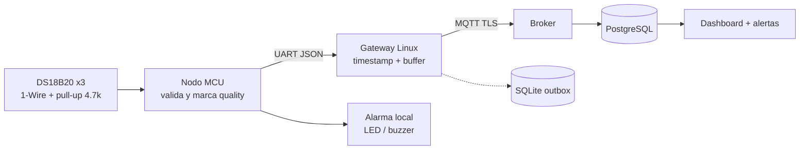
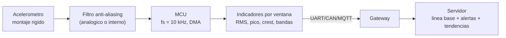
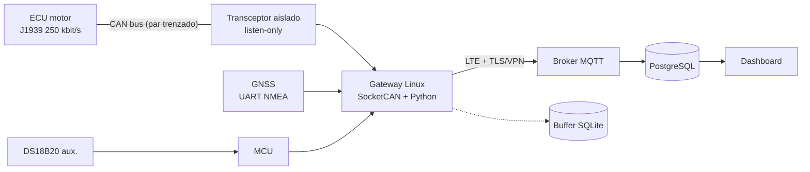
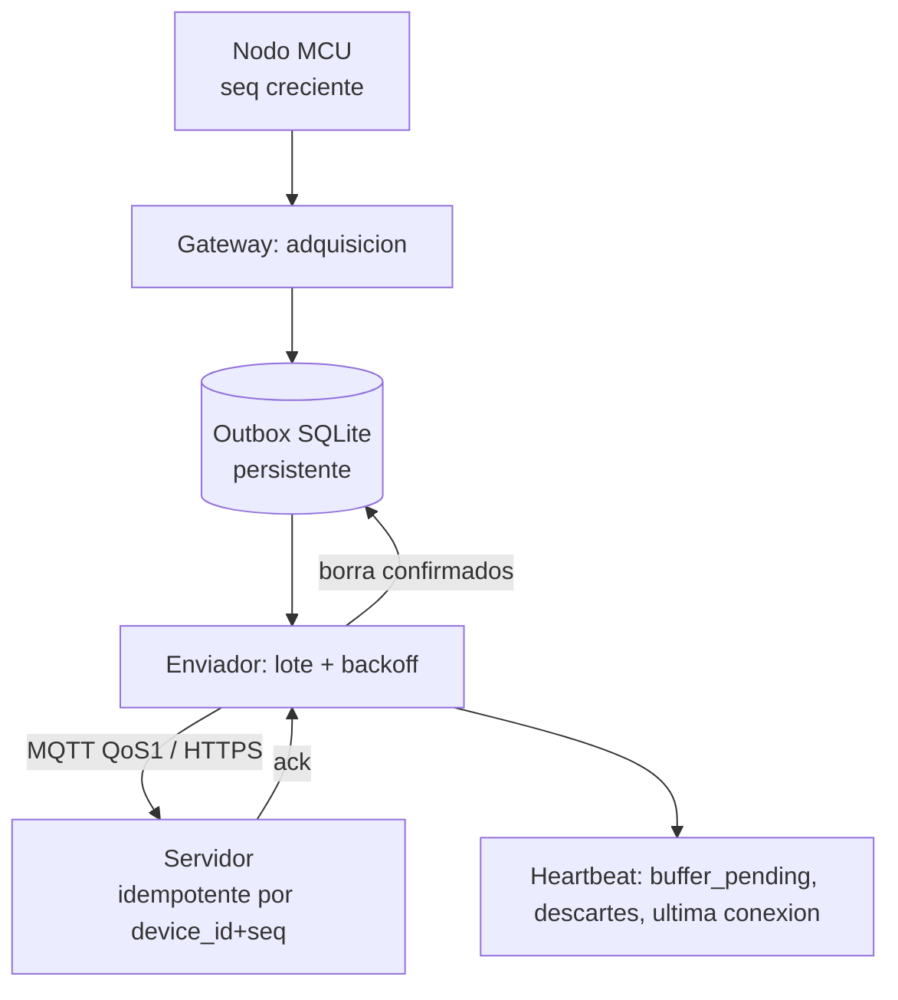

# 14 · Casos prácticos integrales (A–D)

> **Uso.** Son ejercicios de **diseño de solución** (la parte de 15 min del simulacro). Cada caso sigue la misma estructura: **requerimientos → supuestos → arquitectura → componentes/protocolos → diagrama → código → formato de datos → diagnóstico → limitaciones → preguntas del evaluador.**
>
> **Aviso.** Son diseños **didácticos de monitoreo**. Cualquier diseño industrial real requiere validación, análisis de riesgos, cumplimiento normativo y pruebas en campo; **no** son aptos para control o funciones de seguridad sin ese proceso. El caso más completo (integrado, con fuentes de ruido y protocolos) está en [`15_caso_realista_arquitectura.md`](15_caso_realista_arquitectura.md).

---

## CASO A — Monitoreo de temperatura de un motor

### Requerimientos
- R1: medir la temperatura del bloque de un motor eléctrico/diésel de una bomba, 1 muestra cada 2 s.
- R2: alarma local (LED/buzzer) > 95 °C y crítica > 105 °C *(umbrales de ejemplo; los define el fabricante)*.
- R3: enviar datos al servidor; conservarlos si no hay red.
- R4: detectar sensor desconectado/lectura inválida.
- R5: histórico y dashboard con alerta por correo/mensajería.

### Supuestos
- Un DS18B20 por punto (vaina metálica, hasta 3 puntos), alimentación 12 V de la máquina, cobertura Wi-Fi/celular intermitente, sin requisito de control (solo monitoreo).

### Arquitectura y selección
| Elemento | Elección | Razón |
|---|---|---|
| Sensor | DS18B20 en vaina (1-Wire) | Digital, ID único, multipunto, inmune a ruido analógico |
| Nodo | ESP32 (MCU) | Wi-Fi, suficiente, C/C++ (Arduino/ESP-IDF) |
| Enlace de nodo | Wi-Fi/MQTT directo **o** UART al gateway | Simplicidad vs autonomía; aquí UART→gateway para buffer robusto |
| Gateway | Raspberry Pi (Linux, Python) | Buffer SQLite, TLS, logs, systemd |
| Transporte | MQTT/TLS (QoS 1) | Telemetría continua, redes malas |
| Servidor | Broker + PostgreSQL + Grafana/Django | Experiencia previa del estudiante |
| Alimentación | DC/DC 12→3.3 V con TVS y fusible | Protección automotriz/industrial |



### Código
- **MCU:** [`arduino_temp_monitor.ino`](../examples/cpp/arduino_temp_monitor/arduino_temp_monitor.ino) (requiere Arduino framework y bibliotecas OneWire/DallasTemperature; no ejecutado en hardware aquí).
- **Lógica de validación y clasificación (verificada en PC):** [`01_temperature_stats.c`](../examples/c/01_temperature_stats.c), [`ds18b20_decode.c`](../examples/c/ds18b20_decode.c) (CRC y −127/85).
- **Gateway:** [`05_serial_reader.py`](../examples/python/05_serial_reader.py) → [`09_alerts_thresholds.py`](../examples/python/09_alerts_thresholds.py) → [`08_store_and_forward.py`](../examples/python/08_store_and_forward.py) → [`06_post_to_api.py`](../examples/python/06_post_to_api.py).

Pseudocódigo del ciclo del MCU:
```
cada 2 s (timer, no delay):
    t = leer_ds18b20(i)                          # 12 bits, conversion no bloqueante
    calidad = GOOD
    si crc_malo o t == -127:      calidad = BAD; t = NULL
    sino si t == 85.0 y no_convertido:  calidad = BAD
    sino si t fuera de [-40, 150]:      calidad = BAD
    alarma_local(t)  # solo si calidad == GOOD, con histéresis y confirmación
    enviar_json(device_id, seq++, t, unit="C", quality=calidad)
    alimentar_watchdog()  # solo si el ciclo completo funcionó
```

### Formato de datos
```json
{"device_id":"bomba02","seq":8123,"ts":"2026-03-01T14:03:22Z","sensor":"temp_bloque_1","value":82.4,"unit":"C","quality":"good"}
```

### Estrategia de diagnóstico
| Falla | Prueba |
|---|---|
| Nunca lee | Alimentación, pull-up 4.7 kΩ, `ls /sys/bus/w1/devices` / ROM search |
| −127 °C | Cable/conector; CRC; sensor dañado |
| 85 °C fijo | Lectura sin conversión (esperar 750 ms a 12 bits) |
| Valores ruidosos | Cable largo/ruido → alimentación normal (no parásita), par trenzado |
| Sin datos en dashboard | Módulo 12, escenarios 9–10 |

### Limitaciones
- DS18B20 mide **su punto**, no necesariamente el bobinado; la vaina y la pasta térmica influyen.
- Rango −55…+125 °C: **no** apto para temperaturas de escape (usar termopar).
- La alarma local no sustituye una protección térmica de seguridad certificada.
- Wi-Fi en campo abierto es limitado; evaluar celular/LoRa.

### Preguntas del evaluador
1. ¿Por qué 1-Wire y no un termistor analógico? · 2. ¿Qué significa 85 °C? · 3. ¿Cómo evitas falsas alarmas? (confirmación + histéresis) · 4. ¿Qué pasa con la alarma si cae la red? (local, independiente) · 5. ¿Cómo se alimentan tres sensores en un cable de 10 m? · 6. ¿Cómo identificas cuál sensor es cuál? (ROM 64 bits ↔ punto de medición, tabla de asignación) · 7. ¿Cómo evitas que un cortocircuito en un sensor tumbe el bus?

---

## CASO B — Adquisición de vibración y detección de anomalías

### Requerimientos
- R1: medir vibración de una bomba/motor (rodamientos) y **detectar cambios** respecto al comportamiento sano.
- R2: reportar indicadores (RMS, pico, factor de cresta, energía por bandas) cada 10 s; no enviar forma de onda cruda continua.
- R3: alerta temprana con mínima cantidad de falsos positivos.

### Supuestos
- Acelerómetro MEMS con ancho de banda suficiente (~ hasta 5 kHz; **verifica el modelo**), montado rígido; velocidad del eje de 1500 rpm = 25 Hz; el análisis es **de tendencia** (no diagnóstico certificado según ISO 10816/20816, que define criterios de severidad con equipo y método específicos; verifica la norma vigente).

### Arquitectura
| Elemento | Elección | Razón |
|---|---|---|
| Sensor | MEMS (I2C/SPI) o piezo IEPE + acondicionador | MEMS económico; IEPE para bandas altas |
| Adquisición | MCU con DMA (STM32/ESP32) a fs = 10 kHz, ventanas de 0.1–1 s | Muestreo determinista |
| Procesamiento | En el borde: RMS, pico, crest, FFT (o Goertzel en bandas) | Reduce datos 1000× |
| Envío | JSON de indicadores cada 10 s | Ancho de banda |
| Modelo | Línea base + umbral relativo y/o z-score | Simple y explicable |



### Código (verificado)
[`vibration_anomaly.py`](../examples/python/vibration_anomaly.py): señal sintética 50 Hz (+ ruido) y una falla con componente de 3 kHz. Salida real:
```
linea base: {'rms': 0.719, 'peak': 1.235, 'crest': 1.717, ...}
sano   rms=0.71 crest=1.75 alta_freq=0.0001 -> normal
sano   rms=0.70 crest=1.85 alta_freq=0.0001 -> normal
FALLA  rms=1.29 crest=2.13 alta_freq=0.1560 -> ANOMALIA
```
Nota: 1.0·sen → RMS teórico 1/√2 = 0.707 ✓. **Datos sintéticos**: no validan un algoritmo real.

### Formato de datos
```json
{"device_id":"bomba02","seq":221,"ts":"2026-03-01T14:05:00Z","window_s":1.0,"fs_hz":10000,
 "rms_g":0.71,"peak_g":1.24,"crest":1.75,"band_2_4k":0.0001,"temp_c":61.2,"rpm":1498,"quality":"good"}
```
*(Unidad y calibración del acelerómetro deben quedar registradas: g o m/s².)*

### Estrategia de diagnóstico
- ¿Rígido el montaje? (un montaje flojo cambia todo el espectro). ¿Se está saturando el sensor? ¿Aliasing (componentes por encima de fs/2)? ¿Cambió la carga/velocidad (la vibración depende de la operación → **comparar en el mismo régimen**)?
- Falsos positivos: ventana de confirmación, línea base por régimen, no alertar en arranque/parada.
- Verificar con un vibrómetro de referencia.

### Limitaciones
- Diagnóstico de rodamientos real requiere **frecuencias características** (BPFO/BPFI), envolvente y experiencia; aquí se hace **detección de cambio**.
- MEMS baratos: ruido, ancho de banda y linealidad limitados.
- Cálculo en MCU limitado por RAM/CPU: elegir ventanas y bandas con criterio.

### Preguntas del evaluador
1. ¿A qué frecuencia muestrearías y por qué? (Nyquist + margen; filtro anti-aliasing) · 2. ¿Qué es el aliasing y cómo se evita? · 3. ¿Por qué enviar RMS y no la señal cruda? · 4. ¿Cómo defines "anómalo"? (línea base por régimen) · 5. ¿Dónde y cómo montarías el sensor? · 6. ¿Qué pasa si la máquina cambia de carga? · 7. ¿I2C alcanza para 10 kHz × 3 ejes? (calcular: 3 ejes × 2 B × 10 kHz = 60 kB/s = 480 kbit/s + overhead: **excede** I2C a 400 kHz; usar SPI o FIFO del sensor).

---

## CASO C — Telemetría de una máquina agrícola con CAN y gateway

### Requerimientos
- R1: leer parámetros del motor de un tractor (RPM, temperatura del refrigerante, presión de aceite, horas) desde su bus CAN **sin interferir**.
- R2: agregar posición GNSS y una temperatura auxiliar.
- R3: enviar por celular al servidor, con buffer si no hay señal.
- R4: identificar el equipo y su versión de software.

### Supuestos
- El tractor expone un bus **J1939/ISOBUS a 250 kbit/s** (verificar en el manual/fabricante); conector de diagnóstico accesible; **solo lectura** (autorización del fabricante/propietario para conectar). Los PGN/SPN exactos se toman de **SAE J1939-71 o del DBC del fabricante** (aquí se usan EEC1 y ET1 como ejemplo).

### Arquitectura
| Elemento | Elección | Razón |
|---|---|---|
| Interfaz CAN | Transceptor (TJA1051/SN65HVD230) + controlador (MCP2515 por SPI o CAN del MCU); **modo listen-only** | No transmitir ni dar ACK al bus del tractor |
| Protección | Aislamiento galvánico del CAN (transceptor aislado), TVS, fusible, DC/DC automotriz | Lazos de tierra y transitorios |
| Gateway | Raspberry Pi (o gateway industrial), SocketCAN, `python-can` | Linux, decodificación en Python |
| GNSS | Módulo UART (NMEA) | [`nmea_parser.c`](../examples/c/nmea_parser.c) |
| Backhaul | LTE modem (o Wi-Fi del taller) + VPN/TLS | Cobertura |
| Servidor | MQTT + PostgreSQL + dashboard | |



### Código
Decodificación J1939 verificada: [`can_j1939_decode.py`](../examples/python/can_j1939_decode.py)
```
0x0CF00400 -> {'priority': 3, 'pgn': 61444, ..., 'engine_speed_rpm': 1850.0}
0x18FEEE00 -> {'priority': 6, 'pgn': 65262, ..., 'coolant_temp_c': 85}
```
Lectura real con `python-can` (esqueleto; requiere interfaz CAN y `pip install python-can`):
```python
import can                                             # pip install python-can
bus = can.Bus(interface="socketcan", channel="can0")   # SocketCAN: can0 configurado por ip link (ver examples/linux/04_can_socketcan.sh)
for msg in bus:                                        # bloquea hasta recibir; añadir timeout en producción
    if msg.is_extended_id:                             # J1939 usa ID de 29 bits
        print(decode(msg.arbitration_id, bytes(msg.data)))   # decode() de can_j1939_decode.py
```
Configuración de la interfaz (solo escucha): [`04_can_socketcan.sh`](../examples/linux/04_can_socketcan.sh).

### Formato de datos
```json
{"device_id":"tractor01","seq":50231,"ts":"2026-03-01T14:10:00.100Z","src":"can0",
 "readings":[{"sensor":"engine_speed","value":1850.0,"unit":"rpm","spn":190,"quality":"good"},
             {"sensor":"coolant_temp","value":85,"unit":"C","spn":110,"quality":"good"},
             {"sensor":"gps","lat":14.30251,"lon":-90.78,"unit":"deg","quality":"good"}]}
```
(Coordenadas de ejemplo.)

### Estrategia de diagnóstico
1. **Sin tramas:** bitrate, terminación (~60 Ω con el bus apagado, sin conectar el gateway), conexión a CANH/CANL correctos, modo listen-only, alimentación del transceptor (módulo 12 · escenario 5).
2. **Tramas con error:** ruido; ISO 11898-2 requiere par trenzado.
3. **Valores 0xFF:** "no disponible" (no un dato).
4. **Sin GPS:** cielo/antena/`fix`; `GPGGA` calidad 0.
5. **Estado del bus:** `ip -details -statistics link show can0`.

### Limitaciones
- **Seguridad:** el CAN carece de autenticación; conectar equipos puede afectar garantías o seguridad: **solo lectura y con autorización**.
- Los PGN propietarios (fabricante) no son públicos.
- ISOBUS/J1939 tienen requisitos de gestión de direcciones (*address claim*) si se transmite: **no transmitir**.
- Cobertura celular en cañaverales variable.

### Preguntas del evaluador
1. ¿Por qué *listen-only*? · 2. ¿Cómo sabes el bitrate del tractor? · 3. ¿Qué es un PGN/SPN? · 4. ¿Por qué el gateway y no leer CAN desde la nube? · 5. ¿Qué haces si aparecen *error frames*? · 6. ¿Cómo aíslas el gateway del sistema eléctrico? · 7. ¿Cómo manejas 0xFF (no disponible) y datos fuera de rango? · 8. ¿Qué problemas de seguridad tiene conectar un gateway al CAN del tractor?

---

## CASO D — Monitoreo que pierde conectividad y debe recuperar datos

### Requerimientos
- R1: no perder mediciones durante cortes de hasta **24 h**.
- R2: al volver la red, reenviar en orden **sin duplicar** y sin saturar el enlace.
- R3: conservar el **timestamp original**.
- R4: notificar localmente y al servidor (cuando vuelva) cuánto tiempo estuvo desconectado y si hubo descartes.

### Supuestos
- Tasa = 1 mensaje/s por dispositivo, ~300 B/mensaje → 86 400 msg/día ≈ **26 MB/día** (JSON; sin compresión); SD/eMMC de ≥ 8 GB; NTP cuando hay red y RTC con batería (DS3231) para la hora sin red.

### Arquitectura

Secuencia interactiva: [`sequence_offline_recovery.html`](../diagrams/archify/sequence_offline_recovery.html).

### Código (verificado)
- Cola persistente y reenvío: [`08_store_and_forward.py`](../examples/python/08_store_and_forward.py) → 7 pendientes sin red; 7 enviados al volver; orden `[1..7]`.
- Cliente con reintentos + servidor idempotente: [`06_post_to_api.py`](../examples/python/06_post_to_api.py) + [`mock_api_server.py`](../examples/python/mock_api_server.py) → `accepted=1`, reenvío `duplicates=1`.
- Detección de silencio: [`07_timeout_detector.py`](../examples/python/07_timeout_detector.py).

Algoritmo del enviador:
```
loop:
    lote = outbox.peek(N)                     # por orden de id
    si vacío: dormir(1 s); continuar
    ok = enviar(lote)                         # con timeout
    si ok: outbox.ack(ids)                    # borrar SOLO tras confirmación
    sino:  espera = min(tope, base * 2^intentos) * jitter; dormir(espera)
    limitar velocidad al vaciar (p. ej. 50 msg/s) para no saturar el enlace
```

### Formato de datos
Igual al del módulo 11 más `"replayed": true` y `"sent_at"` (para medir la demora de recuperación):
```json
{"device_id":"tractor01","seq":10452,"ts":"2026-03-01T06:00:00Z","sent_at":"2026-03-01T09:15:00Z","replayed":true,"sensor":"temp_motor","value":82.4,"unit":"C","quality":"good"}
```

### Estrategia de diagnóstico
- ¿Crece `buffer_pending`? → el enlace sigue caído o el enviador falla (logs, 4xx que no se deben reintentar → *dead letter*).
- Huecos en `seq` en el servidor → pérdida antes del buffer (MCU→gateway); duplicados → falta de idempotencia.
- `ts` en 1970 → gateway sin hora tras reinicio (RTC/NTP).
- Disco lleno → política de descarte; alerta al 80 %.

### Limitaciones
- Buffer finito: tras N horas hay que descartar (documentar política y contarla).
- Si el gateway pierde energía durante la escritura, SQLite con `journal_mode=WAL` y `synchronous` adecuado mitiga pero no elimina el riesgo; considerar UPS.
- QoS 1 puede duplicar → idempotencia obligatoria.
- Los reintentos masivos tras una caída larga pueden saturar el servidor: **limitar tasa**.

### Preguntas del evaluador
1. ¿Qué guardas en el buffer y cómo evitas que crezca sin límite? · 2. ¿Cómo evitas duplicados? · 3. ¿Cómo conservas el orden? · 4. ¿Qué timestamp usas? · 5. ¿Qué pasa si se apaga el gateway mientras hay datos pendientes? · 6. ¿Cómo sabes que no perdiste ninguno? (`seq` sin huecos) · 7. ¿Cuánto almacenamiento necesitas para 24 h? (26 MB/día ejemplo) · 8. ¿Cómo diferencias "sin datos" de "sin conexión"?

---

## Comparativa rápida de los cuatro casos

| | A: Temp. motor | B: Vibración | C: CAN + gateway | D: Sin conexión |
|---|---|---|---|---|
| Foco | Sensor digital y validación | Muestreo y procesamiento | Protocolo y decodificación | Robustez de datos |
| Bus | 1-Wire | I2C/SPI | CAN (J1939) + UART | — (capa de red) |
| Riesgo principal | Lecturas inválidas | Aliasing / montaje | Interferir con la máquina | Pérdida/duplicados |
| Clave | CRC, −127/85, histéresis | Nyquist, RMS, línea base | Listen-only, PGN/SPN, aislamiento | Outbox, idempotencia, backoff |
