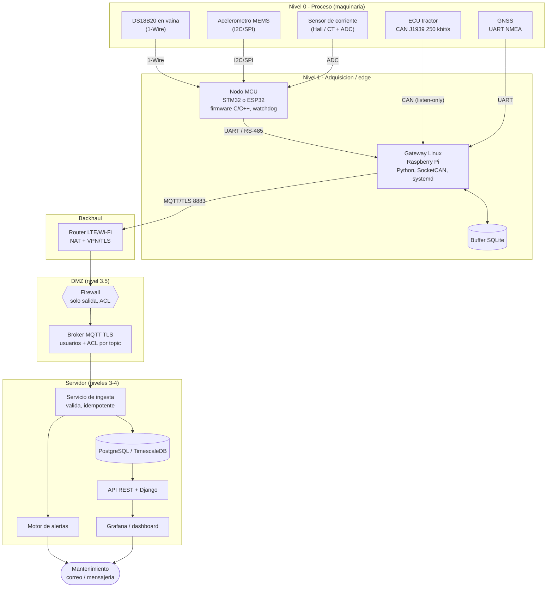
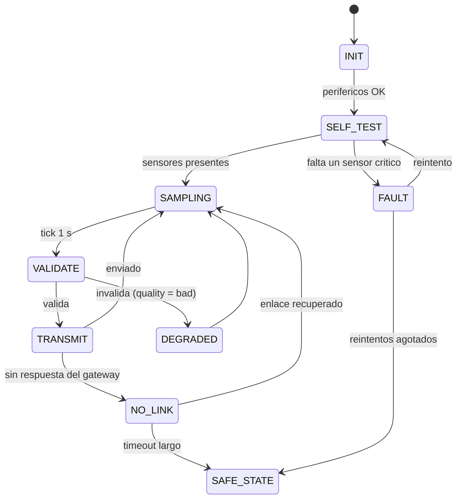

# 15 · Caso realista: sistema de monitoreo y control de temperatura de maquinaria en un ingenio

> **Objetivo.** Un caso de estudio **integral y realista** para responder preguntas de arquitectura de punta a punta: **sensores → microcontroladores → gateway → servidores → IT/OT → protocolos → fuentes de ruido y error → seguridad → pruebas**. Es la síntesis de los módulos 01–14.
>
> **Aviso importante.** Es un **diseño didáctico de referencia**. Cifras (flotas, tasas, presupuestos) son **supuestos ilustrativos** salvo que se indique lo contrario; los valores de estándares/datasheets deben **verificarse**. La parte de **control** (actuar sobre la máquina) se trata solo como **extensión futura** que exigiría análisis de riesgos, seguridad funcional y validación; el sistema descrito es de **monitoreo con alarma**.

## Diagramas interactivos (archify) — ábrelos en el navegador

| Diagrama | Archivo | Qué aprender |
|---|---|---|
| **Arquitectura completa** con zonas OT/IT | [`architecture_case.html`](../diagrams/archify/architecture_case.html) | Componentes, buses, frontera, buffer |
| **Flujo de datos sensor → dashboard** | [`dataflow_sensor_to_dashboard.html`](../diagrams/archify/dataflow_sensor_to_dashboard.html) | Qué dato viaja y en qué formato |
| **Máquina de estados del nodo** | [`lifecycle_firmware.html`](../diagrams/archify/lifecycle_firmware.html) | Estados, degradación, recuperación |
| **Pérdida de red y recuperación** | [`sequence_offline_recovery.html`](../diagrams/archify/sequence_offline_recovery.html) | Store & forward con idempotencia |

Cada HTML es autocontenido (tema claro/oscuro, zoom/paneo, búsqueda, trazado de relaciones y exportación).

## 1. Escenario

El **Ingenio** quiere saber **en tiempo real** la temperatura y el estado de sus máquinas críticas en la zona costera para **mantenimiento predictivo** y evitar paros:

| Activo | Cant. (supuesto) | Qué preocupa | Variables |
|---|---|---|---|
| Tractores / cosechadoras | 10 | Sobrecalentamiento del refrigerante, presión de aceite | Temp. refrigerante, RPM, presión de aceite, horas, ubicación (CAN J1939/ISOBUS, GNSS) |
| Bombas de riego con motor eléctrico/diésel | 6 | Falla de rodamientos, sobrecalentamiento del motor | Temp. carcasa del motor, temp. de rodamiento, vibración, corriente |
| Motores de trapiche / ventiladores | 4 | Sobrecalentamiento continuo | Temp. de bobinado/carcasa, corriente, RPM |

**Requisitos de negocio (supuestos):** ver el dato con **< 10 s** de retraso cuando hay red; **no perder datos** durante cortes de hasta 24 h; alerta al detectar **temperatura alta sostenida** o **pérdida de comunicación**; histórico de 12 meses; acceso remoto seguro; **cero exposición de la red de control a Internet**.

## 2. Arquitectura por capas



### Principios de diseño
1. **Monitoreo, no control.** Solo lectura; el gateway **no transmite** al CAN del tractor ni escribe a PLC.
2. **Determinismo en el borde y flexibilidad en el gateway:** MCU para tiempos y sensores; Linux para protocolos, red, buffers y logs.
3. **La red de control jamás es alcanzable desde Internet:** el gateway **inicia** conexiones salientes; el broker está en DMZ.
4. **Cada dato viaja con contexto:** `device_id`, `ts` UTC de medición, `seq`, unidad, `quality`.
5. **Tolerancia a fallos:** buffer local, reintentos con backoff, idempotencia, heartbeat, watchdog.
6. **Observabilidad:** métricas de salud y logs en cada capa.
7. **Fallo seguro:** ante duda, marcar `quality=bad`/`uncertain`; jamás mostrar un dato inválido como válido.

## 3. Selección de componentes y protocolos (y por qué)

| Enlace | Protocolo / medio | Por qué | Alternativas |
|---|---|---|---|
| Sensor temp. → MCU | **1-Wire** (DS18B20) | Digital, ID único, varios sensores en un cable | RTD PT100 + amplificador; termopar tipo K para temperaturas altas |
| Acelerómetro → MCU | **I2C** (corta distancia, misma caja) o **SPI** | Simple; SPI si se requiere mayor caudal | IEPE + acondicionador para análisis serio |
| Corriente → MCU | **ADC** con Hall/CT | Aislamiento | Medidor Modbus RTU |
| ECU tractor → gateway | **CAN J1939/ISOBUS**, 250 kbit/s (típico, **verificar**) | Es el bus nativo del tractor; ya tiene RPM, temperaturas, etc. | Sensores propios (más instalación) |
| MCU → gateway | **UART** (TTL en la misma caja) o **RS-485** (si hay distancia) | Simple; RS-485 robusto a distancia | CAN propio entre nodos (multi-nodo) |
| GNSS → gateway | **UART NMEA** | Estándar | u-blox binario UBX |
| Gateway → servidor | **MQTT sobre TLS** (QoS 1) | Telemetría continua, redes inestables, LWT | HTTPS por lotes |
| Servidor → dashboard | **SQL / HTTP** | Herramientas existentes | |
| Acceso remoto de mantenimiento | **VPN (p. ej. WireGuard) + SSH por clave** | Cifrado y autenticación | Bastion/jump host |
| Sincronización de hora | **NTP** (+ RTC DS3231 en gateway) | Timestamps confiables | GNSS/PPS |

### Presupuestos (cálculos verificables)

**Tráfico** (supuesto: 1 mensaje/s por máquina, ~350 B JSON, 20 máquinas):
- Por dispositivo: `350 B × 86 400 s = 30.2 MB/día` ≈ **907 MB/mes**. Con datos móviles esto es caro y excesivo para temperatura.
- Reducción: **agregar** en el gateway (min/prom/máx por 5 s) → `350 B × 17 280 = 6.05 MB/día` ≈ **181 MB/mes**; o enviar **por excepción** (cambio > 0.5 °C) + heartbeat cada 30 s.
- Flota: `20 × 350 B/s = 7 kB/s = 56 kbit/s` (payload) — trivial para el servidor; el cuello de botella es el **plan celular**, no el servidor.

**Latencia extremo a extremo (supuestos típicos, red normal):**
| Tramo | Aporte |
|---|---|
| Conversión DS18B20 (12 bit) | hasta **750 ms** |
| Periodo de muestreo del MCU | 1 s |
| UART: 100 B a 115 200 baud (10 bits/byte) | `100·10/115200 ≈ 8.7 ms` |
| Procesamiento en gateway | < 50 ms |
| Red celular + broker + ingesta | 100 ms – varios segundos |
| Refresco del dashboard | 5–10 s |
| **Total típico** | ≈ 2–12 s (**cumple** el objetivo de < 10 s con red buena; no es tiempo real duro) |

**CAN (ejemplo):** trama extendida de 8 bytes ≈ 128 bits sin *bit stuffing* (en el peor caso, unos 150). A 250 kbit/s: `128 / 250 000 = 0.51 ms` por trama. Si el tractor emite 20 mensajes distintos a 10 Hz = 200 tramas/s → `200 × 0.51 ms = 102 ms/s ≈ 10 %` de carga del bus (bus sano típico bien por debajo de ~50 %; **verifica** con el fabricante). Un gateway *listen-only* no añade carga.

**I2C (ejemplo):** leer 2 bytes de un registro a 100 kHz: ~48 tiempos de bit ≈ **0.5 ms**; despreciable a 1 Hz, pero **no** alcanza para vibración continua a 10 kHz × 3 ejes (480 kbit/s de datos útiles) → SPI/FIFO/DMA.

**Buffer para 24 h sin red:** `1 msg/s × 350 B × 86 400 = 30.2 MB` por dispositivo (con agregación cada 5 s: 6 MB); trivial para una SD/eMMC (dimensionar con margen y política de descarte).

**Energía (ejemplo):** nodo MCU 0.3 W + gateway Pi 3–5 W + módem 1–3 W → ~5–8 W → a 12 V ≈ **0.4–0.7 A**. **Verifica** con mediciones reales (picos de módem/Wi-Fi > 1 A momentáneos requieren fuente y condensadores adecuados).

## 4. IT vs OT en este sistema

| Zona | Elementos | Reglas |
|---|---|---|
| **OT: campo** | Sensores, ECU, nodos MCU, gateways | Sin puertos entrantes; firmware firmado/versionado; sin acceso directo desde Internet |
| **Frontera / DMZ** | Firewall, broker MQTT | Solo **saliente** desde OT (TCP 8883); autenticación por dispositivo (cert o usuario+clave) y ACL por topic (`ingenio/costa-sur/<id>/#` solo escribe su propio topic) |
| **IT: servidor** | Ingesta, BD, API, dashboards, alertas | Parches, respaldos, TLS, roles de usuario, auditoría |
| **Usuarios** | Mantenimiento, gerencia | SSO/contraseña fuerte + 2FA para el dashboard; VPN para administración |

**Convergencia responsable:** los datos suben; los comandos **no** bajan. Si en el futuro se quisieran comandos, se diseñaría un canal aparte con autorización, registro, límites y validación de seguridad.

## 5. Fuentes de ruido y de error (catálogo por capa)

| Capa | Fuente | Efecto | Mitigación |
|---|---|---|---|
| **Alimentación** | Arranque del motor (caída de tensión de la batería), *load dump*, ruido de alternador, polaridad invertida | Reinicios, ruido en ADC | DC/DC automotriz, TVS, fusible, diodo/MOSFET de polaridad, condensadores, filtro LC |
| **Analógica** | EMI de relés/inyectores/VFD; lazos de tierra; cables largos; impedancia alta | Ruido, offset, lecturas inestables | Par trenzado y blindaje a un extremo, filtro RC, ADC cerca del sensor, 4–20 mA |
| **Sensor** | Deriva, autocalentamiento, montaje flojo, humedad, lodo; DS18B20 alimentado en modo parásito | Lecturas sesgadas | Calibración, vaina metálica, alimentación normal, IP67, montaje rígido |
| **Muestreo** | Aliasing, frecuencia inadecuada, jitter | Señal falsa | Filtro anti-aliasing, fs adecuada, timers/DMA |
| **Bus 1-Wire** | Pull-up inadecuada, cable largo, ramas | CRC inválido, −127 °C | 4.7 kΩ (ajustar), topología lineal, reintentos con CRC |
| **Bus I2C** | Pull-ups mal dimensionadas, capacitancia, ruido | NACK, bus colgado | Cálculo de Rp, cables cortos, recuperación de bus |
| **Bus CAN** | Terminación errónea, sin par trenzado, derivaciones largas, bitrate distinto, masa | *Error frames*, `BUS-OFF` | 2 × 120 Ω, cable adecuado, listen-only, aislamiento |
| **UART** | Baud/formato distinto, reloj impreciso, GND | Caracteres corruptos | Cristal, checksum/CRC, RS-485 |
| **Firmware** | Overflow, condición de carrera ISR, `float` sin validar, pila, bloqueos | Valores erróneos, reinicios | Revisión, `volatile`+atómico, validación, watchdog |
| **Gateway (Linux)** | Corrupción de SD por cortes, hora incorrecta, disco lleno, servicio caído | Pérdida de datos, timestamps malos | eMMC/SSD, UPS, RTC/NTP, límites del buffer, systemd `Restart=` |
| **Red** | Cobertura celular, NAT con timeout, DNS, interferencia | Desconexiones, latencia | Buffer, keep-alive < timeout NAT, reconexión con backoff |
| **Transporte** | QoS 1 duplica; reordenamiento | Duplicados | Idempotencia `(device_id, seq)` |
| **Servidor** | Zona horaria, esquema, cola saturada, BD llena | Datos ausentes/duplicados | UTC, validación, monitoreo de disco |
| **Humano** | Configuración errónea, unidades, cableado incorrecto | Datos falsos | Lista de verificación de instalación, pruebas de aceptación, etiquetado |
| **Seguridad** | Credenciales por defecto, puertos expuestos, sin TLS | Intrusión, manipulación | TLS, credenciales únicas, sin puertos entrantes, mínimo privilegio |

## 6. Modos de falla y respuesta (FMEA simplificado)

| # | Falla | Efecto en el sistema | Detección | Respuesta | Recuperación |
|---|---|---|---|---|---|
| 1 | Cable del DS18B20 cortado | Sin temperatura del motor | CRC/−127 / presence pulse ausente | `quality=bad`, alarma de sensor | Reparar; datos previos válidos |
| 2 | Sensor pegado (valor congelado) | Falsa normalidad | σ = 0 durante N min | `uncertain`, alerta de mantenimiento | Reemplazar |
| 3 | Bus CAN sin tráfico | Sin RPM/temp. ECU | Timeout por PGN (p. ej. 3× periodo) | Marcar PGN como "sin dato"; alerta | Revisar cableado/máquina apagada |
| 4 | MCU bloqueado | Sin muestreo | Watchdog → reset; gateway detecta silencio | Reinicio; contador de resets | Investigar causa |
| 5 | Gateway pierde red | Sin telemetría en vivo | Fallos de publicación | Buffer local + alarma local | Reenvío al volver |
| 6 | Gateway se reinicia | Cortes breves | Servidor: silencio + LWT | `systemd Restart`, outbox persistente | Reenvío |
| 7 | Servidor caído | Sin dashboard | Monitoreo externo | Los gateways siguen bufferizando | Restauración + reenvío |
| 8 | Reloj del gateway incorrecto | Timestamps erróneos | Comparación `ts` vs `received_at`; `timedatectl` | `ts_quality=bad` | NTP/RTC |
| 9 | Disco lleno del gateway | Se pierde el buffer | Umbral 80 % | Descartar lo más antiguo, contar y avisar | Ampliar/limpiar |
| 10 | Credenciales comprometidas | Datos falsos/intrusión | Auditoría, anomalías | Revocar, rotar | Investigación |
| 11 | Sobretensión en alimentación | Daño del nodo | Reset/fallo | Protecciones (TVS, fusible) | Reemplazo |
| 12 | Falla de energía repentina | Corrupción de archivo | Arranque tras corte | SQLite WAL, escrituras atómicas | Verificar integridad |

## 7. Firmware del nodo: estados y ciclo

Ver [`lifecycle_firmware.html`](../diagrams/archify/lifecycle_firmware.html) y [`state_machine_firmware.mmd`](../diagrams/state_machine_firmware.mmd). Código de referencia verificado en PC: [`04_state_machine.c`](../examples/c/04_state_machine.c).



**Watchdog:** se alimenta solo al final de un ciclo completo y sano. **Reporte de reset:** cada arranque envía `reset_cause` y `boot_id` (contador que evita colisiones de `seq`).

## 8. Formato de datos (contrato)

```json
{
  "schema": 1,
  "device_id": "bomba02",
  "boot_id": 17,
  "seq": 88231,
  "ts": "2026-03-01T14:03:22.000Z",
  "ts_quality": "ntp",
  "fw": "1.4.2",
  "readings": [
    {"sensor": "temp_motor",   "value": 82.4, "unit": "C",    "quality": "good"},
    {"sensor": "temp_rodam",   "value": 71.9, "unit": "C",    "quality": "good"},
    {"sensor": "vib_rms",      "value": 2.3,  "unit": "mm/s", "quality": "good"},
    {"sensor": "corriente",    "value": 18.7, "unit": "A",    "quality": "uncertain"}
  ]
}
```
Topics: `ingenio/costa-sur/<device_id>/telemetry`, `/status` (retain + LWT), `/health` (heartbeat). Clave de idempotencia: `(device_id, boot_id, seq)`.

**Alertas (ejemplo de reglas; los umbrales reales los define el fabricante/mantenimiento):**
| Regla | Condición | Acción |
|---|---|---|
| Temperatura alta sostenida | `temp_motor ≥ T_warn` durante 3 muestras; histéresis 3 °C | Alerta amarilla |
| Temperatura crítica | `temp_motor ≥ T_crit` durante 3 muestras | Alerta roja + aviso inmediato |
| Comunicación perdida | Sin mensaje/heartbeat > 3× periodo | Estado OFFLINE |
| Sensor inválido | `quality=bad` > N min | Ticket de mantenimiento |
| Cambio brusco | Tasa > límite físico | `uncertain` + revisión |
| Buffer creciendo | `buffer_pending` > umbral | Alerta de conectividad |

## 9. Seguridad (resumen de amenazas y controles)

| Amenaza | Control |
|---|---|
| Escucha/manipulación en tránsito | TLS (MQTT 8883 / HTTPS); verificar certificado |
| Dispositivo falso publica datos | Credenciales únicas por dispositivo, ACL por topic, certificados de cliente |
| Acceso a la red de campo desde Internet | Sin puertos entrantes; solo salida; VPN para mantenimiento |
| Movimiento lateral IT→OT | Segmentación, firewall deny-by-default |
| Credenciales en el código | Variables de entorno/archivos 600, rotación; nunca en Git |
| Firmware malicioso | Firmado/verificado (diseño propio), acceso físico controlado |
| DoS al broker | Límites de tasa/conexiones, monitoreo |
| Inyección de tramas CAN | *Listen-only*; no exponer el bus del vehículo a la red |
| Robo del gateway | Cifrado de disco (evaluar), credenciales revocables |

*(Marco de referencia: ISA/IEC 62443 para zonas y conductos; **no** implica que este diseño esté certificado.)*

## 10. Plan de pruebas y puesta en marcha

1. **Banco:** cada sensor y bus por separado (ver [`exercises/protocols.md`](../exercises/protocols.md)). Verificar CRC, rangos y `quality`.
2. **Integración en laboratorio:** nodo + gateway + servidor local; simular fallas (desconectar sensor, red, energía).
3. **Prueba de desconexión de 30 min y de 24 h:** verificar `seq` sin huecos y sin duplicados.
4. **Prueba de energía:** caídas de tensión, arranque del motor, polaridad invertida (con protecciones).
5. **Prueba ambiental:** vibración, temperatura, humedad, polvo, agua; UV para la carcasa.
6. **Piloto en 1–2 máquinas (semanas):** comparar con un termómetro de referencia (calibración/validación).
7. **Despliegue escalonado**, con lista de verificación de instalación (etiqueta, torque, sellado, ruta de cable, pruebas de aceptación).
8. **Operación:** monitoreo del monitoreo (salud de gateways), respaldos, actualizaciones controladas, documentación y capacitación.

**Criterios de aceptación (ejemplos):** pérdida de datos < 0.1 % tras cortes de 24 h; error de temperatura ≤ tolerancia del sensor tras calibración; latencia p95 < 10 s con red; 0 puertos entrantes en OT (verificado con escaneo); recuperación automática tras corte de energía.

## 11. Lo que NO cubre este caso (limitaciones y qué verificar)
- **Control** de la máquina, protección térmica o funciones de seguridad (requieren IEC 61508/ISO 13849/ISO 25119, análisis de riesgos, validación).
- Certificaciones (EMC, ATEX si hay atmósferas explosivas —por ejemplo bagazo/polvo—, IP, automotriz): **verificar normas aplicables**.
- PGN/SPN reales del fabricante, direcciones de sensores, límites térmicos: **datasheets y manuales**.
- Cobertura y costo celular en la zona; disponibilidad de energía y espacio de montaje.
- Cumplimiento de políticas de TI del ingenio, protección de datos y retención.
- Los datos numéricos de tráfico/latencia/energía son **supuestos de ejemplo**.

## 12. Preguntas que podría hacer el evaluador (y cómo responder)

1. **"Explícame la arquitectura de punta a punta."** → Recorre el diagrama: sensores → MCU → gateway → DMZ/broker → BD → dashboard; nombra protocolos, dónde se valida, dónde se buffer, y cómo se separa OT de IT.
2. **"¿Por qué un gateway y no conectar cada MCU a Internet?"** → Punto único de seguridad/política, buffer, protocolos (CAN), gestión de credenciales, menos exposición, menor costo de datos.
3. **"¿Qué pasa si se cae la red durante 5 horas?"** → Autonomía del borde, outbox persistente, timestamps originales, reintentos con backoff, idempotencia, límite de reenvío, alertas locales.
4. **"¿Cómo evitas duplicados?"** → `(device_id, boot_id, seq)` como clave + `ON CONFLICT DO NOTHING`; QoS 1 implica duplicados posibles.
5. **"¿Qué fuentes de ruido ves y cómo las mitigas?"** → Usa la tabla del §5: alimentación (transitorios), EMI, tierras, cables, terminación CAN, pull-ups.
6. **"¿Cómo garantizas que un dato inválido no llegue como válido?"** → CRC, rangos, plausibilidad, `quality`, `null` explícito; el servidor valida de nuevo.
7. **"¿Cómo sabes si el sensor falló o la máquina está apagada?"** → Combinación de `quality`, RPM/corriente (correlación), heartbeat y estado del bus CAN.
8. **"¿Cómo aseguras el sistema?"** → Sin puertos entrantes, TLS, credenciales por dispositivo, ACL, VPN/2FA, segmentación, parches, logs (ver §9).
9. **"¿Cómo lo probarías antes de instalarlo?"** → §10: banco, integración, fallas inyectadas, ambiental, piloto.
10. **"¿Podríamos controlar el motor desde el dashboard?"** → No como extensión trivial: requiere análisis de riesgo, safety, autenticación fuerte, límites y validación; empezaría solo lectura.
11. **"¿Qué harías si aparecen `BUS-OFF` en el CAN?"** → Verificar bitrate, terminación, cableado y ruido; confirmar *listen-only*; consultar contadores de error (`ip -details -statistics link show can0`).
12. **"Presupuesto de datos y almacenamiento."** → §3 (30 MB/día por dispositivo a 1 Hz sin agregar; con agregación 5 s, 6 MB).
13. **"¿Qué material usarías para la carcasa y por qué?"** → ASA (UV/temperatura), 4 perímetros, prensaestopas, respiradero, montaje rígido (módulo 10).
14. **"¿Qué haces primero si el dashboard no muestra datos?"** → Comprobar desde el final hacia el inicio: BD → ingesta → broker → gateway → MCU (módulo 12 · escenario 10).

## 13. Ejercicio propuesto
Amplía el diseño para **50 máquinas** y **enlace satelital de 64 kbit/s compartido**: recalcula el tráfico, decide agregación, prioridad de alarmas y estrategia de buffer; justifica qué enviarías siempre y qué solo por excepción.
